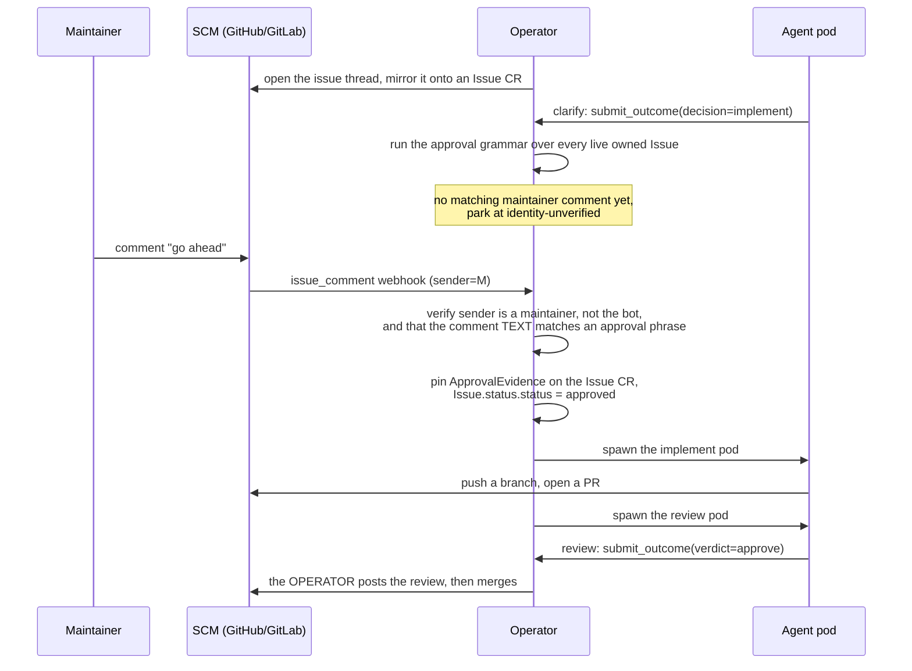
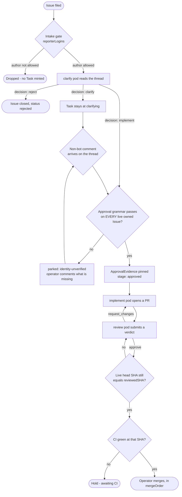

# Approval Gates

Tatara is designed to be useful without being autonomous. Three gates stand
between an issue arriving on a forge and code landing on `main`:

| Gate | What it holds back | Who opens it |
|---|---|---|
| Intake | Whether an issue becomes a Task at all | The sweep's orphan predicate plus `Project.spec.scm.reporterLogins` |
| Approval | Whether any code is written | The [approval grammar](#the-approval-grammar) below. The Task sits at `clarifying` until it passes, then moves to `approved` |
| Merge | Whether reviewed code reaches `main` | The **operator**, on an accepted `submit_outcome(verdict=approve)` from a review pod. The forge's native merge-on-green is never armed, and no MCP tool exposes a merge action |



## Gate 1: Intake - who can drive a Task into existence

The intake gate controls which issues and comments the operator acts on at all.
By default the gate is **open**: the operator mints Tasks from issues by any
author. When `spec.scm.reporterLogins` is non-empty the gate becomes
**restricted**: only these authors (plus the bot and any maintainer) may drive
the platform. Everything else is dropped at intake - sweep and webhook alike -
so unenrolled third parties cannot submit arbitrary work to agents.

The effective reporter set for a given repository is:

1. The configured `botLogin` - always trusted, unconditionally.
2. Every login in `spec.scm.maintainerLogins` - always trusted, unconditionally.
3. Every login explicitly listed in `spec.scm.reporterLogins` - trusted when the
   list is non-empty.

An empty `reporterLogins` disables the gate entirely.

!!! warning "Default: open intake"
    With an empty `reporterLogins`, any SCM user who can file an issue on an
    enrolled repository can drive tatara. Enable the gate for any project where
    the repositories are publicly visible or where you do not want unsolicited
    automation.

```yaml
apiVersion: tatara.dev/v1alpha1
kind: Project
metadata:
  name: my-project
spec:
  scm:
    provider: github
    owner: my-org
    botLogin: my-bot
    reporterLogins:       # restrict intake to these accounts
      - alice
      - ci-system
    maintainerLogins:     # see Gate 2 - the ONLY approval-granting set
      - alice
      - bob
```

Intake decides only whether the platform *listens*. It grants nothing. An
allowlisted reporter who is not a maintainer can open an issue and talk to a
`clarify` agent all day; they cannot cause a line of code to be written.

## Gate 2: The approval grammar { #the-approval-grammar }

Approval is not a label. **Approval is a comment, whose text the operator
reads.**

The operator sets `Issue.status.status = approved` only when **all** of the
following hold:

1. A `clarify` Task for this Issue submitted `decision=implement`. That is the
   agent's judgment on scope, and it is a precondition, never an approval.
2. **Scope.** *Every* Issue the Task owns that is still live - `state == "open"`
   and `status` not in (`done`, `rejected`) - carries valid evidence per clause
   3. Not one of them. Every live one. One `lgtm` on one issue does not approve
   a Task spanning six repositories. Narrowing to live issues is deliberate: a
   human closing one issue of a multi-issue Task must not make approval require
   a phrase on a closed thread, forever.
3. For each such Issue there exists a comment `C` on its thread such that:
    a. `C.author` is in the effective maintainer set, **and**
       `C.author != Project.spec.scm.botLogin` - the bot is excluded
       structurally, not by convention - **and** `IsMaintainer(project, repo,
       C.author)` passes. That check is closed by default and fails closed.
    b. `C` is the **most recent** maintainer-authored comment on that thread. An
       older approval sitting behind a newer maintainer objection does not
       approve.
    c. The comment's normalised body carries the phrase as an **anchored,
       whole-line match**. Normalisation lowercases the body, strips fenced code
       blocks, strips quoted (`>`) lines, strips markdown emphasis around a run,
       and strips trailing emoji and whitespace. Some line of the result must
       then match `^\s*(<phrase>)[\s.!]*$` for a phrase in
       `Project.spec.scm.approvalPhrases`. **The comment must consist of the
       phrase, not merely contain it.**
    d. `C.externalId` is not the comment id already recorded in
       `Issue.status.approval.commentId`. **Approval evidence is single-use**: a
       consumed comment cannot approve a second time.
4. The operator then pins the evidence on the Issue CR, and once every owned
   Issue is approved, moves the Task to the `approved` stage:

```yaml
status:
  status: approved
  approval:
    login: szymonrychu
    commentId: "1234567"
    createdAt: "2026-07-12T10:02:00Z"
    phrase: "go ahead"
```

`approvalPhrases` defaults, when unset, to `approve`, `approved`, `go ahead`,
`lgtm`, `ship it`, `implement it`. **An empty list means the defaults; it can
never mean "any text approves."**

### Why the match is anchored

A substring match is not a gate. Under one, every sentence below approves the
work:

| Comment | Substring match | Anchored match |
|---|---|---|
| `go ahead` | approves | **approves** |
| `LGTM` | approves | **approves** (emphasis and case are normalised away) |
| `I can't approve this until the tests pass` | **approves** | rejected |
| `don't go ahead with this` | **approves** | rejected |
| `> go ahead` (quoting someone else) | **approves** | rejected - quoted lines are stripped |
| ``` `go ahead` ``` inside a code fence | **approves** | rejected - fences are stripped |

And because clause 3b takes the maintainer's *most recent* comment, under a
substring match the maintainer's own corrective follow-up would approve the work
they were objecting to.

A negation blocklist was rejected outright. Blocklists lose: the same argument
that makes the close-directive filter an allowlist applies here verbatim.

Emphasis-stripping is not a nicety either. Without it, `**LGTM**` - which is how
humans actually write it - fails the anchor, and the Task drops into a park it
cannot leave without a second comment.

### When the grammar runs

The grammar is not a one-shot check at `clarify` outcome time. It is evaluated
at **both** of:

1. `clarify`'s `submit_outcome(decision=implement)`, and
2. **every non-bot event on a Task parked at `identity-unverified`** - that is,
   every time a human says something on a thread the platform is waiting on.

Evaluating it only at (1) would leave the normal path broken, not just an attack
path: `clarify` asks for approval while the maintainer is asleep, the grammar
fails, the Task parks - and the maintainer's "go ahead" the next morning would
land on a Task that never re-reads its thread.

### When it fails

If any clause fails, the Task parks with `stageReason=identity-unverified` and
the operator comments on the issue naming exactly what was missing. **That
comment is bot-authored, so it can never un-park the Task the operator just
parked.** The bot is filtered out of the event queue and out of the grammar,
twice over.

### Approval is not sticky

An Issue acquired *after* the Task reached `approved` - through `issue_write`
creating one, or through a `refine` fold adopting one - **resets the Task out of
`approved`** and back to `clarifying`, because clause 2 no longer holds. An
agent cannot widen its own mandate by adopting work after the gate closed behind
it.

!!! danger "Presence is not consent. Text is."
    Before the 2026-07-11 hardening, the operator's `approvingMaintainer()`
    returned a maintainer-authored comment **without reading it**. A maintainer
    who commented "this looks like spam" on a thread thereby approved the work.
    Clause 3c is the fix, and it is the reason approval is defined as a grammar
    over text rather than as an event on a thread.

!!! warning "Fail closed: an empty `maintainerLogins` approves nothing, ever"
    `spec.scm.maintainerLogins` is **closed by default**. An empty or unset list
    means the project has no maintainers, so no comment can ever satisfy clause
    3a, no evidence is ever pinned, and no Issue ever advances into
    implementation. A project must name its maintainers before tatara will write
    a line of code against it. There is no "any human" fallback here, unlike the
    intake gate.

## Labels are write-only

Labels are a **projection** of `Issue.status.status`, never a source of it. The
operator writes them; nothing reads them back into a decision.

```
Issue.status.status   is written ONLY by the approval grammar above, and by the
                      operator's own lifecycle writes (rejected, done).
Labels                are a ONE-WAY PROJECTION of it, written by the operator.
                      No label is EVER read to produce a status. A test in the
                      operator's suite asserts it.
```

There is **no label-to-status path at all** - not from the sweep, not from a
reconcile, and not from the webhook either. An earlier design kept a webhook-only
path, on the reasoning that the webhook alone sees a verified `sender` and could
therefore refuse a bot-written label, where a cron - which sees no sender - would
launder one into an approval. That guard is gone along with the path it guarded:
the three label-name fields the old model configured on `Project.spec` (the
approval, idea and rejected label names) are **removed from the CRD**, and no
label anywhere means "approved" to anything in the control path.

The only label read anywhere in the control path is `tatara-parked`, and it
decides **cost, not authority**: the sweep uses it to mint a parked Issue as a
cheap, pod-less Task instead of an active one. Forging that label onto an issue
buys an attacker a Task that stays parked. It fails safe. Forging a label that
meant "approved" would have bought them production.

`issue_write` has **no `labels` parameter and no `status` parameter**. An agent
cannot stamp a label, so it cannot self-escalate by stamping one.

## Gate 3: Merge - an operator action

Merge is an **operator** action, triggered by a review agent's approval. It is
never an agent action, and the forge's native merge-on-green is never armed on a
tatara PR.

A `review` pod reads the diff and submits `submit_outcome`. If the verdict is
`approve`, the operator - not the agent - posts the SCM review, then walks
`Task.spec.mergeOrder` and merges each repository in turn:

1. It reads the **live** head SHA from the forge, never the mirror.
2. If the live head no longer equals `MergeRequest.status.reviewedSHA`, the head
   moved under the review. The MR is reset to unreviewed and the Task goes back
   to `reviewing`. Reviewed code is what merges, or nothing does.
3. It merges only on green CI at that exact SHA. A `409` or a "head sha changed"
   from the merge call sends the Task back to `reviewing` too, which closes the
   window between the check and the merge.

Two things follow, and they are the whole design:

- **No MCP tool exposes merge.** There is no merge action in any tool profile,
  for any agent kind. A hallucinated merge has nothing to call.
- **Agents never post SCM reviews either.** The operator writes the review from
  the accepted verdict. The platform has one bot identity, and a forge will not
  let an identity post an approving review on its own pull request - so the
  review the operator posts is a comment carrying the verdict, and the
  **approval of record is the merge itself**, not a green review check on the PR.

!!! danger "Accepted risk: one bot identity means the merge gate is operator logic"
    The merge gate is **operator logic, not a forge-enforced control.** An agent
    pod holds `GIT_TOKEN` - the same bot credential the operator merges with -
    and the forge cannot tell a merge request made by a pod apart from one made
    by the operator. A deliberately malicious or catastrophically confused agent
    could merge its own PR by calling the forge API directly.

    This risk is **accepted explicitly**, and it is the direct consequence of
    running one bot identity. It is not a defect awaiting a fix, and the obvious
    countermeasure does not exist: **branch protection cannot require an
    approving review**, because nothing on this platform could ever satisfy such
    a rule, so enabling it would deadlock every merge.

    The answer is detection, not prevention: a merge the operator did not
    initiate is caught by the sweep - it finds a merged MR with no merge-cursor
    advance - and raises `operator_unexpected_merge_total`, a critical alert.

### What is in scope under one identity

Three controls remain available and are all worth having:

1. **Branch protection forbidding direct pushes to `main` on every repository.**
   This stops `git push origin HEAD:main` outright and needs no review
   requirement at all. It is the single highest-value control available under one
   identity, and it is cheap.
2. **A scoped installation token in place of an org-wide PAT**, so the blast
   radius of a leaked pod token is one installation rather than the whole
   organisation.
3. **`gh`, `glab`, and direct-to-forge-API `curl` on the wrapper's deny-list**, so
   a compliant agent has no ergonomic path to the merge endpoint even though a
   determined one has a possible path.

!!! note "The `gh` ban is an IN-CLUSTER ban"
    **In-cluster agent pods** may not use `gh` or `glab`, and may not merge. That
    is enforced structurally: the MCP profile exposes no merge action, and the
    tools are denied in the pod.

    **Workstation skills** - `start-development` and everything it drives, run by
    a human at a terminal with their own forge credentials - **keep `gh` and keep
    human-driven merge.** They do not go through MCP profile gating, and the
    ban's enforcement mechanism does not reach them.

    The rule is about what an autonomous pod may do with the platform's bot
    identity, not about what a human may do with their own.

## Per-repository overrides

Both allowlists can be overridden at the Repository CR level, independently of
the Project. This lets you tighten gates on sensitive repositories without
changing the project-wide defaults.

```yaml
apiVersion: tatara.dev/v1alpha1
kind: Repository
metadata:
  name: payments-service
spec:
  projectRef: my-project
  url: https://github.com/my-org/payments-service
  maintainerLogins:    # overrides project-level for this repo only
    - alice
    - security-lead
  reporterLogins:      # overrides project-level for this repo only
    - alice
    - security-lead
```

Override semantics:

| Field on Repository | Effect |
|--------------------|--------|
| Not set (`null`) | Inherits the Project's list |
| Set to an explicit list (including empty `[]`) | Replaces the Project's list for this repository only |

An explicit empty list `[]` **opens** intake for that repository to any SCM
author, regardless of the project-level `reporterLogins`. To close intake to only
the bot and maintainers, set `reporterLogins` to a non-empty list containing only
the trusted accounts.

Setting `maintainerLogins` to an explicit empty list `[]` for a repository has
the opposite effect: it **closes** the approval gate for that repository - no
maintainer, so no comment there can ever approve anything - even if the
project-level list is non-empty.

## The complete approval flow


