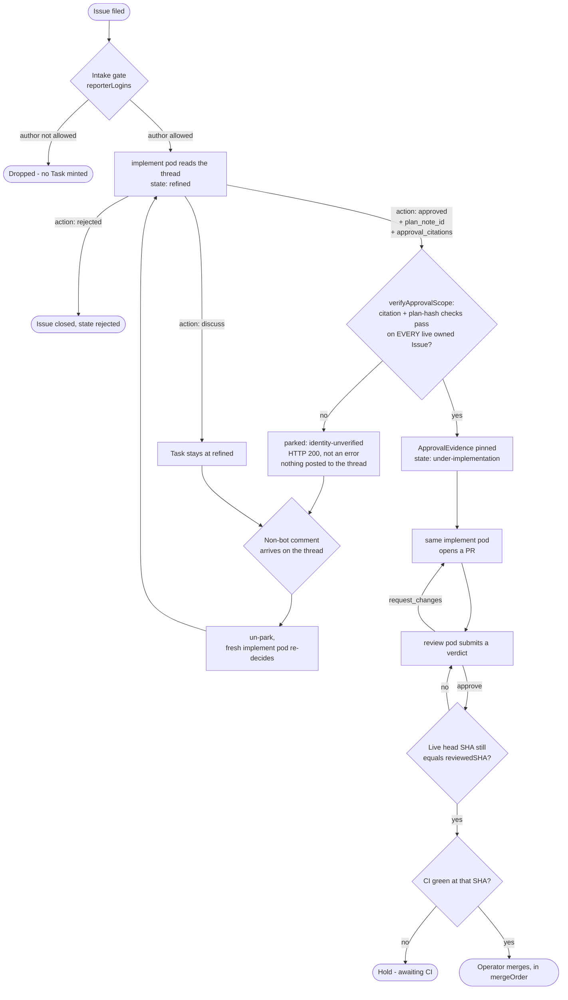

# Approval Gates

Tatara is designed to be useful without being autonomous. Three gates stand
between an issue arriving on a forge and code landing on `main`:

| Gate | What it holds back | Who opens it |
|---|---|---|
| Intake | Whether an issue becomes a Task at all | The sweep's orphan predicate plus `Project.spec.scm.reporterLogins` |
| Approval | Whether any code is written | The [approval grammar](#the-approval-grammar) below. The **implement** agent judges the thread and cites evidence, before writing a line of code; the operator independently verifies it. The Task sits at `refined` until that verification passes, then moves to `under-implementation` |
| Merge | Whether reviewed code reaches `main` | The **operator**, on an accepted `submit_outcome(verdict=approve)` from a review pod. The forge's native merge-on-green is never armed, and no MCP tool exposes a merge action |

!!! info "The approval gate moved into `implement` (contract 4, #521)"
    Before the #521 lifecycle redesign, a separate `clarify` agent kind ran
    this gate and handed off to `implement` only once it passed. `clarify`
    is now gone: its three decisions became `action` values
    (`approved`/`discuss`/`rejected`) on the `implement` outcome, so the same
    pod that judges the approval grammar goes on to write the code, in the
    same turn or a later one on the same Task. The verification mechanics
    below - the operator independently re-reading the cited comment rather
    than trusting the agent's say-so - are unchanged; only which pod
    declares the citation changed.

```mermaid
sequenceDiagram
    participant M as Maintainer
    participant SCM as SCM (GitHub/GitLab)
    participant OP as Operator
    participant AG as Agent pod (implement)

    OP->>SCM: open the issue thread, mirror it onto an Issue CR
    AG->>OP: implement: submit_outcome(action=approved, no citation yet)
    OP->>OP: verifyApprovalScope over every live owned Issue
    Note over OP: no comment to cite yet,<br/>park at identity-unverified
    M->>SCM: comment "go ahead, I approve!"
    SCM->>OP: issue_comment webhook (sender=M)
    OP->>OP: sync the comment mirror,<br/>un-park a fresh implement pod
    AG->>OP: implement: submit_outcome(action=approved,<br/>approving_maintainer=M, plan_note_id=..., approval_citations=[{id, quote}])
    OP->>OP: verify structurally: citation exists, author is a<br/>verified non-bot maintainer, quote occurs verbatim,<br/>not already consumed; plan-hash matches the pinned plan note
    OP->>OP: pin ApprovalEvidence on the Issue CR,<br/>Issue.status.status = approved
    OP->>OP: Task.status.state: refined -> under-implementation
    AG->>SCM: same pod (or its next turn) pushes a branch, opens a PR
    OP->>AG: spawn the review pod
    AG->>OP: review: submit_outcome(verdict=approve)
    OP->>SCM: the OPERATOR posts the review, then merges
```

## Gate 1: Intake - who can drive a Task into existence

The intake gate controls which issues and comments the operator acts on at all.
By default the gate is **open**: the operator mints Tasks from issues by any
author. When `spec.scm.reporterLogins` is non-empty the gate becomes
**restricted**: only these authors (plus the bot and any maintainer) may drive
the platform. Everything else is dropped at intake - sweep and webhook alike -
so unenrolled third parties cannot submit arbitrary work to agents.

The effective reporter set for a given repository is:

1. The configured `botLogin` - always trusted, unconditionally.
2. Every login in `spec.scm.maintainerLogins` - always trusted, unconditionally.
3. Every login explicitly listed in `spec.scm.reporterLogins` - trusted when the
   list is non-empty.

An empty `reporterLogins` disables the gate entirely.

!!! warning "Default: open intake"
    With an empty `reporterLogins`, any SCM user who can file an issue on an
    enrolled repository can drive tatara. Enable the gate for any project where
    the repositories are publicly visible or where you do not want unsolicited
    automation.

```yaml
apiVersion: tatara.dev/v1alpha1
kind: Project
metadata:
  name: my-project
spec:
  scm:
    provider: github
    owner: my-org
    botLogin: my-bot
    reporterLogins:       # restrict intake to these accounts
      - alice
      - ci-system
    maintainerLogins:     # see Gate 2 - the ONLY approval-granting set
      - alice
      - bob
```

Intake decides only whether the platform *listens*. It grants nothing. An
allowlisted reporter who is not a maintainer can open an issue and talk to an
`implement` agent all day; they cannot cause a line of code to be written.

## Gate 2: The approval grammar { #the-approval-grammar }

Approval is not a label, and it is not a wordlist match either. **A maintainer
comment is always required. The implement agent judges whether it approves; the
operator independently verifies the structural facts the agent's judgment
rests on.** The operator has no wordlist and does no text matching of its own -
it never decides what a comment *means*. It only checks that the comment the
agent cited is real, whose it is, and that the quoted text is genuinely there.

The agent's side, `submit_outcome(action=approved, ...)`:

- `reason` says in plain words **who** approved and **why** the agent read
  their comment that way.
- `plan_note_id` is **always required** on `action=approved`, including when
  no human commented: the id of the `task_note(kind="plan")` call that wrote
  the plan being approved. The operator hashes that note's body at grant and
  re-checks the hash before the agent writes any code - see
  [the plan pin](#the-plan-pin) below.
- `approving_maintainer` and `approval_citations` travel **as a pair - both,
  or neither**. `approval_citations` carries one `{id, quote}` pair for every
  Issue the Task owns **that a maintainer has commented on at all**: `id` is
  that comment's forge `external_id`, copied verbatim from the turn-0 bundle;
  `quote` is a verbatim substring of that comment's body. Neither field is
  required when the Issue satisfies the [auto-approve
  carve-out](#the-one-carve-out-with-no-comment-to-cite-autoapprovemaxsignificance)
  below - see clause 3 for what happens on an Issue with no maintainer comment.

The operator sets `Issue.status.status = approved` only when **all** of the
following hold, run by `restapi.verifyApprovalScope` over **every LIVE owned**
Issue - `state == "open"` and `status` not in (`done`, `rejected`); an
out-of-scope Issue is filtered out of the loop entirely and never has to
produce evidence - this is the single grant path; there is no other:

1. An `implement` Task submitted `action=approved`. That is the agent's
   judgment on scope and meaning, and it is a precondition, never itself an
   approval.
2. **Scope.** *Every* live Issue the Task owns satisfies clause 3. Not one of
   them. Every live one. One citation on one issue does not approve a Task
   spanning six repositories. Narrowing to live issues is deliberate: a human
   closing one issue of a multi-issue Task must not make approval require
   fresh evidence on a closed thread, forever.
3. For each live Issue:
    a. **No maintainer has commented on it at all.** Citations are irrelevant
       in this arm: the Issue either satisfies the
       [auto-approve carve-out](#the-one-carve-out-with-no-comment-to-cite-autoapprovemaxsignificance)
       or the whole check refuses with no-maintainer-comment. There is nothing
       for the agent to cite and nothing citing can fix.
    b. **A maintainer has commented**, so a citation is now required. For the
       cited comment `C`:
        i. `C` **exists** on that Issue - the operator looks it up by
           `external_id` in its own mirror (`Issue.status.comments`), never by
           trusting the agent's say-so, and its author is a maintainer,
           structurally excluding the bot.
        ii. The `quote` the agent cited **really occurs** as a substring of
            `C.body` as the operator itself holds it. The operator tries the
            quote exactly as submitted, then - because the turn-0 bundle
            XML-escapes comment bodies (contract E.1), so a maintainer's
            "let's ship it" renders as `let&apos;s ship it` and an agent
            citing that verbatim would otherwise be refused - the quote
            `html.UnescapeString`'d. Both are literal containment tests
            against the operator's own mirror; neither is a fuzzy match, and a
            fabricated quote fails both.
        iii. `C.externalId` is not the comment id already recorded in
             `Issue.status.approval.commentId`. **Approval evidence is
             single-use**: a consumed comment cannot approve a second time.
4. The operator then pins the evidence on the Issue CR, and once every owned
   Issue is approved, moves the Task from `refined` to `under-implementation`:

```yaml
status:
  status: approved
  approval:
    login: szymonrychu
    commentId: "1234567"
    createdAt: "2026-07-12T10:02:00Z"
    phrase: "go ahead, I approve!"
```

`phrase` here is the **matched** form of the agent's quote - exactly as
submitted if that literal substring occurred in the comment body, or the
`html.UnescapeString`'d form if only that one occurred - not necessarily
byte-identical to what the agent submitted, and not a match against any
configured wordlist. The `Project.spec.scm` field that used to hold a closed
phrase list is gone, and there is no replacement: what approves is the
maintainer's comment as the agent read it and the operator verified it, not
membership in a closed set of strings.

### The plan pin { #the-plan-pin }

Approval grants a **specific plan**, not a blank check. `plan_note_id` is
mandatory on every `action=approved` call, human comment or not: it names the
`task_note(kind="plan")` the agent wrote before asking for the go-ahead. The
operator hashes that note's body at grant time and re-checks the hash
immediately before the pod's next code-writing turn - if the plan note has
changed since, the Task routes back to `refined` (`plan-hash-mismatch`)
instead of proceeding on a plan nobody approved. This closes a hole the
pre-#521 gate did not have to think about: when the same pod both judges
approval and writes the code, "the plan I got approved" and "the plan I am
about to implement" are two separate reads that must be pinned to the same
note, not two names for the same variable.

### There is no most-recent-comment requirement, and that is deliberate

Clause 3 does **not** require the cited comment to be the thread's most recent
maintainer comment. Requiring that would deadlock an ordinary thread: a
maintainer who writes "go ahead, I approve!" and later adds "thanks - ping me
when the PR is up" has given unambiguous consent, but that later comment is not
itself a go-ahead, so a most-recent-only check could never be satisfied and the
Task would park forever with no path out.

Whether a later maintainer comment actually **withdraws** an earlier approval
is an intent question, and intent is the agent's job under this design, not the
operator's - the operator only checks structure. An implement pod that reads a
later maintainer comment as a withdrawal or qualification of an earlier
approval must submit `action=discuss`, not cite the stale approval. This is a
real, accepted narrowing of the operator's backstop relative to the old
wordlist grammar's "most recent wins" rule: a misjudging agent that cites a
genuinely-superseded approval is not caught structurally. See
[Prompt-Injection Defenses](prompt-injection.md#residual-risk-in-the-approval-gate-accepted)
for the full accounting of what is and is not covered.

### When the citation check runs

The check is not a one-shot at `implement`'s first outcome. It runs at
**both** of:

1. an `implement` Task's `submit_outcome(action=approved)`, and
2. **every non-bot event on a Task parked at `identity-unverified`** un-parks
   the Task and spawns a fresh `implement` pod - it does not grant approval by
   itself. That pod reads the refreshed thread and submits its own
   `action=approved` with a fresh citation through the same gate.

The webhook path never grants approval on its own any more: it only puts a
live agent back in front of the human who just commented. There used to be
two grant paths - one at the gate agent's outcome time, one on the webhook
comment path - and they have collapsed into the single
`restapi.verifyApprovalScope` call. Collapsing them removes a whole class of
the two paths ever disagreeing with each other.

### When it fails

If any check fails, the Task parks with `parkReason=identity-unverified` -
**HTTP 200, not an error.** **Nothing is posted to the issue thread.** The
refusal reason is recorded as a `Task.status.notes` entry, a WARN log line, and
the `operator_approval_refused_total{reason}` counter - visible to whoever
operates the platform, not to the maintainer waiting on the thread. Un-parking
requires a genuinely new non-bot comment on the thread, and there is nothing on
the thread itself prompting anyone to post one; if the situation is not
otherwise noticed, the Task can sit parked until it ages out at
`ParkRetention` and is reaped.

### Approval is not sticky

An Issue acquired *after* the Task reached `under-implementation` - through
`issue_write` creating one, or through a `refine` fold adopting one - **resets
the Task back to `refined`**, because clause 2 no longer holds. An agent
cannot widen its own mandate by adopting work after the gate closed behind
it.

!!! danger "Presence is not consent. A citation is not a grant."
    Before the 2026-07-11 hardening, the operator's `approvingMaintainer()`
    returned a maintainer-authored comment **without reading it**. A maintainer
    who commented "this looks like spam" on a thread thereby approved the work.
    The fix that followed added a literal phrase-match wordlist; this design
    replaces the wordlist itself. The agent now reads the comment and judges
    its meaning, and the operator verifies the structural facts underneath
    that judgment - who posted the cited comment, and that the quoted text is
    genuinely there - rather than matching text against a closed vocabulary.

!!! warning "Fail closed: an empty `maintainerLogins` approves nothing, ever"
    `spec.scm.maintainerLogins` is **closed by default**. An empty or unset list
    means the project has no maintainers, so no comment on the thread is ever
    a maintainer comment, no citation can ever pass the identity check, no
    evidence is ever pinned, and no Issue ever advances into implementation. A
    project must name its maintainers before tatara will write a line of code
    against it. There is no "any human" fallback here, unlike the intake gate.

### The one carve-out with no comment to cite: `autoApproveMaxSignificance`

There is one path where `ApprovalEvidence` is pinned with no maintainer comment
at all: a bot-authored proposal issue (from `brainstorm` or an `incident`
filing) is auto-approved with `login: <tatara:auto>` and `commentId: ""`, and
`auto: true` is stamped so the transition is queryable without log-scraping. It
exists alongside the citation check above, not instead of it - a maintainer
comment on an auto-approvable issue still routes through the normal citation
path, and the carve-out only fires when there is no maintainer comment for the
agent to cite in the first place.

`Project.spec.autoApproveMaxSignificance` is how much that path may ship:

| value | meaning |
|---|---|
| `off` (default) | The carve-out never fires. Every self-proposed chain parks at `backlog-sweep` until a human comments. |
| `patch` | A self-proposed change may ship at `patch` and no higher. |
| `minor` | ... at `minor` and no higher. |
| `major` | Unrestricted. |

The empty string reads as `off`. That is what makes the CRD upgrade fail closed:
the field replaced a boolean, so every Project written by an older operator
carries no value for it.

!!! danger "The auto-approve grant is PROVISIONAL, and it is settled at submit"
    `change_significance` does not exist on the wire until
    `submit_outcome(action=submitted)` - the agent declares it once the diff is
    real. So the ceiling cannot be enforced at the gate; the gate only asks
    whether the ceiling is above `off`. The **level** is checked at submit, and a
    declared significance over the ceiling is refused there with
    `over-auto-approve-ceiling`, however green the PR is. The work is not lost -
    the pod is alive, the branch is pushed, and the thread goes back to a human
    who can now see the diff they are being asked about.

    An approval a maintainer actually **cited** is never severity-limited. The
    ceiling bounds what tatara approves for *itself*; a human who read the plan
    and said go ahead already made the judgement it stands in for.

!!! warning "The ceiling measures a SELF-DECLARED level, so it bounds mistakes and not intent"
    `change_significance` is whatever the agent says it is. The operator checks
    that the value is in the enum and nothing anywhere compares it to the diff,
    so an agent that declares `patch` walks past a `minor` ceiling with a
    breaking change. A review outcome may also **raise**
    `MergeRequest.status.significance` past the ceiling, and nothing re-checks
    it there: that handler's Task is the review Task, which owns the merge
    requests and not the Issues the evidence lives on.

    Read the ceiling as a bound on how much tatara can ship **by honest
    accident**, not as a containment boundary against an agent trying to get
    past it. The containment boundary is `off`, which stops the self-approval
    path firing at all.

The other four axes of the carve-out are unchanged and all still hold: the issue
must be open, bot-authored, carry a valid `tatara-proposed-by` marker, and still
match its filing-time `Spec.proposalBodyHash` anchor. Raising the ceiling widens
what an already-qualifying proposal may ship; it does not qualify anything new.

## The ship gate: no merge request can carry unapproved work

The grammar above decides whether an agent may **start**. A second, separate
check decides whether the change may **leave**, and until it existed the first
one could simply be skipped: `mr_write(action=open)` checked the head branch,
idempotency and outstanding work, and `submit_outcome(action=submitted)` checked
only the plan hash. Neither read `Issue.status.approval` at all, so an implement
agent that never called the gate - or that was refused by it and wrote the code
anyway - still opened the PR, and neither the reviewer nor the merge corridor
downstream has an approval check of its own.

Both now refuse `409 {reason: "approval-required", ...}` while any **live owned**
Issue is not clear to ship, with one entry per blocking issue:

| issue state | `detail` | remedy |
|---|---|---|
| no evidence, no maintainer comment | `needs-maintainer-comment` | a human has to speak; the agent cannot reach this itself |
| no evidence, a maintainer HAS commented | `needs-approval-tool` | the agent has everything it needs and has simply not called `submit_outcome(action=approved)` |
| auto evidence, declared significance over the ceiling | `over-auto-approve-ceiling` | a maintainer comment plus a real citation, or a smaller change |

Every entry carries a `guidance` sentence naming the next step. The two
no-evidence details are split precisely because their remedies differ: one waits
on a person, the other is a tool call the agent can make in the same turn.

!!! note "Zero live owned Issues is zero blockers, deliberately"
    A takeover Task owns no Issue at all and was authorised more strictly than
    this gate would be, at the takeover endpoint, by a maintainer comment the
    operator verified. An adopted upgrade Task owns a merge request and no Issue.
    Requiring evidence from an empty set would wedge both permanently, so an
    empty set is ungated here. Note that the **grant** path has the opposite
    rule - `verifyApprovalScope` refuses an empty live set, because there an
    empty set means nothing was approved. They are different questions.

    The idempotent `mr_write(action=open)` answer - "you already have MR #N" -
    also survives the gate. It reaches no forge, and a TTL-stopped pod resuming
    needs the number of the merge request it already has.

## Every gate answer guides the agent

`submit_outcome(action=approved)` returns `granted: true` with a `guidance`
string and the Task under `task`, or `granted: false` with `reason`, `declared`
and `guidance`. The ship refusals carry per-issue `guidance` too.

`reason` is a closed constant and a Prometheus label: it names the fault and says
nothing about the remedy, and the remedies genuinely differ per reason -
`plan-note-not-plan` is repaired in the same turn, `no-maintainer-comment` cannot
be repaired by the agent at all. Collapsing that distinction is what produced a
real stall: an agent refused `no-maintainer-comment` could not tell which of five
carve-out axes had closed, concluded it needed a comment it had no way to obtain,
and spent its turn on `action=discuss`.

The guidance is derived operator-side from maps that are total over the closed
vocabularies, pinned by test. `tatara-cli` renders whatever rides the refusal and
holds no second copy of the vocabulary, so a blocker the operator adds later
needs no cli release.

## Labels are write-only

Labels are a **projection** of `Issue.status.status`, never a source of it. The
operator writes them; nothing reads them back into a decision.

```
Issue.status.status   is written ONLY by the approval grammar above, and by the
                      operator's own lifecycle writes (rejected, done).
Labels                are a ONE-WAY PROJECTION of it, written by the operator.
                      No label is EVER read to produce a status. A test in the
                      operator's suite asserts it.
```

There is **no label-to-status path at all** - not from the sweep, not from a
reconcile, and not from the webhook either. An earlier design kept a webhook-only
path, on the reasoning that the webhook alone sees a verified `sender` and could
therefore refuse a bot-written label, where a cron - which sees no sender - would
launder one into an approval. That guard is gone along with the path it guarded:
the three label-name fields the old model configured on `Project.spec` (the
approval, idea and rejected label names) are **removed from the CRD**, and no
label anywhere means "approved" to anything in the control path.

The only label read anywhere in the control path is `tatara-parked`, and it
decides **cost, not authority**: the sweep uses it to mint a parked Issue as a
cheap, pod-less Task instead of an active one. Forging that label onto an issue
buys an attacker a Task that stays parked. It fails safe. Forging a label that
meant "approved" would have bought them production.

`issue_write` has **no `labels` parameter and no `status` parameter**. An agent
cannot stamp a label, so it cannot self-escalate by stamping one.

## Gate 3: Merge - an operator action

Merge is an **operator** action, triggered by a review agent's approval. It is
never an agent action, and the forge's native merge-on-green is never armed on a
tatara PR.

A `review` pod reads the diff and submits `submit_outcome`. If the verdict is
`approve`, the operator - not the agent - posts the SCM review, then walks
`Task.spec.mergeOrder` and merges each repository in turn:

1. It reads the **live** head SHA from the forge, never the mirror.
2. If the live head no longer equals `MergeRequest.status.reviewedSHA`, the head
   moved under the review. The MR is reset to unreviewed and the Task goes back
   to `reviewing`. Reviewed code is what merges, or nothing does.
3. It merges only on green CI at that exact SHA. A `409` or a "head sha changed"
   from the merge call sends the Task back to `reviewing` too, which closes the
   window between the check and the merge.

Two things follow, and they are the whole design:

- **No MCP tool exposes merge.** There is no merge action in any tool profile,
  for any agent kind. A hallucinated merge has nothing to call.
- **Agents never post SCM reviews either.** The operator writes the review from
  the accepted verdict. The platform has one bot identity, and a forge will not
  let an identity post an approving review on its own pull request - so the
  review the operator posts is a comment carrying the verdict, and the
  **approval of record is the merge itself**, not a green review check on the PR.

!!! danger "Accepted risk: one bot identity means the merge gate is operator logic"
    The merge gate is **operator logic, not a forge-enforced control.** An agent
    pod holds `GIT_TOKEN` - the same bot credential the operator merges with -
    and the forge cannot tell a merge request made by a pod apart from one made
    by the operator. A deliberately malicious or catastrophically confused agent
    could merge its own PR by calling the forge API directly.

    This risk is **accepted explicitly**, and it is the direct consequence of
    running one bot identity. It is not a defect awaiting a fix, and the obvious
    countermeasure does not exist: **branch protection cannot require an
    approving review**, because nothing on this platform could ever satisfy such
    a rule, so enabling it would deadlock every merge.

    The answer is detection, not prevention: a merge the operator did not
    initiate is caught by the sweep - it finds a merged MR with no merge-cursor
    advance - and raises `operator_unexpected_merge_total`, a critical alert.

### What is in scope under one identity

Three controls remain available and are all worth having:

1. **Branch protection forbidding direct pushes to `main` on every repository.**
   This stops `git push origin HEAD:main` outright and needs no review
   requirement at all. It is the single highest-value control available under one
   identity, and it is cheap.
2. **A scoped installation token in place of an org-wide PAT**, so the blast
   radius of a leaked pod token is one installation rather than the whole
   organisation.
3. **`gh`, `glab`, and direct-to-forge-API `curl` on the wrapper's deny-list**, so
   a compliant agent has no ergonomic path to the merge endpoint even though a
   determined one has a possible path.

!!! note "The `gh` ban is an IN-CLUSTER ban"
    **In-cluster agent pods** may not use `gh` or `glab`, and may not merge. That
    is enforced structurally: the MCP profile exposes no merge action, and the
    tools are denied in the pod.

    **Workstation skills** - `start-development` and everything it drives, run by
    a human at a terminal with their own forge credentials - **keep `gh` and keep
    human-driven merge.** They do not go through MCP profile gating, and the
    ban's enforcement mechanism does not reach them.

    The rule is about what an autonomous pod may do with the platform's bot
    identity, not about what a human may do with their own.

## Per-repository overrides

Both allowlists can be overridden at the Repository CR level, independently of
the Project. This lets you tighten gates on sensitive repositories without
changing the project-wide defaults.

```yaml
apiVersion: tatara.dev/v1alpha1
kind: Repository
metadata:
  name: payments-service
spec:
  projectRef: my-project
  url: https://github.com/my-org/payments-service
  maintainerLogins:    # overrides project-level for this repo only
    - alice
    - security-lead
  reporterLogins:      # overrides project-level for this repo only
    - alice
    - security-lead
```

Override semantics:

| Field on Repository | Effect |
|--------------------|--------|
| Not set (`null`) | Inherits the Project's list |
| Set to an explicit list (including empty `[]`) | Replaces the Project's list for this repository only |

An explicit empty list `[]` **opens** intake for that repository to any SCM
author, regardless of the project-level `reporterLogins`. To close intake to only
the bot and maintainers, set `reporterLogins` to a non-empty list containing only
the trusted accounts.

Setting `maintainerLogins` to an explicit empty list `[]` for a repository has
the opposite effect: it **closes** the approval gate for that repository - no
maintainer, so no comment there can ever approve anything - even if the
project-level list is non-empty.

## The complete approval flow


```mermaid
flowchart TD
    A([Issue filed]) --> B{Intake gate\nreporterLogins}
    B -- author not allowed --> Z1([Dropped - no Task minted])
    B -- author allowed --> C[implement pod reads the thread\nstate: refined]
    C -- action: rejected --> D([Issue closed, state rejected])
    C -- action: discuss --> E[Task stays at refined]
    C -- "action: approved\n+ plan_note_id\n+ approval_citations" --> F{verifyApprovalScope:\ncitation + plan-hash checks pass\non EVERY live owned Issue?}
    F -- no --> P[parked: identity-unverified\nHTTP 200, not an error\nnothing posted to the thread]
    F -- yes --> G[ApprovalEvidence pinned\nstate: under-implementation]
    P --> H{Non-bot comment\narrives on the thread}
    H --> R[un-park,\nfresh implement pod re-decides]
    R --> C
    E --> H
    G --> I[same implement pod\nopens a PR]
    I --> J[review pod submits a verdict]
    J -- request_changes --> I
    J -- approve --> K{Live head SHA still\nequals reviewedSHA?}
    K -- no --> J
    K -- yes --> L{CI green at that SHA?}
    L -- no --> M([Hold - awaiting CI])
    L -- yes --> N([Operator merges, in mergeOrder])
```
