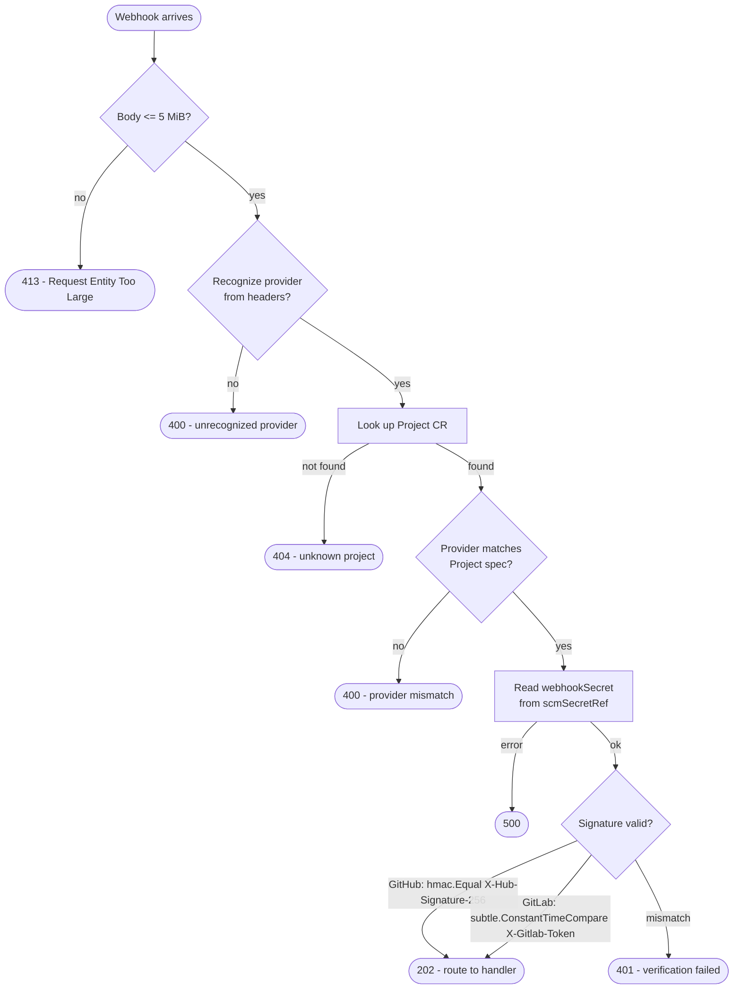

# Webhook & Egress Security

The operator exposes two categories of inbound HTTP paths that carry untrusted
external data: SCM webhooks (GitHub/GitLab push and issue events) and Grafana
alert callbacks. It also receives internal callbacks from short-lived agent
pods. Each path has a different threat model and a correspondingly different
authentication mechanism.



---

## Webhook HMAC verification

### GitHub

GitHub signs every webhook delivery with the `X-Hub-Signature-256` header:

```
X-Hub-Signature-256: sha256=<hex(HMAC-SHA256(secret, body))>
```

The operator verifies this using `crypto/hmac` with `sha256.New` and compares
the result with `hmac.Equal`, which is constant-time and prevents timing attacks:

```go
m := hmac.New(sha256.New, []byte(secret))
m.Write(body)
if !hmac.Equal([]byte(got), []byte(want)) {
    // reject 401
}
```

A missing or malformed header, or a hex value that does not match, returns
`401 Unauthorized`. The body is always read before the check so a timing
difference between "header missing" and "header invalid" does not exist.

### GitLab

GitLab uses a static shared token rather than a per-payload HMAC. The token
is sent as a plain header:

```
X-Gitlab-Token: <secret>
```

The operator validates it with `subtle.ConstantTimeCompare` from `crypto/subtle`
to prevent timing attacks. A missing or mismatched token returns `401`.

### Grafana alerts

The Grafana alert endpoint (`POST /operator/webhooks/{project}/grafana`) is
separate from the SCM webhook route and requires the Project to have
`spec.grafana.enabled: true`. Authentication uses HTTP Bearer:

```
Authorization: Bearer <secret>
```

The operator strips the `Bearer ` prefix and compares the token with
`subtle.ConstantTimeCompare` against the `webhookSecret` key from the Secret
named in `spec.grafana.secretRef`. Mismatch returns `401`.

!!! note "Grafana alert events that are not `firing` are silently accepted (202) and discarded."

### Provider mismatch guard

Before reading the webhook secret, the operator checks that the provider
identified from the delivery headers (GitHub's `X-GitHub-Event` or GitLab's
`X-Gitlab-Event`) matches the `spec.scm.provider` configured on the Project
CR. A mismatch returns `400 Bad Request` without ever touching the secret.

This prevents a cross-project routing mistake (a GitHub delivery arriving at a
GitLab-configured project) from producing a misleading `401 bad_signature`
response that would hide the configuration error.

### Body size limit

All webhook bodies are capped at 5 MiB before any parsing or signature work.
Deliveries exceeding this limit return `413 Request Entity Too Large`. The SCM
retries them, but tatara will never process them.

---

## The `webhookSecret` key in the scmSecret

The operator reads the shared secret from a Kubernetes Secret in the operator
namespace. The Secret name is the value of `spec.scmSecretRef` on the Project
CR. The key within that Secret must be named exactly `webhookSecret`.

```yaml
apiVersion: v1
kind: Secret
metadata:
  name: my-project-scm   # matches spec.scmSecretRef
  namespace: tatara
stringData:
  webhookSecret: "your-webhook-secret-here"
  # ...other keys: scmToken, etc.
```

In the recommended tatara-helmfile deployment pattern the Secret is rendered
from SOPS-encrypted values:

```yaml
# tatara-helmfile values/tatara-operator/prod.secrets.yaml (sops-encrypted)
scmWebhookSecret: "your-webhook-secret-here"
scmSecretName: "my-project-scm"
```

The `scmWebhookSecret` value in `values.yaml` is the chart scalar that lands
in the rendered Secret under the `webhookSecret` key. Do not set it in
plaintext; always supply it through an encrypted values overlay.

!!! warning "Empty `webhookSecret` fails at startup, not at delivery"
    If the Secret exists but the `webhookSecret` key is missing or empty, the
    operator returns `500 Internal Server Error` on the first webhook delivery
    for that project. Provision and verify the secret before registering the
    webhook URL with your SCM provider.

---

## Callback HMAC (optional)

When an agent turn completes, the wrapper pod POSTs to the operator's internal
callback endpoint:

```
POST /internal/turn-complete
```

This endpoint is exposed on `internalAddr` (default `:8082`), reachable only
via the in-cluster `tatara-operator-internal` Service. NetworkPolicy is the
primary guard - only pods with the operator's selector labels can reach port
8082.

For environments where that NetworkPolicy boundary is considered insufficient,
an additional HMAC can be configured. Set `callbackHmacSecretName` in the
operator values to the name of a Secret whose `callback-hmac-secret` key holds
a shared secret:

```yaml
# values.yaml (supplied by tatara-helmfile encrypted overlay)
callbackHmacSecretName: "tatara-callback-hmac"
callbackHmacSecret: "your-callback-hmac-secret-here"
```

When configured, every wrapper pod receives the secret via a `SecretKeyRef`
environment variable (`CALLBACK_HMAC_SECRET`) and signs its callback body:

```
X-Tatara-Signature: sha256=<hex(HMAC-SHA256(secret, body))>
```

The operator verifies this with `hmac.Equal` (constant-time). Requests with a
missing or mismatched signature return `401 Unauthorized`.

When `callbackHmacSecretName` is empty the HMAC check is skipped entirely and
NetworkPolicy remains the sole control. There is no partial state: the feature
is either fully on (both operator and wrapper share the secret) or fully off.

!!! tip "Should you enable callback HMAC?"
    Enable it if you run the operator at `replicaCount > 1` and are concerned
    about a compromised agent pod constructing spoofed turn-complete payloads to
    manipulate Task state. For most single-replica deployments the NetworkPolicy
    boundary is sufficient.

---

## Callback URL constraints

The operator injects the callback URL into each wrapper pod as `CALLBACK_URL`.
Before submitting a turn, the wrapper validates the URL with
`validateCallbackURL` in `internal/httpapi/messages.go`. The rules:

| Check | Allowed | Blocked |
|-------|---------|---------|
| Scheme | `http`, `https` | Anything else |
| Literal `localhost` | - | Blocked unconditionally |
| Loopback IP | - | `127.x.x.x`, `::1` |
| Unspecified | - | `0.0.0.0`, `::` |
| Link-local | - | `169.254.x.x`, `fe80::/10` (covers EC2/GCP metadata) |
| Private ranges | - | RFC1918 `10/8`, `172.16/12`, `192.168/16`; IPv6 ULA `fc00::/7` |
| Hostname (DNS name) | Allowed (resolves at delivery) | - |

The rationale for allowing `http` scheme is that the callback target is always
an in-cluster ClusterIP Service with no external exposure. TLS on an internal
service that never touches the internet adds operational cost without security
value. The IP-range guards provide the SSRF protection: a redirect or a crafted
URL that points to a cloud metadata endpoint (`169.254.169.254`) or a private
service is blocked at the IP level regardless of scheme.

Configure the callback URL via `callbackUrl` in the operator values. Set it to
the in-cluster DNS name of the `tatara-operator-internal` Service:

```yaml
# values/tatara-operator/common.yaml
callbackUrl: "http://tatara-operator-internal.tatara.svc:8082"
```

---

## Agent pod hardening

Agent (wrapper) pods are spawned dynamically by the operator's task controller.
Their security context is built from the `PodConfig` struct, driven by
operator-level values.

### Non-root UID

The wrapper image runs as a named non-root user. To lock the container to a
numeric UID (required by `runAsNonRoot: true` - the kubelet will reject a
named user string):

```yaml
# values/tatara-operator/common.yaml
agentRunAsNonRoot: true
agentRunAsUser: 10001   # wrapper image UID; must be numeric
agentFsGroup: 10001     # optional: volume ownership
```

!!! warning "Default is `agentRunAsNonRoot: false`"
    The chart ships cluster-agnostic defaults. The deploying helmfile must
    explicitly opt in to non-root enforcement. If `agentRunAsNonRoot: true` is
    set without a numeric `agentRunAsUser`, the operator refuses to start with
    a configuration error (`RunAsNonRoot=true requires RunAsUser to be set`).

### Network isolation

Agent pods carry the label `tatara.dev/managed-by: tatara-operator` and are
selected by the `managedPodNetworkPolicy` described in the next section. That
policy is the primary pod-level hardening control: it restricts both ingress
(operator-only) and egress (DNS + allowlisted services).

### Restart policy

All wrapper pods are launched with `RestartPolicy: Never`. The operator's boot
crash handler monitors `ContainerStatus.State.Terminated.Message` (populated
from the container's last stdout/stderr on non-zero exit) and surfaces the
crash reason without requiring log API access. A crashed pod is never
automatically restarted by the kubelet; the operator decides whether to respawn.

---

## Network egress allowlist

The chart ships a `NetworkPolicy` that applies to all pods labeled
`tatara.dev/managed-by: tatara-operator` (agent pods and repo-ingester Jobs).
It is enabled by default via `managedPodNetworkPolicy.enabled: true`.

### Ingress to agent pods

Only the operator itself may initiate connections to agent pods, and only on
port 8080 (the wrapper's HTTP API). No other ingress is permitted.

### Egress from agent pods

| Destination | Port | Purpose |
|-------------|------|---------|
| `kube-dns` (any namespace) | 53 UDP + TCP | DNS resolution |
| `tatara-memory` pods | 8080 TCP | Memory graph reads/writes |
| `tatara-chat` pods | 8080 TCP | Chat context (configurable name via `chatServiceName`) |
| Operator pods (same selector) | 8080 TCP | REST API (MCP tools, turn submission) |
| Operator pods (same selector) | 8082 TCP | Turn-complete callback (`/internal/turn-complete`) |
| Any namespace | 443 TCP | SCM API (GitHub/GitLab), Anthropic API, Keycloak |

The external HTTPS rule (`443` to any namespace) is intentionally broad. CIDR
tightening for GitHub/Anthropic/Keycloak endpoints is deferred because the IP
ranges are not stable and maintaining them would be brittle. The rule covers
exactly the traffic agents need for SCM operations and Claude API calls; all
other ports and protocols are denied by default-deny egress semantics.

### Internet egress for brainstorm pods

Brainstorm tasks configured with the `internet` source (for `WebSearch` /
`WebFetch` tools) require unrestricted outbound HTTPS. The operator stamps the
label `tatara.io/egress: internet` on these pods at spawn time.

A separate `NetworkPolicy` named `tatara-egress-internet` must be applied
manually via `kubectl apply` (it is not helm-managed, per the cluster-agnostic
chart rule):

```yaml
# deploy-samples/tatara-egress-networkpolicy.yaml
apiVersion: networking.k8s.io/v1
kind: NetworkPolicy
metadata:
  name: tatara-egress-internet
  namespace: tatara
spec:
  podSelector:
    matchLabels:
      tatara.io/egress: internet
  policyTypes:
    - Egress
  egress:
    - to:
        - namespaceSelector: {}
          podSelector:
            matchLabels:
              k8s-app: kube-dns
      ports:
        - port: 53
          protocol: UDP
        - port: 53
          protocol: TCP
    - to:
        - ipBlock:
            cidr: 0.0.0.0/0
      ports:
        - port: 443
          protocol: TCP
```

This policy is additive: it grants internet egress on top of the baseline
`tatara-operator-managed-pods` policy. Brainstorm pods that do not carry the
`internet` label are unaffected. Pods without any label (memory, neo4j, chat)
are not selected by either policy and retain open egress until the namespace
receives a default-deny rule.

!!! warning "Applying a namespace-wide default-deny egress policy requires auditing all pods"
    The `tatara-egress-internet` policy does not introduce a default-deny rule.
    Adding one would newly restrict memory, neo4j, CNPG, and chat pods that
    currently have open egress. Harden the namespace only after mapping the
    required egress for every workload it contains.

---

## Reporter intake gate (prompt-injection defense)

The webhook handler applies an allowlist check before creating or reactivating
any Task. The effective check for a given issue or comment:

1. **Bot login** - always accepted, unconditionally.
2. **Maintainer logins** (`spec.scm.maintainerLogins` or per-repo override) -
   always accepted.
3. **Reporter logins** (`spec.scm.reporterLogins` or per-repo override) -
   accepted when the list is non-empty and the author is listed.
4. **Empty reporter list** - open behavior; any author is accepted.

An empty actor login (which could indicate a malformed webhook) is rejected
when an active reporter gate exists. The gate fires on both direct issue events
and `issue_comment` events, so a comment from an unlisted account cannot
reactivate a parked task or queue an interjection into a live session.

See [Prompt-Injection Defenses](prompt-injection.md) for the full layered
defense model, including the bot-identity gate and the headless-agent
picker-denial.
