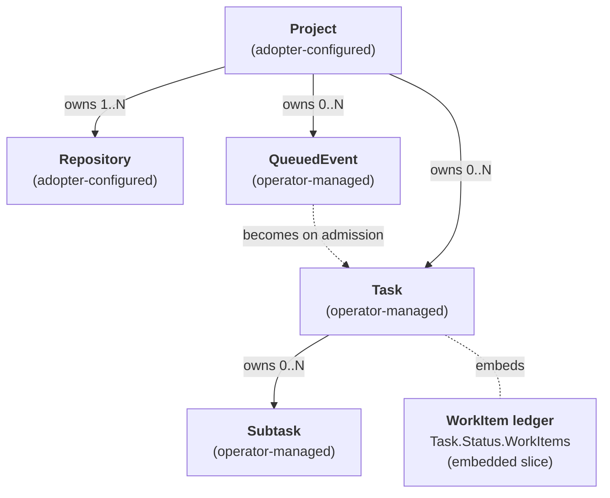
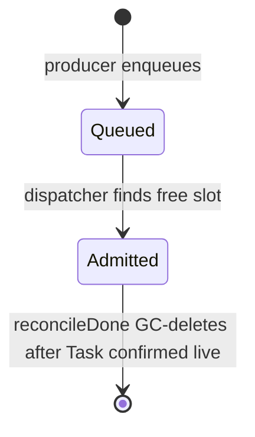

# Custom Resource Reference

All tatara custom resources live in the `tatara.dev/v1alpha1` API group. There are five CRDs: two that you configure as an adopter and three that the operator manages autonomously. The work-item ledger is embedded in `Task.Status` rather than a separate CRD.

## CRD taxonomy

### Adopter-configured

You create and own these resources. The operator reads them but never overwrites spec fields.

| CRD | `kubectl` print columns | Description |
|-----|-------------------------|-------------|
| [`Project`](project.md) | `Webhook` | Top-level grouping: SCM provider, agent configuration, memory stack, queue policy, cron schedule |
| [`Repository`](repository.md) | `Phase`, `Commit` | A git remote ingested into tatara-memory; one per repo enrolled in a Project |

### Operator-managed

The operator creates, updates, and garbage-collects these resources. Do not manually edit them in normal operation; editing `Task.Status` directly will be overwritten on the next reconcile.

| CRD | `kubectl` print columns | Description |
|-----|-------------------------|-------------|
| [`Task`](task.md) | `Phase`, `Lifecycle`, `Kind`, `Turns` | One agent session driving a repository toward a goal |
| [`QueuedEvent`](queued-event.md) | `Seq`, `Class`, `Kind`, `State` | Admission-queue entry; becomes a `Task` on dispatch |
| [`Subtask`](subtask.md) | `Order`, `Phase` | A unit of work fed to a running `Task` agent turn by turn |

`Task.Status.WorkItems` is a typed slice (`[]WorkItemRef`) embedded directly in the Task status - not a separate CRD. It is the authoritative ledger of every SCM artifact (issues, PRs, MRs) the task spans. See the [WorkItem reference](work-item.md) for field details.

## API group and version

```yaml
apiVersion: tatara.dev/v1alpha1
```

All resources are **Namespaced**. Deploy the operator and all CRs into the same namespace (typically `tatara`).

!!! note "API stability"
    The `v1alpha1` version signals that field names and defaults may change across releases. Pin your operator version in `tatara-helmfile` and review the changelog before upgrading.

## Ownership and relationships

The diagram below shows ownership (solid lines, `ownerReference`), derivation (dashed lines, logical), and embedding (dotted lines).



Key derivation rules:

- A `Project` must exist before any `Repository`, `QueuedEvent`, or `Task` can reference it.
- A webhook event or cron scan produces a `QueuedEvent`. The dispatcher promotes it to a `Task` when a concurrency slot is available.
- `clarify` tasks are given a deterministic name - `lc-` plus the first 16 hex chars of `sha256(projectName \0 issueRef \0 isPR-flag)`, e.g. `lc-3f2a9c1d4b6e0f78` - so repeated webhook deliveries for the same work item collide on `Create` (AlreadyExists) and stay idempotent. The `isPR` flag disambiguates a GitHub issue #N from a PR #N in the same repo. Grep `kubectl get tasks` for the `lc-` prefix, not for the issue number.
- `Subtask` resources are created by the agent via the MCP REST API; the Task reconciler feeds them to the running agent session one turn at a time.
- The `WorkItems` ledger is seeded from `Task.Spec.Source` on first reconcile and maintained by the operator as the agent drives MCP actions (open PR, merge, close issue).

## Task kinds and scoping

A `Task.Spec.Kind` determines whether the task is *repo-scoped* (requires `repositoryRef`) or *project-scoped* (must have an empty `repositoryRef`). The CRD schema cannot express this conditional; the reconciler enforces it at runtime and terminates tasks that violate it.

| Kind | Scope | Description |
|------|-------|-------------|
| `brainstorm` | project | Surveys all project repos + external research; proposes a linked issue set across affected repos |
| `incident` | project | Investigates a Grafana alert; files an evidence-backed incident proposal |
| `clarify` | project | Runs the triage/human conversation on a new or commented issue; hands off to `implement` |
| `implement` | project | Picks up the whole Task CR (all issues+comments+open PRs/MRs); opens/updates PRs across every affected repo under the Task |
| `review` | project | Reviews all PRs/MRs under a Task; approves (label + native review) or invokes `implement` again |
| `documentation` | repo (docs repo) | Schedule-driven: updates docs when non-trivial changes have landed since the last run |
| `refine` | project | Groom-only backlog peer: closes duplicates, dedups, recovers stalled `implement` runs |

!!! note "Retired kinds: still valid enum values, no longer created"
    `selfImprove`, `triageIssue`, `healthCheck`, and `issueLifecycle` remain in the
    `Task.Spec.Kind` CRD enum so pre-existing stored Tasks can still be read, but no production
    code path creates a new Task of any of these kinds. `triageIssue` and the front half of
    `issueLifecycle` were absorbed into `clarify`; `healthCheck` was absorbed into `brainstorm`;
    the back half of `issueLifecycle` (Merge/MainCI/Deploying) survives as the operator-only
    [deploy supervisor](../workflows/deploy-supervisor.md), not an agent kind. Treat any other
    reference to these four names elsewhere in the docs or CRD as historical.

!!! info "Almost everything is project-scoped now"
    Where the prior model split kinds roughly evenly between repo-scoped and project-scoped,
    six of the seven live kinds are now project-scoped - the Task CR is a cross-repo umbrella
    (see [Task reference](task.md#task-umbrella-and-the-workitem-ledger)) and `implement`/`review`
    write back across every affected repo under one Task. Only `documentation` stays repo-scoped,
    since it targets one docs repo per run.

## Conventions used in field tables

### kubebuilder defaults

Fields annotated `+kubebuilder:default=<value>` are enforced at admission by the CRD validation webhook. The default is written into the object on create if the field is omitted, so `kubectl get -o yaml` always shows the effective value. Defaults are not applied retroactively on upgrade; existing objects keep their stored value.

### Enum fields

Fields annotated `+kubebuilder:validation:Enum=...` are validated at admission. Only the listed values are accepted. The tables below list all valid enum values for each field.

### Pointer fields (nil vs empty)

Several fields use pointer types (`*bool`, `*[]string`, `*MemorySpec`) to distinguish between "not set / inherit from parent" and "explicitly set to the zero value / empty":

- `*bool` with `+kubebuilder:default=true`: nil is treated as `true` by the operator; set `false` explicitly to disable.
- `Repository.Spec.ReporterLogins *[]string`: nil inherits the Project's `scm.reporterLogins`; an explicit empty list `[]` opens intake for that repo only.
- `Repository.Spec.MaintainerLogins *[]string`: same inheritance pattern as `ReporterLogins`.
- `Project.Spec.Memory *MemorySpec`: nil uses the type defaults (`pgInstances: 1`, `pgStorage: 10Gi`, `neo4jStorage: 10Gi`).

### DEPRECATED fields

Several fields are retained for API backward-compatibility but have no effect. They are documented in the individual CRD pages and marked `DEPRECATED`. Do not set them in new configurations.

### Status conditions

All CRDs with a status subresource expose `status.conditions` as `[]metav1.Condition` (standard Kubernetes condition type). Use `kubectl describe` or the condition array to inspect readiness:

```bash
kubectl -n tatara get project my-project \
  -o jsonpath='{range .status.conditions[*]}{.type}{"\t"}{.status}{"\t"}{.message}{"\n"}{end}'
```

### kubectl printcolumns

The printcolumn markers define what `kubectl get` shows without `-o yaml`. All columns map to `status.*` fields so they reflect observed state, not desired spec:

```bash
# Task: shows Phase, Lifecycle, Kind, Turns at a glance
kubectl -n tatara get tasks

# Repository: shows ingest Phase and last ingested commit SHA
kubectl -n tatara get repositories
```

## Project.Status fields at a glance

| Field | Type | Description |
|-------|------|-------------|
| `webhookURL` | string | Full webhook URL to register with GitHub/GitLab |
| `conditions` | `[]metav1.Condition` | Operator-set readiness conditions |
| `memory.phase` | string | Phase of the per-project memory stack |
| `memory.endpoint` | string | In-cluster LightRAG/memory URL |
| `memory.externalEndpoint` | string | External URL when exposed |
| `grafana.phase` | string | Phase of the grafana-mcp sidecar |
| `grafana.endpoint` | string | In-cluster grafana-mcp endpoint |
| `lastMRScan` | `*Time` | Timestamp of most recent MR scan cycle |
| `lastIssueScan` | `*Time` | Timestamp of most recent issue scan cycle |
| `lastBrainstorm` | `*Time` | Timestamp of most recent brainstorm cycle |
| `lastDocumentation` | `*Time` | Timestamp of most recent documentation cron cycle |
| `lastCDScan` | `*Time` | Timestamp of the most recent push-CD deploy-supervision backstop sweep (the `cdScan` cron) |
| `lastRefine` | `*Time` | Timestamp of most recent refine pre-step |
| `tokenBudget` | object | Token-budget accumulator/snapshot: the custom-window running total and the latest Claude-subscription usage snapshot reported by the wrapper. See [Project reference](project.md). |

## Task.Status fields at a glance

`Task.Status` is split into two logical sections: fields that apply to all task kinds, and deploy-supervision fields populated only once a Task's PR has been review-approved and the deploy supervisor has taken it over.

### All kinds

| Field | Type | Description |
|-------|------|-------------|
| `phase` | enum | `Planning`, `Running`, `Succeeded`, `Failed`, `Deploying` (populated for every kind; `Deploying` only once the deploy supervisor has taken the Task over post-merge) |
| `podName` | string | Name of the current or most recent agent pod |
| `turnsCompleted` | int | Total agent turns executed |
| `prURL` | string | URL of the PR/MR opened (if any) |
| `resultSummary` | string | Human-readable summary of the run outcome |
| `conditions` | `[]metav1.Condition` | Operator-set conditions |
| `reviewVerdict` | object | Agent's review decision (`approve`, `request_changes`, `comment`) with optional inline suggestions |
| `prOutcome` | object | Agent's declared action on a bot-authored PR (`merge` or `close`) |
| `issueOutcome` | object | Agent's triage decision (`implement`, `close`, `discuss`) |
| `implementOutcome` | object | Agent's declared non-implementation reason (`declined`, `already_done`) |
| `brainstormOutcome` | object | Agent's declared no-proposal reason |
| `changeSummary` | object | Scope report: PR title/body, delivered scope, remaining scope, and the required `significance` (`major`/`minor`/`patch`) that drives the push-CD semver tag |
| `followupIssueURL` | string | URL of the follow-up issue opened for remaining scope |
| `workItems` | `[]WorkItemRef` | Work-item ledger (issues, PRs, MRs this task spans) |
| `pendingComments` | `[]string` | Agent-queued comments; posted on next reconcile then cleared |
| `pendingInterjections` | `[]string` | Mid-turn webhook comments delivered to the live session |
| `resolvedModel` | string | Model resolved at pod spawn (`modelForKind`); the model the token/cost metrics price against |
| `cumulativeTokens` | int64 | Total input+output tokens across all turns |
| `lastTurnInputTokens` | int64 | Input token count of the most recent turn (context-window pressure signal) |
| `cumulativeInput` / `cumulativeOutput` / `cumulativeCacheRead` / `cumulativeCacheCreation` | int64 | Per-category token totals across all turns (uncached input, output, cache-read, cache-creation) |

### Deploy-supervision only

Populated only once a Task's PR has been review-approved and the deploy supervisor has taken it
over - never populated for a `clarify`/`implement`/`review` Task still in agent-driven flow.

!!! note "Wire key vs. Go name"
    The JSON/CRD key is unchanged: `lifecycleState`. Only the Go struct field was renamed, to
    `DeployState` (`api/v1alpha1/task_types.go`). `kubectl -o jsonpath` and any Grafana panel or
    automation must read `.status.lifecycleState`, not `.status.deployState`.

| Field | Type | Enum values | Description |
|-------|------|-------------|-------------|
| `lifecycleState` | string | `Triage`, `Conversation`, `Implement`, `MRCI`, `Merge`, `MainCI`, `Deploying`, `Done`, `Stopped`, `Parked` (front four legacy-drain-only, never set by new-model kinds) | Current deploy-supervision phase (Go field: `DeployState`) |
| `lastActivityAt` | `*Time` | - | Last state transition or agent activity |
| `deadlineAt` | `*Time` | - | Babysit deadline; task is parked if exceeded |
| `headBranch` | string | - | Name of the task's feature branch |
| `prNumber` | int | - | PR/MR number in the SCM tracker |
| `mergeCommitSHA` | string | - | SHA of the merge commit after a successful merge |
| `mergedHeadSHA` | string | - | Head SHA of the most recently merged branch; guards against duplicate re-proposals |
| `cascadeStage` | string | `tagged`, `parent-pr-open`, `parent-merged`, `helmfile-applied` | Push-CD cascade progress during the `Deploying` phase |
| `deployedVersion` | string | - | Semver (`vX.Y.Z`) this Task's artifact is driving toward the cluster |
| `deployArtifact` | string | - | Deploy-ledger artifact identity (`repo@vX.Y.Z`) |
| `deployDeadline` | `*Time` | - | Deploy-cascade deadline; the Task parks recoverable (`deploy-timeout`) if exceeded |

`lifecycleIterations`, `implementGiveUps`, `implementEmptyRetries`, `writebackSkip4xxAttempts`,
`handover`, `conversationObjectKey`, `sessionID`, and `implementContext` move to Task-wide fields
(they now apply across the whole Task's `clarify`/`implement` conversation history, not one
phase-scoped lifecycle) - see [Task reference](task.md#conversation-resume-fields-all-kinds).

!!! warning "Terminal state detection"
    A `Task` is terminal when `phase` is `Succeeded` or `Failed`, **or** when `lifecycleState` is `Done`, `Stopped`, or `Parked`. `Deploying` (on either field) is not terminal. Use the `TaskTerminal()` helper in the Go client or check both fields in your automation.

## QueuedEvent lifecycle



The dispatcher evaluates the queue on every reconcile cycle. `normal`-class events consume from the main capacity pool (`queue.capacity`, default equals `maxConcurrentTasks`). `alert`-class events (Grafana incident webhooks) consume from a reserved pool (`queue.alertCapacity`, default `1`) so incidents are never starved by a full normal queue.

`QueuedEvent.Spec.DedupKey` prevents duplicate Task creation: if a `QueuedEvent` with the same `dedupKey` is already `Queued` or `Admitted`, a new event with the same key is dropped.

## WorkItem ledger roles and states

`Task.Status.WorkItems` is the single source of truth for every SCM artifact a task touches.

| Role | Applies to | Meaning |
|------|-----------|---------|
| `source` | issue or PR | The originating item that triggered this task |
| `proposed` | issue | An agent-created proposal issue awaiting human approval |
| `closes` | issue | An issue this task's PR will close on merge |
| `openedPR` | PR | A PR/MR the agent opened |
| `reviewed` | PR | A human-authored PR the agent reviewed |

| State | Meaning |
|-------|---------|
| `proposed` | Proposal issue created; awaiting human approval |
| `approved` | Human approved the proposal |
| `declined` | Human or triage agent declined the proposal |
| `implemented` | Implementation merged; issue closed |
| `open` | Issue or PR is open in the tracker |
| `closed` | Issue closed without merge |
| `merged` | PR/MR merged |

## Quick reference: required vs optional fields

=== "Project"

    ```yaml
    apiVersion: tatara.dev/v1alpha1
    kind: Project
    metadata:
      name: my-project
      namespace: tatara
    spec:
      scmSecretRef: tatara-scm          # required: Secret name with SCM token
      scm:
        provider: github                 # required: github | gitlab
        owner: szymonrychu             # required: org or user slug
        botLogin: szymonrychu-bot      # required: bot account login
      agent:
        model: claude-opus-4-8          # optional: defaults to operator env
      memory:                           # optional block; all fields have defaults
        pgInstances: 3                  # default 1
    ```

=== "Repository"

    ```yaml
    apiVersion: tatara.dev/v1alpha1
    kind: Repository
    metadata:
      name: my-project-tatara-operator
      namespace: tatara
    spec:
      projectRef: my-project            # required
      url: https://github.com/org/repo  # required
      reingestSchedule: "0 6 * * *"    # required: 5-field cron
      defaultBranch: main               # optional, default "main"
      ingestEnabled: true               # optional, default true
      semanticIngest: true              # optional, default true
    ```

See the individual CRD reference pages for the full field tables with all defaults, enums, and deprecation notices.
