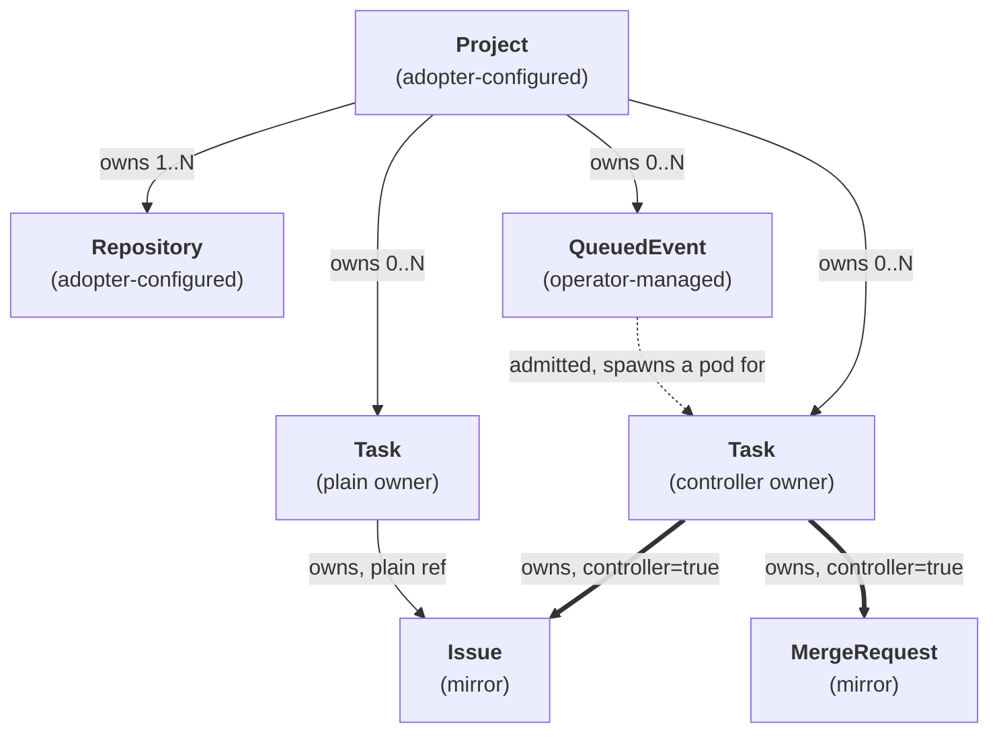
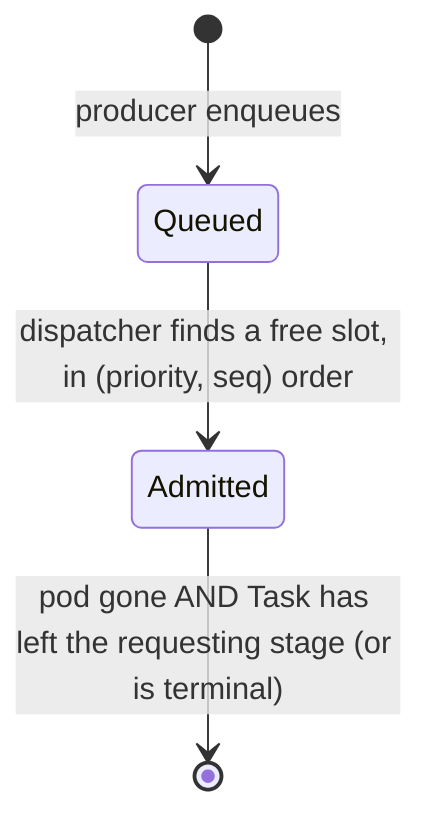

# Custom Resource Reference

All tatara custom resources live in the `tatara.dev/v1alpha1` API group. There are **six CRDs**: two that you configure as an adopter, and four that the operator manages autonomously.

## CRD taxonomy

### Adopter-configured

You create and own these resources. The operator reads them but never overwrites spec fields.

| CRD | `kubectl` print columns | Description |
|-----|-------------------------|-------------|
| [`Project`](project.md) | `Webhook` | Top-level grouping: SCM provider, agent configuration, memory stack, queue policy, cron schedule |
| [`Repository`](repository.md) | `Phase`, `Commit` | A git remote ingested into tatara-memory; one per repo enrolled in a Project |

### Operator-managed

The operator creates, updates, and garbage-collects these resources. Do not manually edit them in normal operation; editing `.status` directly will be overwritten on the next reconcile.

| CRD | `kubectl` print columns | Description |
|-----|-------------------------|-------------|
| [`Task`](task.md) | `Stage`, `Kind`, `Agent`, `Issues`, `MRs`, `Turns`, `Project`, `Description`, `Age` | One durable unit of agent work, carried by a succession of agent pods across its stage machine |
| [`QueuedEvent`](queued-event.md) | `Seq`, `Class`, `Kind`, `State` | Admission-queue entry; admitted into a pod-spawn (a new or existing `Task`) when a concurrency slot is available |
| [`Issue`](issue.md) (`iss`) | `Task`, `Repo`, `Num`, `State`, `Status`, `Comments`, `Age` | Mirror of one SCM issue: title, body, comments, and the platform's approval state. The bundle is rendered from this object, never a live forge call |
| [`MergeRequest`](merge-request.md) (`mr`) | `Task`, `Repo`, `Num`, `State`, `Status`, `CI`, `Age` | Mirror of one SCM pull/merge request: title, body, comments, CI status, mergeability |

## API group and version

```yaml
apiVersion: tatara.dev/v1alpha1
```

All resources are **Namespaced**. Deploy the operator and all CRs into the same namespace (typically `tatara`).

!!! note "API stability"
    The `v1alpha1` version signals that field names and defaults may change across releases. Pin your operator version in `tatara-helmfile` and review the changelog before upgrading.

## Ownership and relationships

The diagram below is a summary. `Issue` and `MergeRequest` are **multi-owned**: any `Task` currently responsible for an artifact holds a plain owner ref, and exactly one owner - the Task responsible *right now* - carries `controller=true`. See [Ownership, GC, and admission](../architecture/ownership.md) for the full treatment, including the controller-transfer rules.



Key derivation rules:

- A `Project` must exist before any `Repository`, `QueuedEvent`, `Task`, `Issue`, or `MergeRequest` can reference it.
- A webhook event or cron scan produces a `QueuedEvent`. The dispatcher admits it - either into an existing `Task` (a stage-driven pod respawn) or by minting a new one - when a concurrency slot is available.
- `Issue` and `MergeRequest` are the mirror: the operator syncs them from the SCM and every agent read (`scm_read(kind=issues|mr|comments)`) is served from these objects, never a live forge call. `scm_read(kind=ci)` is the one exception - CI status is read live.
- `clarify` Tasks are given a deterministic name so repeated webhook deliveries for the same issue collide on `Create` (`AlreadyExists`) and stay idempotent. See [Task naming](task.md).

## Task kinds and scoping

### Two enums, not one

A `Task` carries two kind-shaped fields and they mean different things. Conflating them is the single most common misreading of the model.

| Field | Meaning | Values |
|---|---|---|
| `Task.spec.kind` | The **origin**. Why this Task exists. Immutable; baked into the Task name. | `brainstorm`, `incident`, `clarify`, `refine`, `review`, `documentation` |
| `Task.status.agentKind` | The **running agent**. Which pod is executing right now. Changes as the Task advances through its [stage machine](task-stages.md). | the six above, plus `implement` |

`implement` is an **agent kind only**. There is no `implement` Task origin: a Task that started life as a `clarify` (a human filed an issue) runs an `implement` pod once it is approved, and a `review` pod after that. One Task, one durable object, many pods.

| Origin kind | Scope | Description |
|------|-------|-------------|
| `brainstorm` | project | Surveys all project repos + external research; proposes a linked issue set across affected repos |
| `incident` | project | Investigates a Grafana alert; files an evidence-backed incident proposal |
| `clarify` | project | Runs the triage/human conversation on a new or commented issue; hands off to an `implement` pod once approved |
| `review` | project | Reviews a human-authored PR/MR; can never itself reach `implementing`/`merging` - a human's PR is fixed by the human |
| `documentation` | repo (docs repo) | Schedule-driven: updates docs when non-trivial changes have landed since the last run |
| `refine` | project | Groom-only backlog peer: closes duplicates, dedups, recovers stalled Tasks |

!!! info "Only documentation is repo-scoped"
    `repositoryRef` is set **only** on `documentation` Tasks, which target one docs repo per run. Every other origin kind is project-scoped: the Task CR is a cross-repo umbrella, and its `implement`/`review` pods write back across every affected repo under that one Task.

Model and effort tiering (`Project.spec.agent.modelByKind` / `effortByKind`) keys on the **agent** kind, because that is what determines what the pod is about to do - see [`AgentSpec`](project.md#agentspec).

## Conventions used in field tables

### kubebuilder defaults

Fields annotated `+kubebuilder:default=<value>` are enforced at admission by the CRD validation webhook. The default is written into the object on create if the field is omitted, so `kubectl get -o yaml` always shows the effective value. Defaults are not applied retroactively on upgrade; existing objects keep their stored value.

### Enum fields

Fields annotated `+kubebuilder:validation:Enum=...` are validated at admission. Only the listed values are accepted. The tables below list all valid enum values for each field.

### Pointer fields (nil vs empty)

Several fields use pointer types (`*bool`, `*[]string`, `*MemorySpec`) to distinguish between "not set / inherit from parent" and "explicitly set to the zero value / empty":

- `*bool` with `+kubebuilder:default=true`: nil is treated as `true` by the operator; set `false` explicitly to disable.
- `Repository.Spec.ReporterLogins *[]string`: nil inherits the Project's `scm.reporterLogins`; an explicit empty list `[]` opens intake for that repo only.
- `Repository.Spec.MaintainerLogins *[]string`: same inheritance pattern as `ReporterLogins`.
- `Project.Spec.Memory *MemorySpec`: nil uses the type defaults (`pgInstances: 1`, `pgStorage: 10Gi`, `neo4jStorage: 10Gi`).

### DEPRECATED fields

Several fields are retained for API backward-compatibility but have no effect. They are documented in the individual CRD pages and marked `DEPRECATED`. Do not set them in new configurations.

### Status conditions

All CRDs with a status subresource expose `status.conditions` as `[]metav1.Condition` (standard Kubernetes condition type). Use `kubectl describe` or the condition array to inspect readiness:

```bash
kubectl -n tatara get project my-project \
  -o jsonpath='{range .status.conditions[*]}{.type}{"\t"}{.status}{"\t"}{.message}{"\n"}{end}'
```

### kubectl printcolumns

The printcolumn markers define what `kubectl get` shows without `-o yaml`. All columns map to `status.*` fields so they reflect observed state, not desired spec:

```bash
# Task: shows Stage, Kind, Agent, Issues, MRs, Turns, Project, Description, Age at a glance
kubectl -n tatara get tasks

# Repository: shows ingest Phase and last ingested commit SHA
kubectl -n tatara get repositories
```

## Project.Status fields at a glance

| Field | Type | Description |
|-------|------|-------------|
| `webhookURL` | string | Full webhook URL to register with GitHub/GitLab |
| `conditions` | `[]metav1.Condition` | Operator-set readiness conditions |
| `memory.phase` | string | Phase of the per-project memory stack |
| `memory.endpoint` | string | In-cluster LightRAG/memory URL |
| `memory.externalEndpoint` | string | External URL when exposed |
| `grafana.phase` | string | Phase of the grafana-mcp sidecar |
| `grafana.endpoint` | string | In-cluster grafana-mcp endpoint |
| `lastMRScan` | `*Time` | Timestamp of most recent MR scan cycle |
| `lastIssueScan` | `*Time` | Timestamp of most recent issue scan cycle |
| `lastBrainstorm` | `*Time` | Timestamp of most recent brainstorm cycle |
| `lastDocumentation` | `*Time` | Timestamp of most recent documentation cron cycle |
| `lastCDScan` | `*Time` | RETIRED - there is no independent deploy-supervision backstop cron any more; every stage's stall detection is a fixed per-stage clock. See [Project reference](project.md#status). |
| `lastRefine` | `*Time` | Timestamp of most recent refine pre-step |
| `tokenBudget` | object | Token-budget accumulator/snapshot: the custom-window running total and the latest Claude-subscription usage snapshot reported by the wrapper. See [Project reference](project.md). |

`Task.status` fields are documented on the [Task reference](task.md#taskstatus).

## QueuedEvent lifecycle



The dispatcher evaluates the queue on every reconcile cycle. Capacity comes from `Project.spec.maxConcurrentAgents` (not a Task-count lever): the admission unit is **one agent pod-spawn**, not one Task. A Task advancing to another pod-spawning stage enqueues a new `QueuedEvent`, so every pod-spawn passes the same chokepoint - `maxConcurrentAgents: 0` freezes the whole project mid-flight, including a Task already in flight.

Admission drains in ascending **`(priority, seq)`**, not plain `seq` FIFO. `QueuedEvent.spec.priority` has three values: `incident` (0), webhook-originated (1, a human is waiting on a thread right now), and cron/sweep-originated (2, proactive work). FIFO is preserved within a priority tier. `class=alert` (incidents) still gets a reserved capacity pool (`queue.alertCapacity`) on top of the priority ordering, so a busy normal queue can never starve an incident.

Dedup is a **natural key on a field**, never a hash and never a label selector: `QueuedEvent.spec.dedupKey` holds `iss:<repo>#<number>` or `mr:<repo>!<number>` (or an alert-group hash for incidents), looked up through the `issueKey`/`mrKey` field indexes on `Issue`/`MergeRequest` and the `queuedEventDedupKey` index on `QueuedEvent` itself. Kubernetes label values cannot carry `:` or `#`, so a label-based "natural key" would have been silently hashed back into an opaque digest - the exact failure mode this design avoids.

## Quick reference: required vs optional fields

=== "Project"

    ```yaml
    apiVersion: tatara.dev/v1alpha1
    kind: Project
    metadata:
      name: my-project
      namespace: tatara
    spec:
      scmSecretRef: tatara-scm          # required: Secret name with SCM token
      scm:
        provider: github                 # required: github | gitlab
        owner: szymonrychu             # required: org or user slug
        botLogin: szymonrychu-bot      # required: bot account login
      agent:
        model: claude-opus-4-8          # optional: defaults to operator env
      memory:                           # optional block; all fields have defaults
        pgInstances: 3                  # default 1
    ```

=== "Repository"

    ```yaml
    apiVersion: tatara.dev/v1alpha1
    kind: Repository
    metadata:
      name: my-project-tatara-operator
      namespace: tatara
    spec:
      projectRef: my-project            # required
      url: https://github.com/org/repo  # required
      reingestSchedule: "0 6 * * *"    # required: 5-field cron
      defaultBranch: main               # optional, default "main"
      ingestEnabled: true               # optional, default true
      semanticIngest: true              # optional, default true
    ```

See the individual CRD reference pages for the full field tables with all defaults, enums, and deprecation notices.
