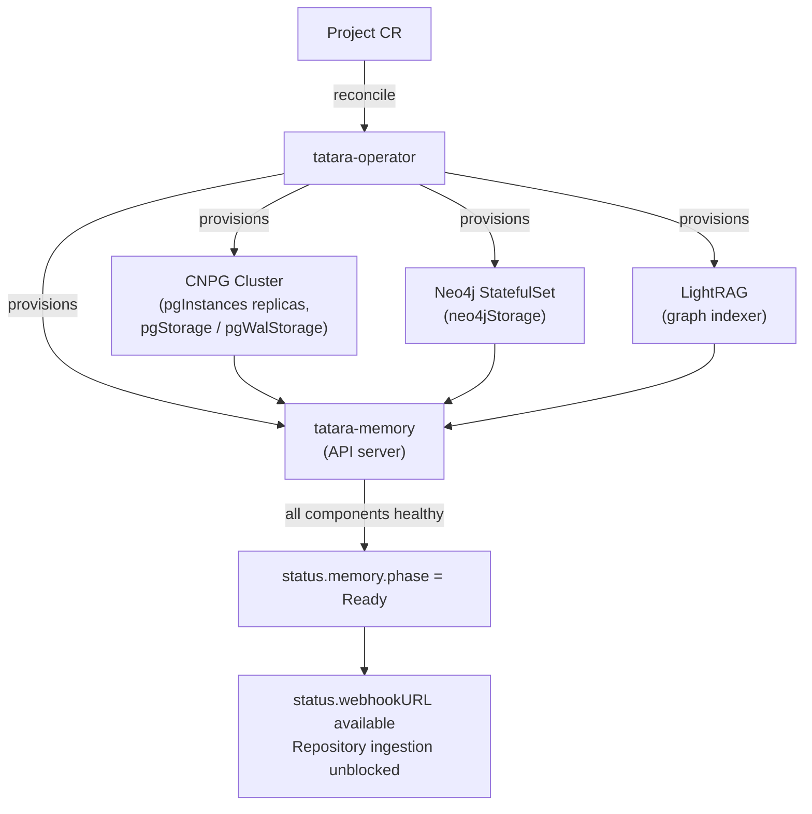

# Project Configuration

The configuration surface of the `Project` custom resource: what each field
controls, its type, its default, and the behavior it selects. It is the companion
to [Your First Project](../getting-started/first-project.md), which covers the
minimal Project only.

This page is organized by the thing being configured. For the same object
presented as an API schema, including the `.status` surface and the fields no
project normally sets, see the [Project CRD reference](project.md). Where the two
pages describe the same field they are describing the same field; the CRD
reference is authoritative on type and shape.

**API group / version:** `tatara.dev/v1alpha1`
**Kind:** `Project`
**Scope:** Namespaced

---

## Required and key top-level fields

`scmSecretRef` is the only field the API requires at the top level. Within
`spec.scm`, `provider`, `owner`, and `botLogin` are required.

| Field | Type | Default | Required | Description |
|---|---|---|---|---|
| `scmSecretRef` | `string` | - | **yes** | Name of the `Secret` in the same namespace. Key `token` holds the bot PAT (GitHub) or project access token (GitLab). |
| `scm.provider` | `string` | - | **yes** | One of `github`, `gitlab`. |
| `scm.owner` | `string` | - | **yes** | GitHub organization name or GitLab group path, as it appears in repository URLs. All enrolled repositories must live under this owner. |
| `scm.botLogin` | `string` | - | **yes** | Bot account username on the provider. Must be non-empty and must not appear in `maintainerLogins` or `reporterLogins`; both constraints are enforced by CEL rules on the CRD. |
| `triggerLabel` | `string` | `tatara` | no | Issue label that admits an issue into the agent loop. |
| `maxConcurrentAgents` | `int` | `3` | no | Caps simultaneously admitted agent **pods** project-wide. The admission unit is the pod-spawn, not the Task. `0` is the full-project pause: no `QueuedEvent` is admitted, so no pod and no Task is created. Minimum `0`; there is deliberately no minimum of `1`. |
| `agentPodTTLSeconds` | `int` | `3600` | no | Bounds one agent pod's life. The Task persists across as many pods as it needs; on expiry the operator takes a handoff turn and a fresh pod resumes. Minimum `300`. |
| `maxLivePods` | `int` | `2` | no | Caps how many Tasks may sit in a live (conversational) state at once. Clamped to `maxConcurrentAgents - 1` at read time so chatty threads cannot occupy the whole concurrency budget, except at `maxConcurrentAgents: 1` where the ceiling equals the cap. |
| `maxNewTasksPerSweep` | `int` | `5` | no | Caps how many Tasks one sweep pass may mint. Minimum `1`. |
| `maxOpenTasks` | `int` | `6` | no | Caps **active** Tasks: every Task whose stage is pod-eligible. A Task creation budget, distinct from the concurrency budget above. Minimum `1`. |
| `maxBundleBytes` | `int` | `400000` | no | Hard byte budget for a rendered [context bundle](context-bundle.md#the-byte-budget). Minimum `50000`. |

!!! note "`maxConcurrentAgents: 0` is the pause switch"
    The pause is a direct check at the top of admission, not a derived queue
    capacity. Every scan, brainstorm, and webhook-triggered event queues and
    nothing is admitted, including the next pod of a Task already in flight. See
    [Tuning](../operations/tuning.md).

### SCM Secret format

The Secret must exist in the Project's namespace before the Project is applied.

```yaml
apiVersion: v1
kind: Secret
metadata:
  name: tatara-scm
  namespace: tatara
type: Opaque
stringData:
  token: "ghp_..."   # bot PAT: contents, issues, pull requests, metadata, org members read
                     # (GitHub fine-grained) or api + read/write_repository (GitLab). No webhook scope.
```

No webhook scope is needed: the operator never registers webhooks. It validates
inbound payloads against a separately configured secret.

---

## Memory sizing

Each Project gets a dedicated memory stack: a CNPG-managed PostgreSQL cluster, a
Neo4j graph database, a LightRAG graph indexer, and the `tatara-memory` API
server the other components query. The stack persists the code-knowledge graph
agents traverse at runtime.



| Field (`spec.memory.*`) | Type | Default | Description |
|---|---|---|---|
| `enabled` | `*bool` | `true` | Tri-state: `nil` and `true` both mean enabled. Only an explicit `false` disables the whole stack, including its ServiceMonitor, PodMonitor, and PrometheusRule. Teardown is deliberately asymmetric: the PostgreSQL and Neo4j volumes are retained and reattached by name if the stack is re-enabled, while the LightRAG volume is deleted because its index is derived data rebuilt by re-ingesting. |
| `pgInstances` | `int` | `1` | CNPG cluster replica count. `1` for development, `3` for HA production. |
| `pgStorage` | `string` | `10Gi` | PVC size per PostgreSQL replica (PGDATA). Grows with repository count and embedding volume. |
| `pgWalStorage` | `string` | `8Gi` | PVC size per PostgreSQL replica for CNPG's dedicated WAL volume, separate from PGDATA. A WAL burst, or WAL retained for a lagging standby, cannot fill PGDATA and stop writes. |
| `neo4jStorage` | `string` | `10Gi` | PVC for the Neo4j graph. Sized proportionally to total ingested lines. |

**Scaling guidance:**

- **Development or a single repository:** the defaults are sufficient for
  evaluation.
- **Production, multiple repositories:** set `pgInstances: 3` for PostgreSQL HA
  and raise storage to `20Gi` or above once ingestion consistently reaches 80% of
  capacity. The live tatara self-hosting project runs `pgInstances: 3`,
  `pgStorage: 10Gi`, `neo4jStorage: 10Gi` across eight repositories.
- **Large monorepos above 500k lines:** start at `neo4jStorage: 20Gi` and
  `pgStorage: 20Gi`.

!!! warning "Storage provisioning is one-way"
    PVC expansion requires a storage class supporting `allowVolumeExpansion`, and
    the CNPG cluster must be restarted after a resize. CNPG's admission webhook
    rejects a shrink outright, so these values only ever go up. Plan capacity
    before the initial repository ingest.

```yaml
spec:
  memory:
    pgInstances: 3
    pgStorage: 20Gi
    pgWalStorage: 8Gi
    neo4jStorage: 10Gi
```

### Memory readiness and what it gates

`status.memory.phase` is one of `Provisioning`, `Ready`, `Degraded`, `Failed`, or
`Disabled`. `status.memory.notReady` names the stack components currently below
their readiness gate (`postgres`, `neo4j`, `lightrag`, `memory-api`) and is empty
when the stack is `Ready`.

Readiness is debounced. A consumer treats the stack as stably ready only after it
has held `Ready` for three minutes, measured from `status.memory.readySince`. That
debounce gates repository **ingestion**, the `TATARA_MEMORY_DEGRADED` pod
environment variable, and the degraded turn-0 prompt appendix. It is **not** a
pod-spawn gate: agent pods spawn and submit turns whatever the stack's phase, with
the degradation declared to them, because an unbounded memory outage otherwise
held every Task indefinitely.

During the debounce window a Repository carries a `MemoryNotReady` condition with
message `waiting for project <name> memory stack to become stably Ready` even
though `status.memory.phase` already reads `Ready`.

---

## Agent configuration

`spec.agent` configures every agent pod the operator schedules for this Project.
The fields below are the ones a project normally sets; see
[`AgentSpec`](project.md#agentspec) for the complete list, including the extra
containers, volumes, MCP servers, and skill sources.

| Field (`spec.agent.*`) | Type | Default | Description |
|---|---|---|---|
| `model` | `string` | operator default | Claude model ID. No CRD default: when empty the operator's compiled-in default applies. A single model serves all agent kinds unless overridden in `modelByKind`. |
| `image` | `string` | operator default | Full `tatara-claude-code-wrapper` image reference, registry and tag. Pin to an explicit tag; the operator uses the value verbatim in every agent Pod spec. |
| `effort` | `string` | `xhigh` | Reasoning effort forwarded to the wrapper as the `EFFORT` env var. Enum `low`, `medium`, `high`, `xhigh`, `max`. |
| `permissionMode` | `string` | `bypassPermissions` | Claude Code permission mode. Headless agents require the default. |
| `turnTimeoutSeconds` | `int` | `1800` | Per-turn **inactivity** window in seconds. It does not kill the turn: after this long with no agent activity the operator sends a probe instead. See [Stall detection](../architecture/agent-execution.md#stall-detection-probe-interrupt-stop). |
| `stallProbeGraceSeconds` | `int` | `300` | How long the operator waits for a stall probe to be answered before counting the attempt unanswered. The probe is delivered at the agent's next tool-call boundary, so a healthy agent inside one long tool call answers late rather than never. Minimum `60`. |
| `stallProbeMaxAttempts` | `int` | `2` | Unanswered probes before the operator interrupts the session and runs the stop-and-handoff sequence. Range `1` to `5`. |
| `modelByKind` | `map[string]string` | `{}` | Per-agent-kind override of `model`. A missing or empty entry falls back to `model`. Values must start with `claude-`. |
| `effortByKind` | `map[string]string` | `{}` | Per-agent-kind override of `effort`, same keying as `modelByKind`. |
| `skillsRef` | `string` | `main` when empty | Git ref of the `tatara-agent-skills` repo the wrapper clones at boot. Hand-managed; no pipeline rewrites it. See [`AgentSpec`](project.md#agentspec). |
| `hooks` | `LifecycleHooks` | - | Optional shell commands run at fixed session points. See below. |

### Deprecated agent fields

Four `spec.agent` fields are retained in the CRD **with zero effect**. They exist
only so helmfile values that already set them keep validating; removal is a
breaking API change reserved for a later major version. Setting any of them
changes nothing.

| Field | Default | What it used to do | What replaced it |
|---|---|---|---|
| `maxTurnsPerPod` | `40` | Capped turns within one pod's run. | `agentPodTTLSeconds` and the boot-crash watchdog. It had no enforcement reader even before it was retired. |
| `maxTurnsPerTask` | `300` | Lifetime turn ceiling across every pod of a Task. | Stall probes, and failing those, the hardcoded 24h [residency cap](task-stages.md#the-deadline-invariant). A turn count measures how much an agent has done, not whether it is stuck. |
| `maxReviewRounds` | `3` | Parked the Task after this many `request_changes` verdicts. | Nothing. The `reviewing`/`implementing` cycle is not capped by a round count. `status.reviewRounds` is still incremented for observability only. |
| `maxPodRecreations` | `3` | Parked the Task after this many respawns. | An alert, not a cap: `operator_pod_recreations_total` is still counted and exported, and the residency cap is the only remaining backstop. See [Runbooks](../operations/runbooks.md#tatara-runbook-operator-agent-pod-recreation-loop). |

`maxHumanReviewRounds` (default `5`) is the one survivor of that group and is
still live: it bounds un-parks of a `review`-kind Task back to `reviewing` on a
human PR comment.

```yaml
spec:
  agent:
    model: claude-opus-4-8
    image: harbor.example.com/tatara-claude-code-wrapper:v1.2.3
    effort: xhigh
    turnTimeoutSeconds: 1800    # 30 minutes of inactivity, not wall-clock age
    stallProbeGraceSeconds: 300
    stallProbeMaxAttempts: 2
```

!!! tip "Turn timeout semantics"
    `turnTimeoutSeconds` measures inactivity, not elapsed time. An agent writing a
    large Go implementation that keeps emitting tool-call output is never killed by
    this timer. Only a turn producing no output at all for the timeout duration is
    probed, and only an unanswered probe sequence interrupts it. The default of
    1800 seconds accommodates large file writes and long compilation steps.

### Lifecycle hooks

Optional shell commands the wrapper runs at fixed lifecycle points. Each is
executed via `sh -c`. An empty field is skipped. A non-zero exit is logged and
counted as a metric but never aborts the agent run.

```yaml
spec:
  agent:
    hooks:
      preClone: "echo cloning $1"
      postClone: "mise install"
      conversationStart: "notify-start.sh"
      agentTurnFinished: "run-metrics-push.sh"
```

| Hook | When it fires | Arguments |
|---|---|---|
| `preClone` | Before each repository clone | Repo URL as `$1` |
| `postClone` | After each successful clone and checkout | Clone destination as `$1` |
| `conversationStart` | Once, after the agent session boots successfully | Task context from pod env (`TATARA_TASK`, `TATARA_PROJECT`) |
| `conversationRestart` | Each time the session is relaunched after a crash | Same as `conversationStart` |
| `agentTurnFinished` | After each agent turn completes | Same as `conversationStart` |
| `conversationFinished` | Once, during session teardown | Same as `conversationStart` |

---

## Approval and intake

The intake model determines which accounts can drive the agent loop. A separate
allow-list determines which accounts can release an issue into implementation.

**Approval is a comment, never a label.** When the `implement` agent has settled
the scope, a maintainer posts a comment. The agent judges whether that comment
approves and cites it - its forge `external_id` plus a verbatim quote - in
`submit_outcome(action=approved)`, alongside the plan note it wants approved. The
operator does not take the agent's judgment on faith. It independently verifies
that the cited comment exists, that its author is a verified maintainer and not
the bot, and that the quoted text occurs in the comment body the operator itself
holds. It then pins the comment id on the Issue as single-use evidence and lets
the work start. The operator holds no wordlist and never decides what a comment
means.

### What approves, and what does not

| A maintainer comments | Result |
|---|---|
| `go ahead, I approve` | **Approves**, if the `implement` agent cites it. The agent reads this as unambiguous consent. |
| `LGTM` | **Approves**, for the same reason. There is no required phrase; the agent judges ordinary language. |
| `I can't approve this until the tests pass` | **Should not approve.** This is a judgment call, not a structural guarantee. An `implement` agent reading it correctly does not cite it. The operator only confirms the quote exists in the comment it is given, so a misjudging agent that cited it anyway would not be caught here. |
| An approval from an account not in `maintainerLogins` | Does not approve. Identity is checked before the quoted text is compared. |
| The bot posting `go ahead` | Does not approve. The bot is excluded structurally, before the quoted text is compared. |

If no citation passes, the Task parks. **Nothing is posted to the issue**: the
reason lives in the operator's logs and metrics, not on the thread, so no prompt
tells anyone a comment is needed. A comment posted at any time afterwards un-parks
the Task to a fresh `implement` pod, which picks up the conversation where it left
off. See [Approval Gates](../operations/security/approval-gates.md#the-approval-grammar)
for the full rules, including why the cited comment need not be the thread's most
recent one.

### Allow-lists

| Field | Type | Effect when empty | Effect when set |
|---|---|---|---|
| `scm.maintainerLogins` | `[]string` | **Closed by default.** No login is a maintainer, so no comment can approve anything and no issue - human-filed or bot-authored - advances out of `refined`. | Only a comment authored by a listed login can be cited as approval. The set also forms the trusted-insider set for intake. |
| `scm.reporterLogins` | `[]string` | Issues and comments from any author are processed. | Only the bot, maintainers, and listed reporters trigger the agent loop. Everything else is dropped at intake, on both the cron and webhook paths. |

Both lists are capped at 100 entries, and neither may contain `scm.botLogin`; the
API rejects a Project that violates either constraint. Both are overridable
per-repository via `RepositorySpec.maintainerLogins` and
`RepositorySpec.reporterLogins`.

!!! danger "Security recommendation"
    Set both lists to the humans who hold commit access to the enrolled
    repositories. Leaving `reporterLogins` empty permits any account that can file
    an issue to steer an agent holding elevated SCM permissions. See
    [Prompt-Injection Defenses](../operations/security/prompt-injection.md) for the
    threat model.

```yaml
spec:
  scm:
    maintainerLogins:
      - alice
      - bob
    reporterLogins:
      - alice
      - bob
```

### Label set

The operator projects a small set of labels onto an issue as a **one-way,
write-only mirror** of `Issue.status.status` and the Task's state. The labels are
useful for dashboards and for humans scanning an issue list, and no label is ever
read back to derive that status. Defaults work without configuration; override
only to match organizational naming conventions.

| Field (`spec.scm.*`) | Default | Written when |
|---|---|---|
| `brainstormingLabel` | `tatara-brainstorming` | The issue is at `refined`, meaning pre-approval triage or discussion. |
| `approvedLabel` | `tatara-approved` | `Issue.status.status` becomes `approved`, after the approval grammar accepts a maintainer comment. Never itself read to grant approval. <!-- stale-ok: approvedLabel, tatara-approved --> |
| `implementationLabel` | `tatara-implementation` | The Task's running agent becomes `implement`. |
| `declinedLabel` | `tatara-declined` | `Issue.status.status` becomes `rejected`. |
| `incidentLabel` | `tatara-incident` (applied by the operator; no CRD default) | The issue originated from an incident investigation. Applied additively alongside `brainstormingLabel` and never swept by the phase-label reconciler. |
| `priorityLabel` | *(empty)* | Optional priority tag, applied to high-priority tasks when set. |

The old label fields that configured a label-driven approval trigger are removed
from the CRD outright. See [Project: Label set](project.md#label-set).

### Merge policy

An agent-opened PR is never merged by an agent. Once a `review` pod calls
`submit_outcome(verdict=approve)` from a separate pod that structurally cannot
decide its own diff's fate on the forge, the operator reads the live PR head,
posts a `COMMENT`-type review carrying the verdict, and
[merges it](../workflows/merge-and-deploy.md#the-merge-sequence). The review is
never a native forge `APPROVE`, because GitHub blocks a PR's own author from
approving it and one bot identity makes that call fail with a 422.

| Field | Type | Default | Enum | Description |
|---|---|---|---|---|
| `scm.mergePolicy` | `string` | `afterApproval` | `afterApproval`, `autoMergeOnGreenCI` | Gates the operator's own merge. `afterApproval` trusts the agent's relayed approving signal and does not consult live PR review state. `autoMergeOnGreenCI` additionally requires green CI, falling back to `afterApproval` when the PR has no CI at all. <!-- stale-ok: autoMerge --> |

No tatara-opened PR is ever created with the forge's own merge-when-green setting
switched on; `mergePolicy` is evaluated inside the operator. <!-- stale-ok: auto-merge -->

There is no SCM branch-protection rule that adds a human merge step on top of
this. A rule requiring an approving review would deadlock every merge, because the
platform cannot satisfy it on its own PR. Combining `autoMergeOnGreenCI` with a <!-- stale-ok: autoMerge -->
branch-protection rule that requires an approved review before CI can pass is the
supported way to reinstate a human gate. See
[the accepted-risk note](../operations/security/index.md) for what
defense-in-depth looks like under one bot identity.

### PR reaction scope

`spec.scm.prReactionScope` gates which human PRs and MRs the sweep's re-review
path reacts to. It has **no default**, and unset is the widest setting rather than
the narrowest.

| Value | Behavior |
|---|---|
| unset, or `all` | The sweep reviews every open human PR or MR in every enrolled repository. This is the historical open behavior; `all` is an explicit synonym for it. |
| `labeledOrMentioned` | Re-review is restricted to PRs labeled with `triggerLabel` or `@mention`ing the bot account, so unlabeled, un-mentioned PRs are not re-reviewed every scan cycle. |

!!! warning "Set this explicitly to narrow scheduled re-review"
    The field is deliberately not defaulted to `labeledOrMentioned`: a defaulted
    value is indistinguishable from an explicit one, so auto-defaulting would
    silently gate every project. The inbound-webhook PR path is separately
    hardcoded to labeled-or-mentioned regardless of this field; this setting
    governs the scheduled re-review loop.

---

## Cron activities

All schedules use standard 5-field cron syntax. An empty `schedule` disables that
activity. Five activities exist under `spec.scm.cron`.

!!! danger "`scm.cron.mrScan` no longer exists"
    The MR-scan cron was removed from the CRD when the sweep became the single
    issue and PR intake. A `Project` that still carries an `mrScan` block applies
    without error and the block is **pruned silently** - there is no warning
    anywhere. Scheduled PR re-review is now part of the sweep and is scoped by
    [`prReactionScope`](#pr-reaction-scope) above.

=== "Issue scan"

    ```yaml
    spec:
      scm:
        cron:
          issueScan:
            schedule: "0 * * * *"   # every hour at :00
            maxPerRepo: 1            # concurrent issue-scan Tasks per repository lane
    ```

    | Field | Type | Default | Description |
    |---|---|---|---|
    | `schedule` | `string` | - | 5-field cron expression. Empty disables the activity. |
    | `maxPerRepo` | `int` | `1` | Concurrent in-progress Tasks of this type per repository lane. A repository whose lane is full is skipped until the in-flight Task completes. Minimum `1`. |

=== "Brainstorm"

    ```yaml
    spec:
      scm:
        cron:
          brainstorm:
            enabled: true
            schedule: "0 * * * *"
            targetOpenProposals: 3   # backlog target the operator refills toward
            historyWindow: 20
            staleProposalDays: 14
            sources:                 # docs | memory | internet
              - docs
              - memory
              - internet
    ```

    | Field | Type | Default | Description |
    |---|---|---|---|
    | `enabled` | `bool` | `false` | Must be `true` to activate. |
    | `schedule` | `string` | - | 5-field cron expression. |
    | `targetOpenProposals` | `*int` | `3` | The backlog **target**: how many proposals the operator keeps open and awaiting a maintainer decision across all repositories in the project. The controller refills toward it and never closes a proposal to reconcile downward. An explicit `0` disables refill. |
    | `maxOpenProposals` | `int` | `5` | **Deprecated.** The pre-target ceiling, retained as an alias honoured as the target only while `targetOpenProposals` is unset. Set `targetOpenProposals` instead. |
    | `historyWindow` | `*int` | `20` | How many recent proposals are rendered into the session's turn-0 prompt as the `<proposal_history>` block, with their outcome and maintainer comments. An explicit `0` omits the block. |
    | `staleProposalDays` | `int` | reaper on, default window | Auto-closes bot-authored proposals with no human engagement for at least this many days, clearing dead proposals out of the backlog. A positive value sets an explicit window; the unset value of `0` enables the reaper with a generous but finite default window; a **negative** value is the explicit opt-out that disables the reaper. |
    | `minSessionIntervalMinutes` | `int` | `12` | Floors the wall-clock gap between two brainstorm sessions, whichever path dispatched the prior one. A rate limit, not a circuit breaker: it delays a refill, never suppresses one. Same sentinel semantics as `staleProposalDays` - positive is explicit, `0` is the default floor, negative disables it. |
    | `maxPerCycle` | `int` | `1` | **Deprecated and ignored.** The controller hard-caps brainstorm at one Task per project per cycle. |
    | `sources` | `[]string` | - | Knowledge sources the agent may consult. Enum per item: `docs`, `memory`, `internet`. An empty list uses only repository contents. |

    | Source | What the agent reads |
    |---|---|
    | `docs` | Repository documentation and code already ingested into the memory graph |
    | `memory` | The structured knowledge graph, meaning entity and relationship queries |
    | `internet` | External web search for relevant context and prior art |

=== "Documentation"

    ```yaml
    spec:
      documentation:
        enabled: true
        repo: https://github.com/my-org/my-docs
      scm:
        cron:
          documentation:
            schedule: "0 2 * * *"   # nightly at 02:00
            maxPerRepo: 1
    ```

    Two gates, both required. The `CronActivity` under `scm.cron.documentation` has
    no `enabled` field of its own; the on-switch is the top-level
    [`spec.documentation`](project.md#documentationspec) block.

    | Field | Type | Default | Description |
    |---|---|---|---|
    | `documentation.enabled` | `bool` | `false` | Master switch for the documentation agent. No CRD default. |
    | `documentation.repo` | `string` | - | Git URL of the docs repo the agent maintains. Must also be enrolled as a `Repository` CR under this Project so the bot has push access and CI runs. |
    | `scm.cron.documentation.schedule` | `string` | - | 5-field cron expression. Empty disables the activity. |
    | `scm.cron.documentation.maxPerRepo` | `int` | `1` | Concurrent documentation Tasks per repository lane. Minimum `1`. |

    Each tick spawns a documentation Task scoped to the docs repo, covering every
    enrolled component repository that advanced since `status.lastDocumentation`.
    There is no webhook path; only the cron tick drives it. See the
    [Documentation workflow](../workflows/documentation.md).

=== "Refine"

    ```yaml
    spec:
      scm:
        cron:
          refine:
            schedule: "0 */6 * * *"
            closedLookbackDays: 30
    ```

    Refine carries **its own schedule** and is not a pre-step of any other
    activity. Grooming the backlog is periodic work; refilling it is not, and
    brainstorm is demand-driven with no cadence to hang a barrier off.

    | Field | Type | Default | Description |
    |---|---|---|---|
    | `schedule` | `string` | - | 5-field cron expression. Empty disables refine. |
    | `closedLookbackDays` | `int` | `30` | How far back closed issues are loaded for already-implemented detection. Zero uses the default of 30. |

=== "Upgrade"

    ```yaml
    spec:
      upgradePolicy:
        engine: none
        majorStrategy: nextHopOnly
      scm:
        cron:
          upgrade:
            schedule: "58 */4 * * *"
            maxOpenUpgrades: 1
    ```

    The dependency-upgrade cron, **off by default** for every project: enabling it
    lets an agent open merge requests that change deployed versions.

    | Field | Type | Default | Description |
    |---|---|---|---|
    | `schedule` | `string` | - | 5-field cron expression. Empty disables the activity. |
    | `maxOpenUpgrades` | `int` | `1` | Caps concurrent open upgrade lanes: live upgrade Tasks plus enqueued events not yet minted into one. Range `1` to `10`. Set it explicitly in the enrollment values - a CRD default applies only on write and never reaches a Project CR that already exists. |

    Each due tick mints at most one upgrade Task, so throughput is the cron
    frequency rather than a fan-out. The policy the agent is handed lives in the
    top-level [`upgradePolicy`](project.md#upgradepolicyspec) block.

---

## Grafana incident-response integration

When enabled, the operator provisions a per-project `grafana-mcp` **Deployment**
backed by a read-only Grafana Viewer service account, and exposes an alert-webhook
receiver at `<webhookURL>/grafana`. Agent pods reach the deployment over the
network via the `TATARA_GRAFANA_MCP_URL` env var the operator injects; it is a
standalone in-cluster service, not a sidecar container in each agent pod. Grafana
alert rules that POST to the webhook receiver trigger incident-response tasks.

| Field (`spec.grafana.*`) | Type | Default | Description |
|---|---|---|---|
| `enabled` | `bool` | `false` | Master switch. Must be `true` for any other field to take effect. |
| `url` | `string` | - | Grafana base URL that `grafana-mcp` queries. Non-sensitive. |
| `secretRef` | `string` | - | Name of the `Secret` holding Grafana credentials. |
| `cooldownSeconds` | `int` | `3600` | **Deprecated, zero effect.** Retained for API compatibility. Per-alert-group refire dedup is handled at admission time via in-flight idempotency. |

```yaml
spec:
  grafana:
    enabled: true
    url: http://prometheus-grafana.monitoring.svc.cluster.local
    secretRef: tatara-grafana
```

The referenced Secret must contain two keys:

```yaml
apiVersion: v1
kind: Secret
metadata:
  name: tatara-grafana
  namespace: tatara
type: Opaque
stringData:
  serviceAccountToken: "glsa_..."   # Grafana Viewer SA token (mounted into grafana-mcp)
  webhookSecret: "..."              # bearer the Grafana contact point presents to the webhook
```

---

## Project board projection

| Field (`spec.scm.board.*`) | Type | Default | Description |
|---|---|---|---|
| `githubProjectNumber` | `int` | - | GitHub Projects (V2 or classic) project number. |
| `gitlabBoardId` | `int` | - | GitLab board ID. Use instead of `githubProjectNumber` on GitLab. |
| `statusField` | `string` | `Status` | Name of the board field the operator writes task phase into. |

```yaml
spec:
  scm:
    board:
      githubProjectNumber: 42
      statusField: Status
```

---

## Project guidance

`spec.scm.guidance` is free-form text appended verbatim to the brainstorm goal
context. It scopes the agents' focus area for this project.

```yaml
spec:
  scm:
    guidance: >-
      Treat the helm charts, CI pipelines, and Kubernetes configuration as in-scope
      alongside application features. Prioritize reliability and observability
      improvements.
```

---

## Queue tuning

Omit `spec.queue` entirely if the capacity derived from `maxConcurrentAgents` is
sufficient.

| Field (`spec.queue.*`) | Type | Default | Description |
|---|---|---|---|
| `capacity` | `int` | value of `maxConcurrentAgents`, else `3` | Maximum concurrently admitted normal-class pod-spawns. Events above the limit wait in `Queued` state until a slot frees. |
| `alertCapacity` | `int` | `1` | Reserved concurrent slots for alert-class events, meaning Grafana-sourced incidents. Kept separate so a saturated normal queue cannot starve incident response. |

---

## Annotated full Project YAML

A production-shaped example for a GitHub organization, using the commonly set
fields.

```yaml title="my-project-full.yaml" linenums="1"
apiVersion: tatara.dev/v1alpha1
kind: Project
metadata:
  name: my-project              # (1)!
  namespace: tatara
spec:
  scmSecretRef: tatara-scm      # (2)!
  triggerLabel: tatara          # (3)!
  maxConcurrentAgents: 5        # (4)!
  agentPodTTLSeconds: 3600      # (5)!
  maxLivePods: 2                # (6)!
  maxNewTasksPerSweep: 5
  maxOpenTasks: 6               # (7)!
  maxBundleBytes: 400000

  agent:
    model: claude-opus-4-8      # (8)!
    image: harbor.example.com/tatara-claude-code-wrapper:v1.2.3  # (9)!
    effort: xhigh               # (10)!
    turnTimeoutSeconds: 1800    # (11)!
    stallProbeGraceSeconds: 300
    stallProbeMaxAttempts: 2
    maxHumanReviewRounds: 5     # (12)!

  memory:
    pgInstances: 3              # (13)!
    pgStorage: 20Gi             # (14)!
    pgWalStorage: 8Gi
    neo4jStorage: 10Gi          # (15)!

  scm:
    provider: github            # (16)!
    owner: my-org               # (17)!
    botLogin: my-org-bot        # (18)!
    botEmail: 12345+my-org-bot@users.noreply.github.com  # (19)!
    maintainerLogins:           # (20)!
      - alice
      - bob
    reporterLogins:             # (21)!
      - alice
      - bob
    mergePolicy: afterApproval  # (22)!
    prReactionScope: labeledOrMentioned  # (23)!
    guidance: >-                # (24)!
      Focus on reliability and observability alongside new features.
    board:
      githubProjectNumber: 42
      statusField: Status
    cron:
      issueScan:
        schedule: "0 * * * *"
        maxPerRepo: 1           # (25)!
      brainstorm:
        enabled: true
        schedule: "0 * * * *"
        targetOpenProposals: 3  # (26)!
        historyWindow: 20
        staleProposalDays: 14   # (27)!
        sources:
          - docs
          - memory
          - internet
      documentation:
        schedule: "0 2 * * *"
      refine:
        schedule: "0 */6 * * *" # (28)!
        closedLookbackDays: 30

  documentation:
    enabled: true               # (29)!
    repo: https://github.com/my-org/my-docs

  grafana:
    enabled: true               # (30)!
    url: http://prometheus-grafana.monitoring.svc.cluster.local
    secretRef: tatara-grafana   # (31)!

  queue:
    capacity: 5                 # (32)!
    alertCapacity: 1            # (33)!
```

1.  The Project name must be unique per namespace. It becomes the label
    `tatara.dev/project` on every downstream resource: agent pods, the memory
    stack, and the cron-driven Tasks.
2.  Name of the `Secret` in the same namespace. It must contain key `token` with
    the bot PAT and must exist before the Project is applied.
3.  Issues carrying this label enter the agent loop. Defaults to `tatara`.
4.  The project's kill switch: maximum concurrent agent **pods** across all
    repositories. The admission unit is the pod-spawn, not the Task. `0` fully
    pauses the project - no `QueuedEvent` is admitted, so no pod and no Task is
    created.
5.  Bounds one agent pod's life in seconds. The Task persists across as many pods
    as it needs; a pod that runs past this deadline is stopped with a guaranteed
    handoff note written to `Task.status.notes`, and a fresh pod resumes from it.
    Minimum `300`.
6.  Caps Tasks in a live conversational state. It is clamped to
    `maxConcurrentAgents - 1` so open conversations cannot consume the entire
    concurrency budget.
7.  Caps **active** Tasks, meaning every Task at a pod-eligible stage. A Task
    creation budget, separate from the pod concurrency budget above.
8.  Claude model for all agent kinds in this Project, unless overridden per kind in
    `modelByKind`. Changing it affects new pods immediately; an in-flight pod
    continues on the model it started with.
9.  Full image reference for the `tatara-claude-code-wrapper` container. The
    operator uses this value verbatim in every agent Pod spec, so pin an explicit
    tag or digest.
10. Reasoning effort. `xhigh` is the default and the recommended starting point.
    Lower values reduce API cost and also agent quality on complex multi-file
    implementation work.
11. Per-turn inactivity window in seconds. It does not kill the turn: past this
    long with no agent output the operator probes the agent, and only an
    unanswered probe sequence interrupts the session. A turn actively writing
    files or running tests is never probed.
12. The one surviving budget counter of the old group. It bounds how many times a
    human PR comment un-parks a `review`-kind Task back to `reviewing`.
    `maxTurnsPerPod`, `maxTurnsPerTask`, `maxReviewRounds`, and
    `maxPodRecreations` are deprecated with zero effect and are omitted here on
    purpose.
13. CNPG PostgreSQL replica count. `1` is acceptable for development; `3` gives HA
    and is the production setting.
14. PVC storage per PostgreSQL replica (PGDATA). Scale with the number and size of
    enrolled repositories.
15. PVC for the Neo4j graph database. The code-knowledge graph grows with total
    ingested line count across every enrolled repository.
16. SCM provider: `github` or `gitlab`.
17. GitHub organization name or GitLab group path, as it appears in repository
    URLs.
18. Username of the dedicated bot account. Its PAT must grant repository contents
    read and write, issues, pull requests, and org-membership read on all target
    repositories. No webhook-admin scope is needed; the operator never registers
    webhooks.
19. GitHub noreply commit-author email for the bot. It links agent commits to the
    bot account in the GitHub web UI, and is found in the bot account's GitHub
    email settings.
20. Human maintainer logins. **Required for anything to ever be approved**: empty
    means no approval is possible. Only a comment from one of these accounts can
    be cited as approval by the `implement` agent, and the operator verifies the
    citation independently. The set also forms the trusted-insider set for intake.
    Must not contain `botLogin`. Overridable per-repository.
21. Reporter allow-list. When set, issues and comments from accounts not in this
    list, not in `maintainerLogins`, and not the bot are dropped at intake. This
    closes the primary prompt-injection vector. Must not contain `botLogin`.
    Overridable per-repository.
22. Gate on the operator's own merge. `afterApproval` is the default and trusts the
    relayed approving signal; `autoMergeOnGreenCI` additionally requires green CI. <!-- stale-ok: autoMerge -->
23. Scope of scheduled PR re-review. This example opts in to the narrow setting.
    Left unset, or set to `all`, the sweep re-reviews every open human PR or MR
    each cycle. The field has no default, so set it explicitly to narrow the loop.
24. Free-form project charter text appended verbatim to the brainstorm goal
    context. Use it to focus agent attention on this project's priorities.
25. Concurrent issue-scan Tasks per repository lane. `1` is the safe default; one
    scan agent per repository prevents conflicting concurrent scans.
26. The backlog **target** the operator refills toward across all repositories. It
    never closes a proposal to reconcile downward. The deprecated
    `maxOpenProposals` alias is honoured only while this field is unset.
27. Opts the staleness reaper into an explicit 14-day window: bot proposals with no
    human engagement for that long are auto-closed, keeping the backlog from
    filling with dead proposals. Unset enables a default window; a negative value
    disables the reaper.
28. Refine carries its own schedule. It is not a pre-step of the scan or brainstorm
    cycles, and an empty schedule disables it entirely.
29. The real on-switch for the nightly documentation agent, alongside
    `documentation.repo`. `scm.cron.documentation.schedule` above is a separate and
    also-required gate.
30. Enables the per-project Grafana integration: a read-only `grafana-mcp`
    Deployment provisioned with a Viewer service account token, reached by agents
    through the injected `TATARA_GRAFANA_MCP_URL`, plus an alert-webhook receiver
    at `<webhookURL>/grafana`.
31. Kubernetes Secret containing two keys: `serviceAccountToken`, the Grafana
    Viewer SA token mounted into the grafana-mcp container, and `webhookSecret`,
    the bearer token the configured Grafana contact point must present to the
    webhook.
32. Queue admission capacity: maximum simultaneously admitted normal-class events.
    Defaults to `maxConcurrentAgents` when unset. Override only to decouple queue
    capacity from the concurrency cap.
33. Reserved concurrent slots for alert-class events. Alert slots are separate from
    `capacity`, so an incoming incident still gets an agent pod when the normal
    queue is saturated.
