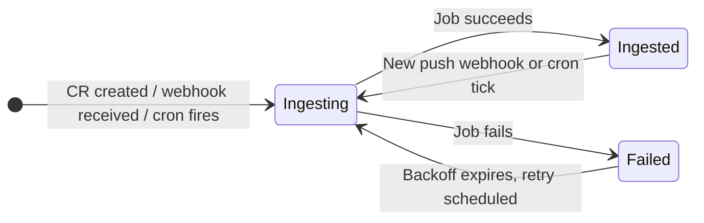

# Repository

A `Repository` CR represents one git remote enrolled in a [`Project`](project.md). The operator
ingests the repository into the project's memory stack and monitors it for SCM events (push
webhooks, issue/PR activity). Each Repository has its own ingest lifecycle, independent of its
siblings in the same Project.

```
apiVersion: tatara.dev/v1alpha1
kind: Repository
```

---

## Spec

| Field | Type | Default | Required | Description |
|-------|------|---------|----------|-------------|
| `projectRef` | `string` | - | yes | Name of the parent `Project` CR in the same namespace |
| `url` | `string` | - | yes | Full git remote URL (HTTPS or SSH) |
| `defaultBranch` | `string` | `main` | no | Branch the operator tracks for ingest and event routing |
| `ingestEnabled` | `*bool` | `true` | no | Controls whether ingest Jobs are created for this repository |
| `semanticIngest` | `*bool` | `true` | no | Enables Phase 2 LLM semantic entity/relationship extraction in addition to AST parsing; set `false` for AST-only to reduce per-file LLM cost |
| `reingestSchedule` | `string` | - | **yes** | Standard 5-field cron expression (e.g. `"0 6 * * *"`) for periodic catch-up re-ingest, supplementing push webhooks |
| `reporterLogins` | `*[]string` | `nil` | no | Override the Project's SCM `reporterLogins` intake allowlist for this repository only; `nil` = inherit, `[]` = open all reporters |
| `maintainerLogins` | `*[]string` | `nil` | no | Override the Project's SCM `maintainerLogins` (maintainer/approver set) for this repository only; `nil` = inherit, `[]` = clear all maintainers for this repo |

### reingestSchedule validation

The field is validated by kubebuilder at admission time against the pattern `^(\S+\s+){4}\S+$`
(exactly 5 whitespace-separated fields) with `minLength: 9`. Kubernetes will reject the CR if the
expression does not match. There is no default; omitting the field is an admission error.

!!! warning "Required field with no default"
    Unlike `ingestEnabled` and `semanticIngest`, `reingestSchedule` has no default and cannot be
    omitted. A common production schedule is `"0 3 * * *"` (nightly at 03:00 UTC). Webhooks
    deliver near-real-time deltas; the cron schedule is a catch-up backstop for missed or
    out-of-order events.

---

## The pointer pattern

`ingestEnabled`, `semanticIngest`, `reporterLogins`, and `maintainerLogins` are pointer types
(`*bool` or `*[]string`) rather than plain value types. This enables a three-way distinction that
plain booleans and slices cannot express:

| YAML representation | Go value | Semantics |
|---------------------|----------|-----------|
| field omitted entirely | `nil` pointer | **Inherit** the project-level setting |
| field set to a value | non-nil pointer | **Override** for this repository only |
| `reporterLogins: []` | non-nil pointer to empty slice | **Explicitly empty** - distinct from inherit |

For `*bool` fields the operator uses the `BoolVal` helper to dereference safely:

```go
// BoolVal returns the value of a *bool field, or def when the pointer is nil.
// Use this to dereference IngestEnabled, SemanticIngest, and similar
// +kubebuilder:default=true pointer fields without risking a nil dereference.
func BoolVal(b *bool, def bool) bool {
    if b == nil {
        return def
    }
    return *b
}
```

The kubebuilder `+kubebuilder:default=true` marker causes the API server to inject `true` into
`ingestEnabled` and `semanticIngest` when those fields are omitted in a CREATE request, so a newly
created Repository always has a non-nil pointer for those two fields. The `*[]string` fields do
**not** carry a default and remain `nil` until explicitly set.

!!! info "Practical effect on reporterLogins / maintainerLogins"
    - Omit the field (default): this repository uses the Project's SCM `reporterLogins` /
      `maintainerLogins` list unchanged.
    - Set an explicit list: this repository enforces its own allowlist, narrowing or widening the
      project default for this repo only.
    - Set to an explicit empty list (`[]`): for `reporterLogins` this opens intake to any GitHub
      user for this repository; for `maintainerLogins` this removes the maintainer/approver gate
      for this repository. Use with care.

---

## Status

The operator writes back to `status` after each reconcile. Inspect with
`kubectl -n <namespace> describe repository <name>`.

| Field | Type | Description |
|-------|------|-------------|
| `phase` | `string` | Current lifecycle phase: `Ingesting`, `Ingested`, or `Failed` |
| `lastIngestedCommit` | `string` | SHA of the most recently successfully ingested commit |
| `lastIngestTime` | `metav1.Time` | Timestamp of the last successful ingest Job completion |
| `lastScheduledReingest` | `metav1.Time` | Last time the cron expression fired and stamped a reingest-requested annotation; used as the base to compute the next fire time |
| `ingestFailureCount` | `int` | Count of consecutive ingest Job failures; resets to zero on any success; drives exponential backoff |
| `lastIngestFailureTime` | `metav1.Time` | Timestamp of the most recent ingest Job failure; used together with `ingestFailureCount` to compute the next retry deadline |
| `jobName` | `string` | Name of the currently active (or most recently created) ingest Kubernetes Job |
| `conditions` | `[]metav1.Condition` | Standard Kubernetes conditions map-keyed on `type`; see below |

### Phase lifecycle



### Conditions

Conditions follow the standard `metav1.Condition` contract (`type`, `status`, `reason`, `message`,
`lastTransitionTime`). The list is keyed on `type` (`+listType=map`, `+listMapKey=type`), meaning
each `type` appears at most once and is updated in-place on each reconcile.

---

## Ingest backoff

When an ingest Job terminates with a non-zero exit code the operator increments
`status.ingestFailureCount` and records `status.lastIngestFailureTime`. On subsequent reconciles
the operator computes a backoff window using both fields before creating the next Job. The delay
grows exponentially with each consecutive failure.

A successful Job resets `ingestFailureCount` to zero and clears the backoff, regardless of how
many failures preceded it.

!!! tip "Forcing an immediate retry"
    To bypass backoff and trigger an ingest immediately, annotate the Repository:

    ```sh
    kubectl -n tatara annotate repository <name> \
      tatara.dev/reingest-requested=true --overwrite
    ```

    The operator detects the annotation on the next reconcile and creates a new Job,
    resetting the failure counter only if the Job succeeds.

!!! warning "ingestEnabled: false does not cancel a running Job"
    Setting `ingestEnabled` to `false` prevents **new** Jobs from being created. Any Job already
    running at the time of the update will complete normally. The `phase` will reflect the
    completed Job's outcome.

---

## Annotated example

The following manifest shows a fully configured repository with per-repository maintainer and
reporter overrides. Inline comments explain each non-obvious field.

```yaml
apiVersion: tatara.dev/v1alpha1
kind: Repository
metadata:
  name: payments-service          # (1)!
  namespace: tatara
spec:
  projectRef: platform            # (2)!
  url: https://github.com/my-org/payments-service  # (3)!
  defaultBranch: main             # (4)!

  ingestEnabled: true             # (5)!
  semanticIngest: true            # (6)!

  reingestSchedule: "0 3 * * *"  # (7)!

  # Per-repository overrides - both are *[]string (pointer-to-slice).
  # Omit entirely to inherit from Project.scm.maintainerLogins /
  # Project.scm.reporterLogins.
  maintainerLogins:               # (8)!
    - alice
    - bob
  reporterLogins:                 # (9)!
    - alice
    - bob
    - charlie
```

1. Must be unique within the namespace. The operator uses this name to construct Job names and
   metric labels.
2. Must match an existing `Project` CR in the same namespace. The operator will set
   `status.phase = Failed` and stop reconciling if the referenced Project does not exist.
3. HTTPS URLs are standard. SSH URLs are supported if the ingest Job has an SSH key mounted via
   `Project.spec.agent.extraVolumes` / `extraVolumeMounts`.
4. Kubebuilder default is `main`. Override for repositories that use a different trunk branch
   (e.g. `master`, `develop`).
5. `true` is the kubebuilder default. Explicitly setting this to `false` suspends ingest for this
   repository without deleting the CR or any previously ingested memory data.
6. `true` enables Phase 2 LLM extraction (entity + relationship inference per changed file) on top
   of the Phase 1 AST parse. Set `false` for large, low-churn repositories to reduce token cost.
7. Nightly at 03:00 UTC. Push webhooks deliver incremental updates in near-real-time; this cron
   is a catch-up backstop for events missed during operator downtime or webhook delivery failures.
8. Non-nil list: overrides `Project.scm.maintainerLogins` for this repository. Only `alice` and
   `bob` can approve tatara tasks opened against `payments-service`.
9. Non-nil list: overrides `Project.scm.reporterLogins`. Only these three accounts can open
   issues that the operator will act on.

---

## Checking ingest status

```sh
# Summary columns (Phase and last ingested commit)
kubectl -n tatara get repository payments-service
# NAME               PHASE     COMMIT
# payments-service   Ingested  a3f912c

# Full status including conditions and backoff counters
kubectl -n tatara describe repository payments-service

# Watch phase transitions in real time
kubectl -n tatara get repository payments-service -w
```

To list all repositories and their phases across a namespace:

```sh
kubectl -n tatara get repositories
```
