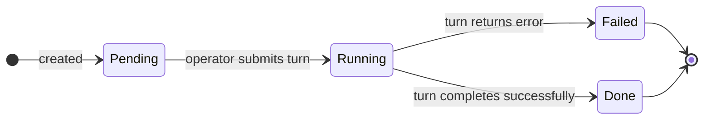

# Subtask

A `Subtask` CR represents a single ordered step within a running [`Task`](task.md) session.
Where a Task carries the high-level goal for an agent, Subtasks break that goal into
discrete turns - each submitted to the agent session in order, with the operator tracking
progress through the phase lifecycle.

```
apiVersion: tatara.dev/v1alpha1
kind: Subtask
```

!!! important "Subtasks drive the generic turn loop, not `issueLifecycle`"
    Subtasks are the execution model for the **single-shot** task kinds (`implement`, `review`,
    `triageIssue`, `brainstorm`, `selfImprove`, `refine`, `healthCheck`, `incident`): the Task
    reconciler's generic turn loop plans, then drains Pending subtasks one turn at a time. The
    `issueLifecycle` kind is different - it runs its own multi-phase state machine
    (`Triage` -> `Conversation` -> `Implement` -> `MRCI` -> ...) and does **not** decompose into
    ordered Subtasks. See the [issueLifecycle state machine](task.md#state-machine) for that
    driver.

Subtasks are **namespaced** resources. The operator `kubectl` print columns expose `Order`
and `Phase` so you can monitor progress at a glance:

```bash
kubectl get subtasks -n tatara
# NAME                          ORDER   PHASE
# implement-issue-42-step-1     1       Done
# implement-issue-42-step-2     2       Running
# implement-issue-42-step-3     3       Pending
```

---

## Spec

| Field | Type | Required | Description |
|---|---|---|---|
| `taskRef` | string | **yes** | Name of the parent `Task` CR in the same namespace |
| `title` | string | **yes** | Short label for this step; used in the turn prompt submitted to the agent |
| `detail` | string | no | Extended instructions or context passed alongside `title` in the turn |
| `order` | int | no | Execution sequence; lower values run first. Subtasks with the same `order` value are processed in creation-time order |

!!! note "Default order"
    When `order` is omitted it defaults to `0`. Multiple subtasks at the same order
    value are sequenced by creation timestamp, so omitting `order` is safe when the
    agent creates subtasks one at a time.

---

## Status

| Field | Type | Description |
|---|---|---|
| `phase` | enum | Current lifecycle phase: `Pending`, `Running`, `Done`, or `Failed` |
| `turnId` | string | Identifier of the wrapper turn that processed this subtask |
| `result` | string | Agent output text from the completed turn |

### Phase transitions



The operator reconciler selects the lowest-`order` `Pending` subtask for the parent Task
and submits it as the next turn. Only one subtask per Task is `Running` at a time.

---

## How agents use subtasks

Agents create and update subtasks via the tatara-cli MCP REST API exposed inside the
agent pod. The typical pattern for a multi-step implementation task:

1. The operator starts the Task session with the high-level goal as the first turn.
2. The agent calls the `subtask_create` MCP tool (REST: `POST /tasks/{task}/subtasks`) for
   each planned step, setting `title`, `detail`, and `order`. It updates status via
   `subtask_update` (REST: `PATCH /subtasks/{id}`). The task defaults to the `TATARA_TASK`
   env when omitted.
3. The operator picks up `Pending` subtasks in order, submitting each as a turn.
4. Each completed turn writes `phase=Done` and `result` back to the Subtask status.
5. Each reconcile, the turn loop picks the lowest-`order` subtask still in `Pending` (or with
   an empty phase) and submits it. `Failed` subtasks are not eligible and are skipped. When no
   `Pending` subtasks remain, the Task terminates `Succeeded` with reason `NoPendingSubtasks`.

!!! note "Selection and drain semantics"
    At most one subtask per Task is `Running` at a time. The reconciler selects the
    lowest-`order` `Pending` (or empty-phase) subtask each cycle; ties break by creation time.
    The Task terminates `Succeeded` once no `Pending` subtasks remain.

!!! warning "A `Failed` subtask does not fail the parent Task"
    In the generic turn loop a `Failed` subtask is simply skipped by the next-subtask selector;
    it is not retried and it does **not** flip the parent Task to `Failed`. If it is the last
    non-`Done` step, the Task still drains to `Succeeded` (`NoPendingSubtasks`). The parent Task
    goes `Failed` only through the turn-submit error path (turn timeout, max-turns, or an agent
    error), not because a subtask reached `Failed`. Deleting and recreating a subtask to force a
    retry only works while the parent Task is still in an active phase.

---

## Example

```yaml
apiVersion: tatara.dev/v1alpha1
kind: Subtask
metadata:
  name: implement-issue-42-step-1
  namespace: tatara
spec:
  taskRef: implement-issue-42
  title: "Write unit tests for RetryClient"
  detail: |
    Create tests in internal/handler/retry_client_test.go.
    Cover: success path, transient error with retry, permanent error (no retry).
    Use table-driven tests with t.Run.
  order: 1
---
apiVersion: tatara.dev/v1alpha1
kind: Subtask
metadata:
  name: implement-issue-42-step-2
  namespace: tatara
spec:
  taskRef: implement-issue-42
  title: "Implement RetryClient"
  detail: |
    Implement internal/handler/retry_client.go to pass the tests from step 1.
    Use exponential backoff; wrap errors with fmt.Errorf("retry: %w", err).
  order: 2
```
