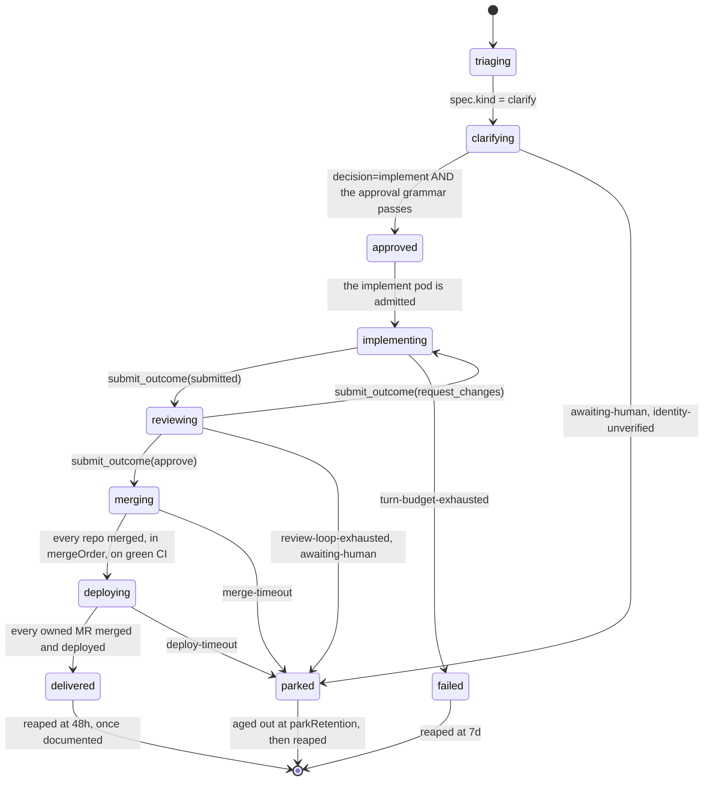

# The Task stage machine

`Task.status.stage` is the single progress field on a Task. It is written by the
**operator only**. No agent ever writes `status.stage`, and no agent can ask for a
stage: an agent submits an outcome, and the operator decides what that outcome
means. A transition that is not in [the transition table](#the-transition-table)
is rejected by the reconciler, logged at ERROR, and counted in
`operator_illegal_stage_transition_total`.

---

## The stage enum

Fifteen members:

`triaging`, `brainstorming`, `clarifying`, `investigating`, `refining`,
`approved`, `implementing`, `reviewing`, `merging`, `deploying`, `delivered`,
`documenting`, `rejected`, `failed`, `parked`.

| Group | Stages | Meaning |
|---|---|---|
| Working | `triaging`, `brainstorming`, `clarifying`, `investigating`, `refining`, `approved`, `implementing`, `reviewing`, `merging`, `deploying`, `documenting` | The Task is live. It counts against `maxOpenTasks` |
| Quasi-terminal | `delivered` | The work landed. Reaped at **48h**, and only once `status.documentedBy` is stamped or the Task provably has nothing to document |
| Terminal | `rejected`, `failed`, `parked` | **All three age out.** The reaper deletes them on their own budget |

`delivered` is held for 48h rather than 24h because the documentation batch runs
once a night: a Task delivered at 23:30 would otherwise have had thirty minutes
of margin before its own reaper deleted it out from under the batch that was
about to cover it.

The happy path, with the two side exits every stage carries:



The other origin kinds enter their own agent stage straight out of `triaging`:
`brainstorm` to `brainstorming`, `incident` to `investigating`, `refine` to
`refining`, `review` to `reviewing`, `documentation` to `documenting`.

---

## Which agent each stage spawns

`Task.spec.kind` is the **origin** and never changes. `Task.status.agentKind` is
the **agent that is running right now**, and it changes as the Task moves. The
stage is what picks it.

| Stage | Pod (agent kind) | Pod name |
|---|---|---|
| `triaging` | none (the operator classifies, and mints the Issue CRs) | - |
| `brainstorming` | `brainstorm` | `<task>-brainstorm` |
| `clarifying` | `clarify` | `<task>-clarify` |
| `investigating` | `incident` | `<task>-incident` |
| `refining` | `refine` | `<task>-refine` |
| `approved` | none (admission gate) | - |
| `implementing` | `implement` | `<task>-implement` |
| `reviewing` | `review` | `<task>-review` |
| `merging` | none (operator) | - |
| `deploying` | none (operator) | - |
| `documenting` | `documentation` | `<task>-documentation` |
| `delivered` / `rejected` / `failed` / `parked` | none | - |

`implement` appears in this column and nowhere in `spec.kind`. **It is an agent
kind only.** There is no such thing as an implement-kind Task; a Task reaches
`implementing` by being approved, not by being minted that way.

Every pod-spawning stage enqueues a `QueuedEvent`. The pod is created only when
that event is **admitted** against `maxConcurrentAgents`.

!!! note "`triaging` enqueues a QueuedEvent and spawns no pod. Both are true."
    The `QueuedEvent` that `triaging` enqueues is for the pod of the **next**
    stage - the one `spec.kind` selects. `triaging` itself is pure operator work:
    classify the origin, mint the Issue CRs, pick the next stage. It runs no agent.

---

## Pod naming

The pod is `<task-name>-<agent-kind>`. The Task name is:

```
<project>-<kind>-<YYYY-MM-DD>-<uid5>
```

capped at **49 characters**. The cap is not arbitrary: the worst-case pod suffix
is `-documentation`, which is 14 characters, and a Kubernetes RFC-1123 label
cannot exceed 63. `agent.TaskName()` truncates the project segment to hold the
cap. A Task whose name still overflows fails immediately with
`stage=failed`, `stageReason=name-too-long` - a CRD cannot constrain
`metadata.name` length and there is no validating webhook, so the guard is a
reconcile-time check.

So a clarify Task on the `tatara` project might be
`tatara-clarify-2026-07-12-m4z8q`, and the pod it spawns at `implementing` is
`tatara-clarify-2026-07-12-m4z8q-implement`. The pod name carries the **agent**
kind, the Task name carries the **origin** kind, and they routinely differ.

---

## The transition table

Written by the operator only.

**Every transition, without exception, does all four of these:**

```
status.stageEnteredAt     = now
status.podStartedAt       = nil
status.stageWorkStartedAt = nil
stats.podRecreations      = 0
```

and thereafter:

```
podStartedAt       is stamped when the pod is CREATED
                   (and RE-stamped on every respawn)
stageWorkStartedAt is stamped when the pod becomes READY
```

Both timestamps are cleared, not just `stageWorkStartedAt`, and that matters on
every re-entry edge (`reviewing` back to `implementing`, `merging` back to
`reviewing`, every un-park). A stale non-nil `podStartedAt` on such an edge does
two things, both bad. It **disarms the admission clock** - which is armed only
while `podStartedAt == nil` - while the Task sits in the queue, and the readiness
clock cannot fire either because its evaluator needs a pod that does not exist
yet: the Task is covered by **no clock at all** while it queues. And it makes the
pod TTL (`podStartedAt + agentPodTTLSeconds`) already in the past for the fresh
pod, so the operator stops that pod before its first turn.

| From | To | Trigger |
|---|---|---|
| (create) | `triaging` | Task minted ACTIVE: webhook-originated, or a human has the last word on the thread. Enqueues a QueuedEvent |
| (create) | `parked(backlog-sweep)` | Task minted from a sweep-discovered backlog issue. **Spawns no pod, enqueues nothing.** It exists to own the Issue CR |
| `parked(backlog-sweep)` | `triaging` | a non-bot `pendingEvent` arrives (a human commented) AND `maxOpenTasks` is not already reached. Over cap the promotion **defers**: the Task stays parked and the event is retained, never dropped. A refine fold does not promote it - the fold deletes it |
| `triaging` | `brainstorming` / `clarifying` / `investigating` / `refining` / `reviewing` / `documenting` | by `spec.kind` = brainstorm / clarify / incident / refine / review / documentation |
| `triaging` | `failed(triage-stalled` \| `name-too-long)` | spec validation or the 49-character name guard fails |
| any pod stage | `failed(agent-contract-mismatch)` | the wrapper reports a `contractVersion` other than `2` at pod-ready, **before turn 0 is submitted**. It never burns a single turn |
| `brainstorming` | `delivered` | `submit_outcome(propose)` - each proposal becomes its own new clarify Task - or `submit_outcome(skip)`. `documentedBy` stays empty: no documentation Task is spawned |
| `clarifying` | `approved` | `submit_outcome(decision=implement)` AND [the approval grammar](../operations/security/approval-gates.md#the-approval-grammar) passes for **every** owned Issue |
| `approved` | `clarifying` | the Task acquires a new Issue after approval (`issue_write(create)`, or a refine fold adopting one). **Approval is not sticky** - the mandate is re-gated |
| `clarifying` | `parked(identity-unverified)` | `decision=implement` but the grammar fails |
| `clarifying` | `parked(awaiting-human)` | `decision=discuss` |
| `clarifying` | `rejected(declined)` | `decision=close` (the operator closes the issue) |
| `investigating` | `clarifying` | `submit_outcome(file_issue)` - the tracker Issue is created under this Task |
| `investigating` | `rejected(false-positive)` | `submit_outcome(false_positive)`. No documentation Task |
| `refining` | `delivered` | folds, closes and links applied, and the fold verified. No documentation Task unless the refine owned merged MRs |
| `refining` | `failed(fold-adoption-unverified)` | fold-adoption verification fails |
| `approved` | `implementing` | a QueuedEvent for the implement pod is **admitted** |
| `implementing` | `reviewing` | `submit_outcome(submitted)` and at least one owned MR is open |
| `implementing` | `parked(implement-declined)` | `submit_outcome(declined)` |
| `reviewing` | `implementing` | `submit_outcome(request_changes)` **AND `spec.kind != "review"`** AND `mr.status.reviewRounds < maxReviewRounds` AND every owned MergeRequest has `status.pendingReview == nil` (an empty owned-MR set does not open the gate either) |
| `reviewing` | `parked(awaiting-human)` | `submit_outcome(request_changes)` on a **`kind == "review"`** Task. The review is posted. **A human's PR is fixed by the human** |
| `reviewing` | `parked(review-loop-exhausted)` | `request_changes` at `maxReviewRounds` (3), on a non-`review` Task |
| `reviewing` | `merging` | `submit_outcome(approve)` on a Task whose `spec.kind != review` (the MRs are the platform's own) AND every owned MergeRequest has `status.pendingReview == nil` (an empty owned-MR set does not open the gate either). The operator posts a `COMMENT` review and stamps `reviewedSHA` from the SHA the agent reported, verified still live |
| `reviewing` | `parked(awaiting-human)` | `submit_outcome(approve)` on a **`review`-kind** Task. The review is posted. The Task never reaches `merging`. **Merging a human's PR is a human action** |
| `merging` | `reviewing` | a live head that is not `reviewedSHA`, or a merge call that 409s "head moved". Increments `status.headMoveReentries`, capped at 3, then `failed(head-moving)` |
| `merging` | `failed(merge-order-missing)` | `len(spec.mergeOrder) == 0` on entry. A bug-catcher, not a normal path: the outcome endpoint resolves the single-repo case |
| `merging` | `deploying` | every repo in `mergeOrder` merged, in order, each on green CI |
| `merging` | `failed(merge-blocked)` | `status.mergeReentries >= 3` |
| `deploying` | `delivered` | every owned MR merged and deployed. **The operator then closes every owned Issue** and stamps `deliveredAt` |
| `deploying` | `failed(deploy-blocked)` | `status.deployReentries >= 3` |
| `delivered` | (nothing is spawned per delivery) | Documentation is a **nightly batch**, not a per-delivery spawn. A delivered Task with at least one MR ref, all merged, becomes eligible for the next batch. Everything else - a brainstorm `skip`, an incident `false_positive`, a fold-only refine, a declined implement - is never documented and has `documentedBy` permanently empty |
| (nightly cron) | `documenting` | one documentation Task per project per night. `spec.documentsTasks` is every eligible Task delivered in the last 24h. Minted only when that list is non-empty |
| `documenting` | `reviewing` | `submit_outcome(submitted)` on the docs MR |
| `documenting` | `delivered` | `submit_outcome(declined)`. Either way, `status.documentedBy` is stamped on every Task in `spec.documentsTasks` |
| any pod stage | `parked(admission-starved)` | clock 1: `podStartedAt == nil` and `now > stageEnteredAt + 24h`. Recoverable. **Skipped entirely when the project is paused** (`maxConcurrentAgents == 0`) |
| any pod stage | (a **respawn**, not a transition) | clock 2: the pod exists but never became Ready within `podReadyTimeout` (5m) of `podStartedAt`. The pod respawns, `stats.podRecreations` increments, and the Task does **not** fail |
| any pod stage | `failed(pod-recreation-exhausted)` | `stats.podRecreations > maxPodRecreations` (3). This is the terminal for a pod that never boots |
| any pod stage | `failed(turn-budget-exhausted)` | `stats.turns >= maxTurnsPerTask` |
| any pod stage | `parked(stage-deadline` \| `no-outcome)` | the stage deadline elapses; or a pod stopped having submitted no outcome, with the recreation budget spent |
| `reviewing` | `parked(review-post-refused)` | a structural 4xx from `PostReview` |
| any pod-spawning stage (`brainstorming`, `clarifying`, `investigating`, `refining`, `implementing`, `reviewing`, `documenting`) | `parked(object-too-large)` | the A.7 byte-budget pre-write guard refuses. One of the common `podStageEdges` exits every pod stage carries |
| `triaging` \| `approved` \| `merging` \| `deploying` | `failed(object-too-large)` | the A.7 byte-budget pre-write guard refuses. These four pod-less stages fail instead of parking |
| any non-terminal | `failed(operator-error)` | an unrecoverable operator error |
| any terminal entry | (side effect, not a transition) | on entering `failed` or `rejected`, or being reaped from `parked`: the operator closes **only the MRs it created**. Four clauses, all required - bot-authored, on a `task/<task-name>` head, this Task is the controller owner, and no surviving plain owner exists. It runs **after** controller-ownership is released, never before |

!!! note "The pendingReview gate (contract C.5.3)"
    `reviewing -> implementing` and `reviewing -> merging` both additionally
    require that **every owned MergeRequest has `status.pendingReview ==
    nil`**. A non-nil `pendingReview` means a review is owed to the forge and
    the mirror has not recorded it yet - spawning a pod in that state renders
    a bundle with no findings in it, re-submits, and burns a review round for
    nothing. An **empty** owned-MR set does not open the gate either: zero MRs
    is not a licence to proceed.

!!! info "Documentation is one nightly batch, not one pipeline per merged fix"
    A per-delivery documentation Task is a 3-5x work amplifier: a docs Task, a
    docs MR, a review pod, a merge, and a `tatara-documentation` release, for
    every one-line patch. And a cron brainstorm that correctly reports "nothing
    novel" must not spawn any of it at all. Documentation Tasks exist only where
    code actually shipped, and one batch covers a whole night of it.

---

## The deadline invariant

**No stage may be entered without a deadline that leaves it.**

There is no stage in which a Task can sit forever, and no cycle it can go round
forever. A new stage cannot be added without a budget: a table-driven test
asserts that every member of the enum has one.

Every **pod stage** carries **three clocks**. Exactly one is armed at a time, and
which one is armed is determined entirely by which timestamps are set.

**1. Admission**, from `status.stageEnteredAt`, 24h, to `parked(admission-starved)`.

Armed while `podStartedAt == nil`. It asks: has this Task been waiting for an
agent slot too long? It is **skipped entirely when the project is paused**
(`maxConcurrentAgents == 0`), so the kill switch is not a backlog shredder. That
carve-out applies on every pod stage, not on `approved` alone.

**2. Readiness**, from `status.podStartedAt`, **5 minutes** (`podReadyTimeout`,
which is the same constant as the operator's `agentBootDeadline`).

Armed once the pod exists (`podStartedAt != nil`) but has not become Ready
(`stageWorkStartedAt == nil`). It asks: the pod exists - did it ever come up?
**On breach the pod respawns** and `stats.podRecreations` increments. **It does
not terminate the Task.** Only when `podRecreations > maxPodRecreations` (3) does
the Task go to `failed(pod-recreation-exhausted)`.

This clock measures from `podStartedAt` and **never** from `stageEnteredAt`.
`stageEnteredAt` includes the admission queue, and clocking readiness from it
would kill a Task that is queueing behind three live agents in perfectly ordinary
steady state at `maxConcurrentAgents: 3`.

**3. Work**, from `status.stageWorkStartedAt`, the per-stage budget below, to
`parked(stage-deadline)`.

Armed once the pod is Ready and doing real work. It asks: it is running - has it
taken too long?

!!! warning "There is no `pod-not-ready` stage reason"
    A never-Ready pod is a **respawn trigger**, not a terminal state. The
    readiness window is **5 minutes**, not 15, and its breach costs one
    `podRecreations`, not the Task. The terminal for a pod that never boots is
    `pod-recreation-exhausted`, once the recreation budget is spent. Anything
    describing a `pod-not-ready` terminal, a 15-minute readiness window, or a
    readiness clock measured from `stageEnteredAt` is describing a design that
    was rejected precisely because it kills healthy Tasks in steady state.

**Pod-less stages** (`triaging`, `approved`, `merging`, `deploying`, `delivered`,
and the rest) run **clock 3 only**, measured from `stageEnteredAt` against their
own budget. They do **not** run clock 1. If they did, `merging` would carry a 24h
admission budget and could never reach `merge-timeout` at 4h, and the bounded
merge re-entry cycle would never engage at all.

Two clocks, a single per-edge deadline field, or pod-less stages on the admission
clock: all three are wrong.

### The budgets

| Stage | Budget | On elapse |
|---|---|---|
| `triaging` | 5m | `failed(triage-stalled)` |
| `brainstorming` | 2h | `parked(stage-deadline)` |
| `clarifying` | 24h | `parked(awaiting-human)` |
| `investigating` | 2h | `parked(stage-deadline)` |
| `refining` | 2h | `parked(stage-deadline)` |
| `approved` | 24h | `parked(admission-starved)`, **except** when the project is paused (`maxConcurrentAgents == 0`) |
| `implementing` | 6h | `parked(stage-deadline)` |
| `reviewing` | 4h | `parked(stage-deadline)` |
| `merging` | 4h | `parked(merge-timeout)` |
| `deploying` | 2h | `parked(deploy-timeout)` |
| `documenting` | 2h (`docStageBudget`) | `delivered(doc-timeout)`, stamping `documentedBy` on every covered parent. **A stuck documentation batch never pins a parent** |
| `delivered` | 48h | the reaper deletes it, once documented (or provably not documentable) |
| `rejected` | 24h | the reaper deletes it |
| `failed` | 7d | the reaper deletes it. It releases its Issues **immediately** on entering `failed`, not at reap |
| `parked` (except `backlog-sweep`) | 7d (`parkRetention`) | the reaper deletes it, **after** the bot park comment has landed. The next sweep re-mints the still-open issue as `parked(backlog-sweep)` |
| `parked(backlog-sweep)` | **none - exempt by design** | it is reaped only when its Issues close |

`parked(backlog-sweep)` is the one stage with no time-based exit, and it has none
precisely because it consumes nothing: no pod, no queue slot, no turn, no forge
request. It is not stalled work. It is the durable owner of an Issue CR, and
ageing it out would churn mint-and-reap forever.

Every pod-spawning stage additionally exits on `failed(turn-budget-exhausted)`
(`stats.turns >= maxTurnsPerTask`, default 300), on
`failed(pod-recreation-exhausted)`, and on `parked(no-outcome)` when a pod stops
having submitted no outcome and the recreation budget is spent.

`maxTurnsPerPod` (default 40) does **not** terminate the Task: it stops the pod,
via the TTL handoff path, and respawns, spending one `podRecreations`. **The
`implement` agent kind is exempt from `maxTurnsPerPod`** - a long, healthy coding
run must not be cut off - and is bounded instead by `maxTurnsPerTask` and the
`implementing` stage deadline.

---

## Cycle caps

The invariant is global, not per-stage: it is not enough that every stage has an
exit if a Task can loop between two of them forever. **Five cycles exist, and all
five are bounded.**

| Cycle | Counter | Cap | On exhaustion | Spawns a pod per lap? |
|---|---|---|---|---|
| `reviewing` and `implementing` | `reviewRounds` (on the MergeRequest) | 3 | `parked(review-loop-exhausted)` | yes |
| `merging` and `parked(merge-timeout)` | `mergeReentries` | 3 | `failed(merge-blocked)` | no |
| `deploying` and `parked(deploy-timeout)` | `deployReentries` | 3 | `failed(deploy-blocked)` | no |
| `reviewing` and `merging` (the head moved) | `headMoveReentries` | 3 | `failed(head-moving)` | **yes** |
| `reviewing` and `parked(awaiting-human)` (a `review`-kind Task) | `humanReviewRounds` | 5 (`maxHumanReviewRounds`) | it stays parked | **yes** |

Two of these spawn a pod on every lap, and those are the two that matter for cost.

The **head-moved** cycle: a PR whose head keeps moving - a human pushing to the
branch, a flapping CI autocommit - spins `reviewing` to `merging` to `reviewing`
and burns a review pod every lap.

The **human-review** cycle: a `review`-kind Task un-parks on every human comment,
so a chatty PR thread would otherwise spawn a review pod per comment.

**Neither is bounded by `reviewRounds`.** That counter moves only on
`request_changes`, so it never advances on the approve path at all. Each of these
cycles needed its own counter, and has one.

---

## Stage reasons

`status.stageReason` is the machine-readable reason for the current stage. It is
**mandatory** on `parked`, `failed` and `rejected`. The set is closed:

`backlog-sweep`, `triage-stalled`, `name-too-long`, `stage-deadline`,
`awaiting-human`, `identity-unverified`, `implement-declined`, `declined`,
`false-positive`, `review-loop-exhausted`, `review-post-refused`, `merge-timeout`, `merge-blocked`,
`merge-order-missing`, `deploy-timeout`, `deploy-blocked`, `no-outcome`,
`turn-budget-exhausted`, `pod-recreation-exhausted`, `object-too-large`,
`fold-adoption-unverified`, `admission-starved`, `agent-contract-mismatch`,
`doc-timeout`, `operator-error`, and `head-moving` - 26 members.

`admission-starved` is armed on **every** pod stage, not on `approved` alone.
There is **no `pod-not-ready`** - see the readiness clock above.

---

## `parked` is a dead end

A parked Task does not "resume". It either matches one of the narrow re-entry
rules below, or it ages out at `parkRetention` (7d) and is reaped. There is
exactly one re-entry function, and this is its entire body:

```
unpark(t):
  switch t.status.stageReason {

  case "backlog-sweep":
      require: a NON-BOT pendingEvent exists (a human commented)
      require: ACTIVE Tasks < Project.spec.maxOpenTasks
               // over cap, the promotion DEFERS: the Task stays parked and the
               // pendingEvent is RETAINED, never dropped. It promotes as soon
               // as a slot frees.
      -> triaging      // and from there, by spec.kind, into its agent stage

      // It NEVER ages out. It is reaped only when its Issues close.

  case "awaiting-human":
      // The ONLY comment-driven re-entry.
      require: a NON-BOT pendingEvent exists.

      if t.spec.kind == "review":
          require: status.humanReviewRounds < 5
                   else: STAY PARKED. Do not spawn another review pod.
          status.humanReviewRounds++
          -> reviewing
          // A review-kind Task may NEVER enter implementing or merging. There
          // is no path, no condition, no exception. It does not exist.
          break

      // The TARGET is RE-DERIVED from state, NEVER from status.parkedFromStage:
          require: len(owned Issues with state == open) > 0
          if EVERY such Issue has status.status == "approved" -> implementing
          else                                                -> clarifying

  case "identity-unverified":
      on a NON-BOT pendingEvent:
          FIRST: sync that issue's comments from the forge.
          THEN:  re-evaluate the approval grammar against the refreshed thread.
          It PASSES -> Issue.status.approval is stamped, status=approved, and
                       require: len(owned Issues with state == open) > 0
                                // the empty set is not a licence here either
                       if EVERY owned open Issue is approved -> implementing
          It FAILS  -> stay parked. Do NOT comment again. Re-evaluate on the
                       next human comment.

  case "merge-timeout":
      require: status.mergeReentries < maxMergeReentries (3)
               else -> failed(merge-blocked). The cycle is BOUNDED.
      status.mergeReentries++
      -> merging       // idempotent: mergeCursor resumes, and every MR is
                       // re-validated against state=merged before any merge
                       // call. NEVER implementing.

  case "deploy-timeout":
      require: status.deployReentries < maxDeployReentries (3)
               else -> failed(deploy-blocked).
      status.deployReentries++
      -> deploying     // idempotent. NEVER implementing.

  case "no-outcome":
      require: ZERO owned MRs are merged
      require: stats.turns < maxTurnsPerTask
      -> implementing

  default:  // review-loop-exhausted, implement-declined, stage-deadline,
            // admission-starved, turn-budget-exhausted,
            // pod-recreation-exhausted, fold-adoption-unverified, doc-timeout,
            // operator-error, triage-stalled, name-too-long
      -> NO re-entry. It ages out at parkRetention and is reaped, AFTER the
         operator posts its bot park comment. The next sweep re-mints the
         still-open issue as a parked(backlog-sweep) Task, which OWNS it and
         costs nothing. If a human then comments, THAT Task promotes to
         triaging and the work resumes - as a NEW Task, not a zombie one.
  }
```

Four properties fall out of that body, and each one is load-bearing.

**1. The operator's own park comment can never un-park anything.** A bot-authored
event is dropped at enqueue, so the comment the operator posts when it parks a
Task cannot land in that Task's `pendingEvents` and un-park it. Without that
filter, parking is a loop.

**2. `identity-unverified` has a comment-driven release, and a comment alone
never triggers it.** A non-bot comment triggers a fresh sync of that issue's
comments from the forge, then a re-run of the anchored, whole-line
[approval grammar](../operations/security/approval-gates.md#the-approval-grammar)
against the refreshed thread. Only a comment that **passes the grammar** un-parks
it - maintainer identity, anchored whole-line phrase, single-use evidence. That is
a stronger gate than "the webhook wrote a status", because the operator re-reads
and re-verifies the thread itself.

**3. A `review`-kind Task can never reach `implementing` or `merging`, by any
path.** Not on the un-park edge, and not on the primary one:
`submit_outcome(request_changes)` on a `kind == "review"` Task goes to
`parked(awaiting-human)`, never to `implementing`. **A human's PR is fixed by the
human.** The next human comment un-parks it back to `reviewing`, bounded by
`status.humanReviewRounds` (cap 5); at the cap it simply stays parked. Every
review Task is non-bot-authored by construction, so `parked(awaiting-human)` is
its only terminal. Both review verdicts - `approve` and `request_changes` - end
there on a human-authored PR.

**4. A partially-merged Task can never re-enter `implementing` and open a second
PR.** Three independent stops: `merge-timeout` and `deploy-timeout` re-enter
their **own** stage, never `implementing`; `no-outcome` requires zero merged MRs;
and `mr_write(open)` refuses outright when a merged MR already exists for that
repo.

---

## See also

- [Task](task.md) - the CRD itself, its fields, and what was removed
- [Task notes](task-notes.md) - the journal that carries context from one pod to the next
- [Tuning](../operations/tuning.md) - the levers that set these budgets and caps
- [Approval gates](../operations/security/approval-gates.md#the-approval-grammar) - the grammar that gates `clarifying` to `approved`
