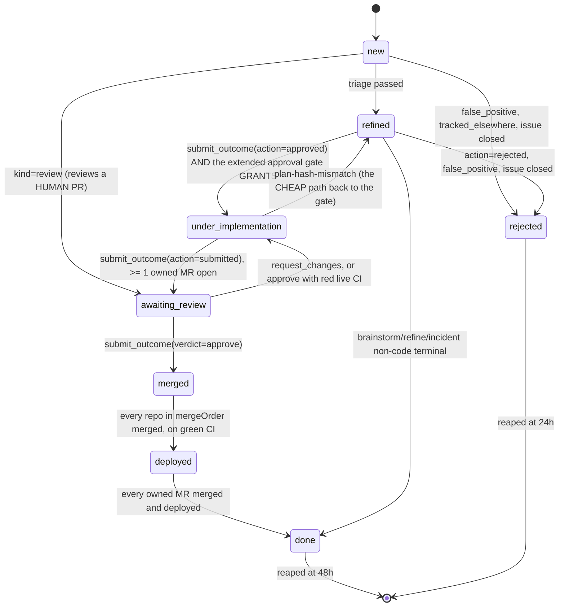

# The Task state machine

`Task.status.state` is the single progress field on a Task, written by the
**operator only**. No agent ever writes `status.state`, and no agent can ask
for a state: an agent submits an outcome, and the operator decides what that
outcome means. A transition that is not in
[the transition table](#the-transition-table) is rejected by the reconciler,
logged at ERROR, and counted in `operator_illegal_stage_transition_total`
(the metric kept its pre-redesign name; only its `from`/`to` label values
are now drawn from the 8-state enum).

!!! info "This page describes the model introduced by the #521 lifecycle redesign"
    The pre-redesign machine had **sixteen** stages, and `parked` was one of
    them - simultaneously a stage, a terminal, and a pod-less marker. That
    conflation is what let a *live, awaiting-human* Task read as *done*
    (`TaskDone(parked) == true`), the defect the redesign exists to close.
    The new model factors the old stage into **three orthogonal
    properties**, and nothing below should be read as still describing
    `triaging`, `clarifying`, `investigating`, `refining`, `approved`,
    `implementing`, `reviewing`, `merging`, `deploying`, `documenting`,
    `delivered`, `parked` or `failed` as live values - they no longer exist
    on the CRD.

## Three orthogonal properties, not one

| Property | Answers | Values |
|---|---|---|
| `status.state` | **Where the work is** | 8 closed values, this page's table |
| `status.parkReason` | **Whether it is stalled** | A flag - empty, or one of 28 reasons ([`park.go`](#the-park-flag)) |
| `Live(state)` | **Whether a pod is up** | A pure property of `state`, not a stored field |

A Task can be `state=refined` **and** `parkReason=awaiting-human` at the same
time: it is waiting on a human, but it is still, structurally, at the refined
gate - unparking re-derives its target from the same state it was already in,
never from a fourth field. `parked` is not a value any field takes any more.

---

## The state enum

Eight members, in lifecycle order: `new`, `refined`, `under-implementation`,
`awaiting-review`, `merged`, `deployed`, `done`, `rejected`.

| Group | States | Meaning |
|---|---|---|
| Pre-gate | `new` | Triage. Counts against `maxOpenTasks` |
| Live (carries a pod) | `refined`, `under-implementation`, `awaiting-review` | An agent pod is up. Bounded by the idle clock, not a fixed work budget |
| Operator-driven | `merged`, `deployed` | No pod. The operator itself advances these |
| Terminal | `done`, `rejected` | Both age out and are reaped on their own retention |

`done` absorbed the old `delivered`. There is no `parked` state and no
`failed` state: parking is the `parkReason` flag on whichever state the Task
was already in, and every old `failed(...)` terminal is now `rejected` with
the equivalent reason, or a park that simply never re-enters (see
[stage reasons](#stage-reasons)).


```mermaid
stateDiagram-v2
    [*] --> new
    new --> refined : triage passed
    new --> awaiting_review : kind=review (reviews a HUMAN PR)
    refined --> under_implementation : submit_outcome(action=approved) AND the extended approval gate GRANTS
    under_implementation --> awaiting_review : submit_outcome(action=submitted), >= 1 owned MR open
    under_implementation --> refined : plan-hash-mismatch (the CHEAP path back to the gate)
    awaiting_review --> under_implementation : request_changes, or approve with red live CI
    awaiting_review --> merged : submit_outcome(verdict=approve)
    merged --> deployed : every repo in mergeOrder merged, on green CI
    deployed --> done : every owned MR merged and deployed
    refined --> done : brainstorm/refine/incident non-code terminal
    new --> rejected : false_positive, tracked_elsewhere, issue closed
    refined --> rejected : action=rejected, false_positive, issue closed
    done --> [*] : reaped at 48h
    rejected --> [*] : reaped at 24h
```

Every **live** state (`refined`, `under-implementation`, `awaiting-review`)
carries a pod for whichever agent kind `AgentKindFor(state, spec.kind)`
resolves to - see [Which agent each state spawns](#which-agent-each-state-spawns)
below. `merged` and `deployed` run no pod at all; the operator advances them
directly.

---

## Which agent each state spawns

`Task.spec.kind` is the **origin** and never changes. `Task.status.agentKind`
is the **agent running right now**, and the state - not the origin alone -
decides it, because the state enum is now kind-agnostic: a `brainstorm` Task
in `refined` needs a `brainstorm` pod, not an `implement` one.

| `spec.kind` (origin) | Agent kind at `refined` / `under-implementation` |
|---|---|
| `brainstorm` | `brainstorm` |
| `incident` | `incident` |
| `refine` | `refine` |
| `review` | `review` |
| `documentation` | `documentation` |
| `takeover` | `implement` |
| `implement` | `implement` |
| `upgrade` | `upgrade` |

At `awaiting-review` every kind runs `review`, regardless of origin. `new`,
`merged`, `deployed`, `done` and `rejected` spawn no pod at all -
`AgentKindFor` returns `""` for each of them, which is a **fail-closed**
result, not an oversight, for an origin kind the map does not recognize.

`clarify` is **gone as an agent kind**. Its three decisions - `implement` /
`close` / `discuss` - became `action` values (`approved` / `rejected` /
`discuss`) on the `implement` outcome, so the pod that judges the approval
grammar is the same pod that goes on to write the code, gated behind
[the extended approval gate](../operations/security/approval-gates.md).
There is no such thing as a `clarify`-kind Task any more; see
[MCP tools by agent kind](mcp-tools.md) for the seven surviving agent kinds.

Every pod-spawning state entry enqueues a `QueuedEvent`. The pod is created
only when that event is **admitted** against `maxConcurrentAgents`.

---

## Pod naming

Unchanged in shape from before the redesign, with one deletion: the
`clr` type token is gone. The wrapper Pod (and Service) name is independent
of the Task's own name, composed once at Task creation and stamped into the
`tatara.dev/pod-name` annotation:

```
<type>-<project>-<repo>-<i|p><id>
```

- `type` is a fixed 3-char token for the Task's agent kind: `brs`
  (brainstorm), `ref` (refine), `inc` (incident), `rev` (review), `imp`
  (implement), `doc` (documentation), `tko` (takeover), `upg` (upgrade); an
  unrecognized kind falls back to its own first 3 lowercased chars.
- `project` and `repo` are trimmed dynamically and proportionally
  (`splitTrimBudget`) to use the 63-char DNS-1123 budget efficiently,
  readability-first; `repo` is omitted for a project-board item with no
  bound repo.
- the trailing id segment is `i<N>` for an issue or `p<N>` for a PR/MR
  (GitHub PR and GitLab MR fold into the single `p` token); a kind with no
  issue/PR/MR number keeps its own collision-avoidance disambiguator
  instead (an incident's `dedupKey`, a documentation Task's short
  source-head-SHA) rather than dropping the segment.
- `sanitizeDNS1123` is the final hard-cap backstop.

The Task's own name is a separate string, `<project>-<kind>-<YYYY-MM-DD>-<uid5>`,
capped at **49 characters** - the worst-case pod suffix is `-documentation`
(14 chars) against the 63-char RFC-1123 label limit. A Task whose name still
overflows fails immediately: `state=rejected`, `stateReason` empty (there is
no `name-too-long` reject reason - the mint refuses before a Task object
exists).

---

## The transition table

Written by the operator only. **Twenty-five edges.** Every transition does all
of:

```
status.stateEnteredAt              = now
status.stateReason                 = reason
status.agentKind                   = AgentKindFor(to, spec.kind)
status.podStartedAt                = nil     <- load-bearing
status.stateWorkStartedAt          = nil
stats.podRecreations               = 0
status.stageElapsedCarrySeconds    = 0
status.conversationLastEventAt     = now, on entry into a LIVE state, else nil
```

Forgetting `podStartedAt = nil` leaves a Task covered by **no clock at all**
while it queues on a re-entry edge, because clock 1 (admission) is armed only
while `podStartedAt == nil` and clock 2 (readiness) needs a pod that does not
exist yet.

`Enter` **refuses a parked Task outright** (`*StillParkedError`). There is
exactly one way out of a park: `Unpark` (or `UnparkTakeover`, the one
documented exception) - see [the park flag](#the-park-flag) below.

| From | To | Trigger |
|---|---|---|
| (create) | `new` | Task minted for triage: webhook-originated, a sweep-discovered backlog issue (minted `parked(backlog-sweep)` alongside), a dependency engine's own merge request matching `upgradePolicy.adoptBranchPrefix` + author (an adopted `kind=upgrade` Task, `MintAdoptedUpgradeTask` - see [MR Ownership](../architecture/ownership.md#adopting-a-dependency-engines-merge-requests)), or a human has the last word on the thread |
| (create) | `under-implementation` | the nightly documentation batch, a dependency-upgrade cron tick, or a maintainer-gated **takeover** (`spec.kind=takeover`) bound to an MR that already exists, is minted straight into implementation work - no driving issue to triage, and no gate. `QueuedEvent.spec.initialState`, copied onto `TaskSpec.InitialState`, is what the create edge reads to route here instead of `new` |
| (create) | `done` | **the terminal-reset guard.** A Task served stateless by the narrowed CRD (see [below](#no-migrator)) carries proof it already delivered - stamped where it finished rather than re-triaged |
| (create) | `rejected` | **the terminal-reset guard**, the stopped-work twin of the edge above |
| `new` | `refined` | triage passed: spec validates and the Task is routed to its origin kind's agent |
| `new` | `awaiting-review` | triage passed on a `kind=review` Task (reviews a **human's** PR), or on an adopted `kind=upgrade` Task bound to a dependency engine's own merge request. Neither has a plan to write or an approval to grant - the gate at `refined` has nothing to do for either |
| `new` | `rejected` | `false_positive`, `tracked_elsewhere`, or a human closed the driving issue mid-triage |
| `refined` | `under-implementation` | `submit_outcome(action=approved)` **AND** the extended approval gate grants: the citation verifies for every live owned Issue, the declared `approvingMaintainer` agrees with it, and the plan note is pinned |
| `refined` | `done` | a non-code kind finished: brainstorm `propose`/`skip`, refine `folds`/`closes`/`links` applied and verified, incident `file_issue` minted its tracker. None of the three ever opens an MR |
| `refined` | `rejected` | `submit_outcome(action=rejected)` closes the issue, `false_positive`, or a human closed the driving issue |
| `under-implementation` | `awaiting-review` | `submit_outcome(action=submitted)` and >= 1 owned MR is open |
| `under-implementation` | `refined` | the plan pinned at grant no longer matches the plan note (`plan-hash-mismatch`) - the cheap path back to the gate, never a park |
| `under-implementation` | `done` | the nightly documentation batch declined or its budget elapsed: `done(doc-timeout)`, no MR opened |
| `under-implementation` | `rejected` | a human closed the driving issue mid-flight |
| `awaiting-review` | `under-implementation` | `submit_outcome(verdict=request_changes)` **AND** `spec.kind != review`, or an `approve` whose **live CI** at the reviewed head has failed. Gated on `pendingReview == nil`. (The `reviewRounds < maxReviewRounds` condition that used to gate this edge was deleted along with the ceiling - see [Cycle caps](#cycle-caps).) |
| `awaiting-review` | `merged` | `submit_outcome(verdict=approve)` **AND** `spec.kind != review`. Gated on `pendingReview == nil`, and on the live CI at the reviewed head not being red |
| `awaiting-review` | `done` | `mr-merged-externally`: a `kind=review` Task whose every owned MR merged externally before/while reviewing - no open MR to post an outcome against, so the operator finalizes the honest finished work |
| `awaiting-review` | `rejected` | `mr-closed-externally` (the review target was abandoned), `mr-taken-over` (a maintainer took the MR over and this parent owns zero MRs), or a human closed the driving issue |
| `merged` | `deployed` | every repo in `mergeOrder` merged, in order, each on green CI |
| `merged` | `awaiting-review` | a live head that is not `reviewedSHA`, or a merge call that 409s "head moved". Increments `status.headMoveReentries`, capped at 3, then `parked(head-moving)` |
| `merged` | `under-implementation` | a maintainer requested changes on the still-open MR before it merged, or the live CI at the reviewed head has failed. `kind=review` is refused here by the same guard that refuses it everywhere |
| `merged` | `rejected` | a human closed the driving issue before the merge completed |
| `deployed` | `done` | every owned MR merged **and** `deployedAt != nil`. The operator then closes every owned Issue and stamps `deliveredAt`. `deployed` carries **no** issue-closed edge: merged work is never rewound |
| `done` | (reap) | `DeliveredRetention` (48h) elapses and the Task is documented, or provably needs no coverage |
| `rejected` | (reap) | `RejectedRetention` (24h) elapses |

`done` and `rejected` are **terminal**: no state exits, only the reaper.

!!! warning "Nothing is minted into `refined`, and that is an invariant"
    There is deliberately **no `(create) -> refined` edge**. `refined` is where
    the approval gate runs, and its only forward edge into the work is
    `submit_outcome(action=approved)`, which `verifyApprovalScope` refuses with
    `no-live-issue` for a Task owning **zero** `Issue` CRs. The operator mints
    Issue mirrors only for a Task whose `Source` is a real issue - never for one
    bound to a PR - so a kind minted straight into `refined` without an issue
    behind it can never leave: it spends a pod, elapses, and parks
    `awaiting-human` forever.

    The `takeover` kind did exactly that until it was fixed: its source is always
    a PR, so it owned zero Issues by construction. It is now minted into
    `under-implementation`, which is where its own re-take un-park already
    landed. The authorisation the gate would have looked for has already been
    performed, and more strictly - the takeover endpoint refuses unless a
    verified **maintainer's** comment asked for it.

    `refined` is therefore reachable through **triage only**, so the question
    "does this kind own an issue?" is answered in one place. A new kind with no
    driving issue belongs on `(create) -> under-implementation` (it writes code)
    or on `new -> awaiting-review` (it only reviews). The operator pins this with
    a table test that is total over every origin kind, so a kind added without
    answering the question fails the build.

    The pin covers **both** routes, and the triage one is the route that matters:
    since nothing is minted into `refined` any more, a new kind reaches the gate
    only by being triaged there, so a test that checked mint states alone would
    have nothing left to check. It asks the question for every kind triage can
    route, not only for a kind whose mint state is `refined`.

!!! note "Six guards live in `LegalFor`, not in the callers"
    A `kind=review` Task may **never** reach `under-implementation` or
    `merged`, by any path - not on `request_changes`, not on `approve`, not
    on a takeover un-park. `awaiting-review -> under-implementation` and
    `awaiting-review -> merged` both additionally require every owned
    MergeRequest to have `pendingReview == nil` (an empty owned-MR set does
    not open the gate either). `awaiting-review -> done`,
    `under-implementation -> done` (from `refined`, not this edge - see the
    table row above) and `new -> awaiting-review` are each restricted to the
    kind(s) whose terminal or triage target they are - the last of these
    admits both `kind=review` and an adopted `kind=upgrade` Task, the only
    two kinds ever minted or triaged straight to `awaiting-review`. An
    adopted Task is *not* `kind=review`, so it is unaffected by the guard
    above and **can** reach `under-implementation` and `merged` like any
    other `upgrade` Task. These guards were
    caller-gated until the #521 review found the hole: a guard that lives in
    the caller is not a guard, because a new call site can reintroduce it by
    not knowing about it. `LegalFor` travels with the edge instead.

---

## Stage reasons

`status.stateReason` carries the reason on `done` and `rejected` only
(mandatory on `rejected`; optional and rare on `done` - most deliveries carry
none at all). `status.parkReason` is a **separate field**, checked in
`park.go` - see below. The two vocabularies are disjoint and validated
independently: `reasonAllowedFor` checks `rejected` against the 6-member
`RejectReasons` set, `done` against the 2-member `DoneReasons` set, and
everything else (states that are not `done`/`rejected`, and every
`parkReason` write) against the full 36-member closed set.

**Reject reasons (6):** `declined`, `false-positive`, `tracked-elsewhere`,
`issue-closed`, `mr-closed-externally`, `mr-taken-over`.

**Done reasons (2):** `doc-timeout`, `mr-merged-externally`. Most deliveries
carry no reason at all - these two name the ways a Task finishes without the
ordinary merge/deploy path.

---

## The park flag

`status.parkReason` replaced the old `parked` **stage**. It is a flag on top
of whichever state the Task is already in, not a fourth state, and it is a
28-member closed vocabulary:

`backlog-sweep`, `triage-stalled`, `name-too-long`, `stage-deadline`,
`awaiting-human`, `identity-unverified`, `implement-declined`,
`review-loop-exhausted`, `review-post-refused`, `merge-timeout`,
`merge-blocked`, `merge-order-missing`, `deploy-timeout`, `deploy-blocked`,
`no-outcome`, `turn-budget-exhausted`, `pod-recreation-exhausted`,
`object-too-large`, `fold-adoption-unverified`, `admission-starved`,
`agent-contract-mismatch`, `operator-error`, `head-moving`,
`handoff-stalled`, `ownership-lost`, `merge-auth-refused`, `ci-red`,
`ci-blocked`.

!!! note "`turn-budget-exhausted`, `review-loop-exhausted`, `pod-recreation-exhausted` are retired"
    The ceilings that produced these three (`maxTurnsPerTask`, `maxReviewRounds`,
    `maxPodRecreations`) were deleted in [tatara-operator#582](https://github.com/szymonrychu/tatara-operator/pull/582):
    a turn, round, or respawn count measures how much an agent has done, not
    whether it is stuck. They stay in the closed vocabulary only because stored
    Tasks can still carry them and old status writes must still validate. Every
    Task that was parked on one of these three at rollout was released exactly
    once by a migration (`driveRetiredUnparks`, latched by the
    `tatara.dev/retired-park-migrated` annotation; anything parked >48h was left
    to age out instead, since a wake-up there would just burn tokens
    rediscovering dead work). No live path parks a Task on any of the three
    going forward - see [Cycle caps](#cycle-caps) and
    [the deadline invariant](#the-deadline-invariant) for what replaced them.

**The park clock outranks every state clock.** Its budget is
`ParkRetention` (7d), except `parked(backlog-sweep)`, which **never** ages
out - it is not stalled work, it is the durable, pod-less owner of an Issue
CR, and it is reaped only when its Issues close.

Un-parking is one function, and the target is **always re-derived from
current state**, never stored:

- `awaiting-human` on `refined` or `under-implementation`: the next
  non-bot comment re-derives the target from whether every owned Issue is
  `approved` (`under-implementation`) or not (`refined`) - never from a
  stashed "where it was parked from" field.
- `awaiting-human` on a `kind=review` Task: re-enters `awaiting-review`,
  bounded by `humanReviewRounds` (cap 5); a stand-down (a human pushed a
  commit) is exempt from that cap and spends no round.
- `identity-unverified`: a non-bot comment re-syncs that Issue's comments
  and puts a fresh `implement` pod in front of the refreshed thread. It
  **never** grants approval directly - only `restapi.verifyApprovalScope`,
  independently re-run on the pod's own next `submit_outcome`, can do that.
- `merge-timeout` / `deploy-timeout`: re-enter their **own** state
  (`merged` / `deployed`), bounded by `mergeReentries` / `deployReentries`
  (cap 3 each), never `under-implementation`.
- `no-outcome`: re-enters `under-implementation`, requiring zero owned MRs
  merged.
- Every other reason (`implement-declined`, `stage-deadline`,
  `admission-starved`, `fold-adoption-unverified`, `doc-timeout`,
  `operator-error`, `triage-stalled`, `name-too-long`, `ci-red`, ...) has
  **no re-entry**: it ages out at `ParkRetention` and is reaped. The next
  sweep re-mints the still-open issue as `parked(backlog-sweep)`, which owns
  it at zero cost; a human comment then promotes that fresh Task through
  `new`, as new work, not a resurrected zombie. `review-loop-exhausted`,
  `turn-budget-exhausted`, and `pod-recreation-exhausted` used to be in this
  same no-re-entry group; they were released by the one-time migration noted
  above instead and no longer occur going forward.
- A `kind=review` Task parked `awaiting-human` also un-parks automatically,
  with no human reply needed, the moment every owned MergeRequest goes
  terminal externally (merged or closed) - see [tatara-operator#595](https://github.com/szymonrychu/tatara-operator/pull/595).
  It resolves `done`/`rejected` per the [transition table](#the-transition-table)
  above rather than re-entering `awaiting-review`; a park exists to wait for a
  human, and the human's answer (the PR's own fate) already arrived.

---

## The deadline invariant

**No state may be entered without a deadline that leaves it**, and no cycle
between two states may run forever. Exactly one of three clocks is armed at
a time, decided by which timestamps are set - never by the state alone:

**1. Admission** - from `stateEnteredAt`, 24h, to `parked(admission-starved)`.
Armed while `podStartedAt == nil`. Skipped entirely while the project is
paused (`maxConcurrentAgents == 0`).

**2. Readiness** - from `podStartedAt`, 5 minutes (`PodReadyTimeout`). Armed
once the pod exists but has not become Ready. **On breach the pod
respawns** (`podRecreations` increments); it does **not** terminate the
Task, and there is no longer a respawn count that does - a boot-crash loop is
now bounded only by [residency](#residency-the-dead-man-switch), 24h, backstopped
by an alert on `operator_pod_recreations_total` (see
[Runbooks](../operations/runbooks.md#tatara-runbook-operator-agent-pod-recreation-loop)).

**3. Work / idle** - for the three **live** states, this is an **idle
clock**, not a work budget: armed only while no turn is in flight, from the
latest of the last human comment, the pod becoming Ready, or the end of the
last turn. Its budget is `Project.spec.scm.conversationIdleMinutes` (default
`ConversationIdleDefault`, 60m). An agent mid-turn is never idle by this
clock - the bound on the work itself is the per-turn probe/stall escalation
(see [Agent Execution](../architecture/agent-execution.md#stall-detection-probe-interrupt-stop))
plus [residency](#residency-the-dead-man-switch), not this clock. For the two
**operator-driven** states (`merged`, `deployed`) it is an ordinary work
budget from `stateEnteredAt`.

### The budgets

| State | Budget | On elapse |
|---|---|---|
| `new` | 5m | `parked(triage-stalled)` |
| `refined` | idle, 60m default | `parked(awaiting-human)` |
| `under-implementation` | idle, 60m default | `parked(awaiting-human)` |
| `awaiting-review` | idle, 60m default | `parked(awaiting-human)` |
| `merged` | 4h | `parked(merge-timeout)` |
| `deployed` | 2h | `parked(deploy-timeout)` |
| `done` | 48h (`DeliveredRetention`) | reaped, once documented |
| `rejected` | 24h (`RejectedRetention`) | reaped |

A `merged`/`deployed` **re-entry** after a timeout park gets its own fresh,
non-carry-adjusted window - `TimeoutReentryBudget` (30m) - rather than the
state's ordinary budget, so the resumed lap is not already over budget on
arrival. The reported *residency* is still cumulative across the whole round
trip; only the *deadline* resets.

!!! warning "The idle clock replaced separate work budgets on all three live states"
    Before the redesign, `implementing` had its own 6h work budget and
    `reviewing` its own 4h. The redesign promoted the old `conversing`
    stage's idle-clock mechanism to all three live states uniformly - armed
    only while no turn is in flight, so a silently-working agent is never
    mistaken for an idle conversation and parked mid-turn.

No live state exits on a turn or pod-recreation count any more.
`turn-budget-exhausted` and `pod-recreation-exhausted` are retired (see
[the park flag](#the-park-flag)); `maxTurnsPerPod` (default 40) is
**deprecated with zero effect** - it never terminated the Task, and no longer
stops the pod either. What bounds an agent that never converges is
[residency](#residency-the-dead-man-switch), below - a hard 24h ceiling, not a
work budget.

---

## Residency: the dead-man switch

A **fourth** clock, orthogonal to the three above: a cumulative bound on
total time in a live state, tracked across the whole round trip - re-parks,
re-entries, and all - not reset by any of the events that reset the other
three. `stage.ResidencyCapAll = 24h`, a **hardcoded constant, not a
Project-configurable field**, applied uniformly to `refined`,
`under-implementation`, and `awaiting-review` since
[tatara-operator#582](https://github.com/szymonrychu/tatara-operator/pull/582)
(previously kind-specific: 24h / 6h / 4h respectively).

It exists for the population none of the other three clocks can reach: a
wedged pod, a boot-crash loop, or an operator bug that the probe/stall
machinery and the ordinary idle clock never see. It is deliberately a
constant rather than a CRD field, because a CRD field can be pruned silently
by structural-schema pruning when the schema and a values file fall out of
lockstep - and the failure mode of a silently-pruned dead-man switch is no
dead-man switch at all.

Every feature this platform ships is bound by this one invariant: **nothing
exceeds 24h residency in a live state, ever.** The known cost of widening
6h/4h to 24h is that a genuinely wedged Task now holds a concurrency slot up
to four times longer; the compensating control is headroom in
`maxConcurrentAgents` plus the `operator_pod_recreations_total` alert (see
[Runbooks](../operations/runbooks.md#tatara-runbook-operator-agent-pod-recreation-loop)).

---

## Cycle caps

Five cycles remain bounded (`reviewRounds` / `review-loop-exhausted` was
retired along with `maxReviewRounds` - see [the park flag](#the-park-flag) -
so the `reviewing <-> implementing` cycle is no longer capped by a round
count; [residency](#residency-the-dead-man-switch) is the backstop instead):

| Cycle | Counter | Cap | On exhaustion | Spawns a pod per lap? |
|---|---|---|---|---|
| `merged` and `parked(merge-timeout)` | `mergeReentries` | 3 | `parked(merge-blocked)`\* | no |
| `deployed` and `parked(deploy-timeout)` | `deployReentries` | 3 | `parked(deploy-blocked)`\* | no |
| `awaiting-review` and `merged` (the head moved) | `headMoveReentries` | 3 | `parked(head-moving)` | **yes** |
| `awaiting-review` and `parked(awaiting-human)` (a `review`-kind Task) | `humanReviewRounds` | 5 | stays parked | **yes** (except a take-over comment on a stood-down MR, which is exempt) |
| `awaiting-review` / `merged` and the re-implement edge (red live CI) | `ciRedReentries` | 3 | `parked(ci-blocked)` | yes, on the re-implement lap |

\* `merge-blocked` and `deploy-blocked` are park reasons with no re-entry -
the old machine's `failed(merge-blocked)` / `failed(deploy-blocked)`
terminals are now the same park reasons, just reached without a separate
`failed` state to land in.

The **head-moved** and **CI-red** cycles both spawn a pod on every lap and
are the two that matter for cost. Neither is bounded by `reviewRounds`,
which moves only on `request_changes`.

---

## No migrator {: #no-migrator }

The redesign shipped with **no data migration**, and the reason is a CRD
mechanic, not a choice: Kubernetes structural pruning applies on the
**read** path, not only on write. Once `status.stage` left the schema, no
`GET` on a pre-redesign Task returns it at all - the field is gone the
instant a client asks, regardless of what is stored. Every pre-redesign
Task is therefore served **stateless**, and `stage.Enter` is the only writer
of `status.state`, so the `(create)` edge fires again for it.

A guard - `controller.terminalResetTarget` - inspects what pruning leaves
behind (`deliveredAt`, `documentedBy`, the Issue mirrors - separate objects,
not pruned) and stamps the Task directly onto `done` or `rejected` when
that evidence is unambiguous. Ambiguous evidence deliberately leaves the
Task stateless rather than guessing: re-triage is noisy, but a false
terminal strands real work permanently.

---

## See also

- [Task](task.md) - the CRD itself, its fields, and what was removed
- [Task notes](task-notes.md) - the journal that carries context from one pod to the next
- [MCP tools by agent kind](mcp-tools.md) - the seven agent kinds and their `submit_outcome` schemas
- [Approval Gates](../operations/security/approval-gates.md) - the extended grammar that gates `refined` to `under-implementation`
- [Tuning](../operations/tuning.md) - the levers that set these budgets and caps
