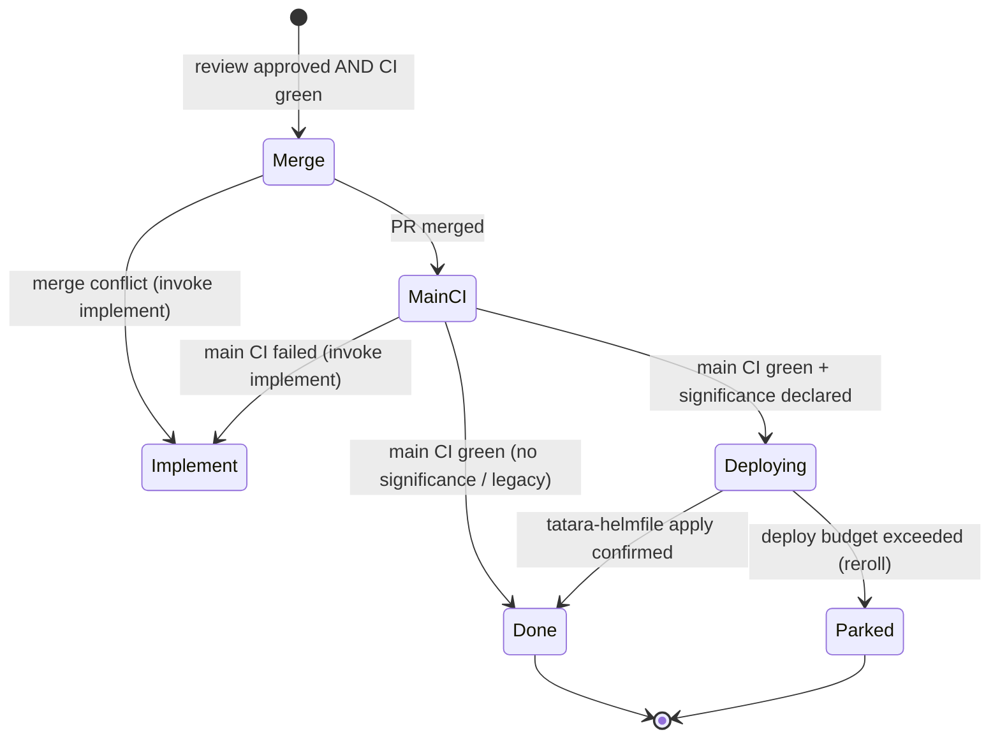

# Task

A `Task` CR represents one discrete unit of agent work. The operator creates Tasks by admitting
a `QueuedEvent` from the queue. Events are enqueued by SCM webhooks (issue and PR/comment
activity spawn `clarify`/`review`), by Grafana alert webhooks (`incident` tasks, enqueued as
`alert`-class events), and by the project's cron scans (`brainstorm`, `documentation`, and
`refine` are schedule-driven; `mrScan`/`issueScan` remain the backstop sweep for webhook
misses). `incident` is not cron-driven - there is no incident schedule in `scm.cron`; the
`cdScan` cron is a deploy-supervision backstop that sweeps existing `Deploying` Tasks rather
than creating new ones.

One long-lived wrapper Pod (plus a Service) is created per Task **session** and reused across
every turn. The operator submits each turn to the existing pod; it only re-creates the pod when
it is absent (first turn) or has crashed, bounded by a fixed recreation budget (3 attempts)
after which the Task is failed. A Task is not one pod per turn.

```
apiVersion: tatara.dev/v1alpha1
kind: Task
```

!!! note "Operator-managed"
    Tasks are created and fully managed by the tatara operator. Direct `kubectl apply` of a
    Task is supported for debugging but is not the normal path. Prefer letting the operator
    create Tasks from QueuedEvents or cron triggers.

---

## Kind families

Task kinds are divided into two families based on scope. The `repositoryRef` field is
**required** for repo-scoped kinds and **must be empty** for project-scoped kinds. The
operator rejects Tasks that violate this contract at reconcile time.

| Kind | Scope | Description |
|---|---|---|
| `brainstorm` | project | Surveys all project repos + external research; proposes a linked issue set across affected repos |
| `incident` | project | Investigates a Grafana alert; files an evidence-backed incident proposal |
| `clarify` | project | Runs the triage/human conversation on a new or commented issue; hands off to `implement` |
| `implement` | project | Picks up the whole Task CR (all issues+comments+open PRs/MRs); opens/updates PRs across every affected repo under the Task |
| `review` | project | Reviews all PRs/MRs under a Task; approves (label + native review) or invokes `implement` again |
| `documentation` | repo (docs repo) | Schedule-driven: updates docs when non-trivial changes have landed since the last run |
| `refine` | project | Groom-only backlog peer: closes duplicates, dedups, recovers stalled `implement` runs |

!!! note "Retired kinds: still valid enum values, no longer created"
    `selfImprove`, `triageIssue`, `healthCheck`, and `issueLifecycle` remain in the
    `Task.Spec.Kind` CRD enum so pre-existing stored Tasks can still be read, but no production
    code path creates a new Task of any of these kinds. `triageIssue` and the front half of
    `issueLifecycle` were absorbed into `clarify`; `healthCheck` was absorbed into `brainstorm`;
    the back half of `issueLifecycle` (Merge/MainCI/Deploying) survives as the operator-only
    [deploy supervisor](../workflows/deploy-supervisor.md), not an agent kind.

!!! warning "Kind-conditional validation"
    The CRD schema cannot express conditional field requirements, so `repositoryRef`
    validation is enforced at reconcile time by the controller, not by the API server.
    A Task that fails validation is immediately terminated with a descriptive condition.

---

## Task umbrella and the WorkItem ledger

A Task is no longer a single-repo, single-artifact object. One project-scoped Task is the
umbrella for an entire implementation stream: every linked issue (across every affected repo)
plus every MR/PR opened against that stream, with per-member state kept fresh by light operator
SCM polls. `Task.Status.WorkItems` (`[]WorkItemRef`) is the structured member list - small enough
to live on the CR status - carrying, per member: issue/PR identity (`provider`, `repo`, `number`,
`kind`), state, labels, head branch/SHA, CI/pipeline status, mergeability, and a last-synced
cursor.

At pod spawn the operator renders the **full umbrella context into the turn-0 prompt**: every
issue body + comment thread + state, every MR description + branch + comment thread + CI/
mergeability state, the set of repos in scope, and explicit per-repo checkout instructions. The
agent gets everything upfront and does not re-crawl SCM to rebuild history mid-run. There is no
new durable context store behind this - `tatara-memory` is unchanged and untouched (it only
ingests default branches, so it cannot hold MR/PR content); raw thread text comes live from SCM
at pod-build time and is assembled by the operator, not read back out of a separate service.

Because the umbrella can span many repos, heavy per-repo code exploration is delegated to
`Agent`-tool **subagents** split by context boundary (per-repo, per-concern) so the surface pod's
context holds the requirements bundle plus lean subagent results, not raw code from every repo at
once - see [Subagent-only orchestration](../concepts/agentic-model.md) and
[Implement](../workflows/implement.md#subagent-tiering).

!!! note "WorkItemRef is fully shipped"
    `WorkItemRef` (`tatara-operator`'s `api/v1alpha1/workitem_types.go`) carries: `provider`,
    `repo`, `number`, `kind`, `role`, `state`, `title`, `headSHA`, `labels`, `headBranch`,
    `ciStatus`, `mergeable`, `body`, and `lastRefreshedAt`. `role` records how the item relates to
    the task (`source`, `closes`, `openedPR`, `proposed`, `reviewed`); `title` and `body` are the
    item's title and issue/PR body captured at the last poll, rendered whole into the pod's
    turn-0 context bundle so a fresh pod reconstructs full cross-repo state from the CR alone.

---

## Spec

| Field | Type | Default | Required | Description |
|---|---|---|:---:|---|
| `projectRef` | string | - | yes | Parent `Project` CR name |
| `repositoryRef` | string | - | conditional | `Repository` CR name. Required for repo-scoped kinds; must be omitted for project-scoped kinds. |
| `goal` | string | - | yes | Natural-language task goal passed as the first agent turn |
| `kind` | enum | `implement` | no | Task kind (see table above) |
| `source` | [TaskSource](#tasksource) | - | no | SCM work-item that originated this task |
| `maxTurns` | int | from Project | no | Per-task override for `agent.maxTurnsPerTask` |
| `proposedIssue` | [ProposedIssueSpec](#proposedissuespec) | - | no | Issue blueprint for brainstorm-created proposals awaiting a maintainer to apply `tatara-approved` |
| `reposInScope` | `[]string` | - | no | Repository CR names this task is expected to change. Empty = single-repo (primary only). When set, the writeback step warns for any in-scope repo that produced no commits. |
| `systemicGroup` | [SystemicGroup](#systemicgroup) | - | no | Marks this task as the systemic-improvement lead. The lead opens one combined PR that closes only the `sameRepoSiblings` that carry their own recorded maintainer approval - see [SystemicGroup](#systemicgroup). |
| `alertRule` | string | - | no | Grafana alert rule name (`alertname` label) that triggered an incident task. Descriptive only; dedup key is the `tatara.dev/alert-group` label hash. |

### TaskSource

Records the SCM work-item that originated the task. Populated automatically from the
webhook payload when the operator creates the Task from a QueuedEvent.

| Field | Type | Description |
|---|---|---|
| `provider` | enum | `github` or `gitlab` |
| `issueRef` | string | Canonical reference: `owner/repo#N` for issues and GitHub PRs, `owner/repo!N` for GitLab MRs |
| `url` | string | Browser URL of the originating issue or PR |
| `authorLogin` | string | SCM login of the item's author |
| `isPR` | bool | `true` when the source item is a PR or MR |
| `number` | int | Issue or PR number |
| `headSHA` | string | PR/MR head commit SHA captured at enqueue. Seeds the review Task's `role:reviewed` ledger entry so same-head re-review dedup works on the very next scan cycle, without waiting for the cron backstop to fill it. Empty for issues. |
| `title` | string | Title at enqueue time. Feeds the deterministic branch slug and the no-agent PR-title fallback. |
| `dedupNumber` | int | Linked issue number for bot-PR tasks. When a bot MR body contains `Closes #N`, this field holds `N` so dedup matches the task against the issue slot, not the PR number. Zero means the task targets the item identified by `number`. |

### ProposedIssueSpec

Carried by brainstorm tasks that propose a new issue awaiting a maintainer to apply `tatara-approved` directly to it. The operator
creates a tracker issue from this spec when the task completes.

| Field | Type | Description |
|---|---|---|
| `repositoryRef` | string | Target `Repository` CR name |
| `title` | string | Proposed issue title |
| `body` | string | Proposed issue body (Markdown) |
| `kind` | enum | `bug` or `improvement` |
| `systemicId` | string | Groups related proposals into one systemic improvement. When set, `createProposal` stamps a `tatara/systemic-<id>` label and sibling footer; the whole group counts as one against `maxOpenProposals`. |
| `incident` | bool | `true` when filed by an incident-investigation agent; `createProposal` then adds the incident label. |
| `alertGroup` | string | Per-alert-group dedup identity of the incident that filed this proposal (the `tatara.dev/alert-group` hash label of the in-flight incident Task, falling back to its `alertRule` name). `createProposal` stamps `tatara/alert-group-<hash>` on the created issue and dedups future incident proposals by it, so a recurring alert tracks onto its existing open issue instead of spawning a near-duplicate. Empty for non-incident proposals. |

### SystemicGroup

Carried by the lead task of a systemic-improvement group. The lead opens a single PR that
targets same-repo siblings and is aware of cross-repo siblings as reference context.

| Field | Type | Description |
|---|---|---|
| `systemicId` | string | Group identifier. Matches the `tatara/systemic-<id>` SCM label applied by `createProposal`. |
| `sameRepoSiblings` | `[]int` | Issue numbers in the same repository the lead PR is aware of. |
| `crossRepo` | `[]string` | Cross-repo sibling references in `owner/repo#N - title` form. Informational only; not closed by this PR. |

!!! warning "Approval is per-sibling, never group-wide"
    A maintainer approving the lead issue does **not** approve its siblings. Each entry in
    `sameRepoSiblings` needs its own independently recorded `Status.ApprovedByMaintainer` (on
    that sibling's own Task) before the lead's implementation prompt includes it. An unapproved
    or declined sibling is never force-closed: the writeback step downgrades any `Closes #N`
    directive targeting it to `refs #N` before posting the PR body, so the reference survives
    but merging the lead PR does not close that sibling's issue. A late approval co-resolves on
    a later reconcile, since the group is filtered against currently-recorded approvals every
    time, not snapshotted once. See
    [Approval Gates](../operations/security/approval-gates.md#systemicgrouped-issue-sets-approval-is-per-issue-not-per-group).

---

## Status

### Core progress fields

| Field | Type | Description |
|---|---|---|
| `phase` | enum | `Planning`, `Running`, `Succeeded`, `Failed`, `Deploying`. Populated for every kind's own run; `Deploying` is set only once a Task's PR has been review-approved and the deploy supervisor has taken it over, alongside `lifecycleState: Deploying` (see [Deploy-supervision status](#deploy-supervision-status-phasedeploying) and [Termination](#termination)). |
| `approvedByMaintainer` | string | Empty until a verified maintainer approval is recorded; then holds the approving login. Set exclusively by the webhook when it observes an `issues.labeled` event for `tatara-approved` whose actor is a `maintainerLogins` member (never the bot). This is the **only** signal that releases a front-half Task into implementation - not raw label presence on the issue, not a comment, not `clarify`'s own verdict. See [Approval Gates](../operations/security/approval-gates.md#gate-2-maintainer-approval-label-who-can-approve-implementation). |
| `podName` | string | Name of the currently running agent Pod |
| `turnsCompleted` | int | Total turns completed across all runs |
| `prURL` | string | URL of the opened PR or MR |
| `resultSummary` | string | Short natural-language summary written by the agent at task end |
| `conditions` | `[]Condition` | Standard Kubernetes conditions (`type`, `status`, `reason`, `message`). Includes `WritebackFailed` when the writeback loop-breaker trips. |
| `discoveredIssues` | `[]string` | Issue URLs discovered as a side-effect of the task (e.g. bugs found during review) |
| `followupIssueURL` | string | URL of the follow-up issue opened when `changeSummary.remainingScope` is non-empty. Guards against opening a second follow-up on re-entry. |
| `gateEnteredAt` | time | Timestamp when this task entered the admission gate. Used to detect gate-stall. |

### Agent outcome structs

One outcome struct is populated by the agent via MCP tool at the end of each task kind.
All other outcome fields are absent.

| Field | Type | Populated by |
|---|---|---|
| `reviewVerdict` | [ReviewVerdict](#reviewverdict) | `review` tasks |
| `prOutcome` | [PROutcome](#proutcome) | Post-merge or close of a tatara-authored PR |
| `issueOutcome` | [IssueOutcome](#issueoutcome) | `clarify` tasks |
| `implementOutcome` | [ImplementOutcome](#implementoutcome) | `implement` tasks that open no PR |
| `brainstormOutcome` | [BrainstormOutcome](#brainstormoutcome) | `brainstorm` tasks that file no proposals |
| `changeSummary` | [ChangeSummary](#changesummary) | `implement` tasks via the `change_summary` MCP tool |

#### ReviewVerdict

| Field | Type | Description |
|---|---|---|
| `decision` | enum | `approve`, `request_changes`, or `comment` |
| `body` | string | Review comment body |
| `suggestions` | `[]Suggestion` | Inline code suggestions. Each entry: `path` (file path), `line` (1-based), `body` (suggestion text). |
| `semver` | `[]SemverAssignment` | `approve` only: per-MR `semver:<level>` assignments applied best-effort across every MR in the stream, human and tatara-authored alike. Each entry: `repo` (owner/repo slug, matches `WorkItemRef.Repo`), `number` (MR/PR number), `level` (`major`\|`minor`\|`patch`). Respects an existing human `semver:*` label on that MR; otherwise falls back to the MR's own `change_significance`, then `patch`. The only semver-labeling path for human-authored MRs - see [Review workflow](../workflows/review.md#semver-labeling-on-approve). |

#### PROutcome

| Field | Type | Description |
|---|---|---|
| `action` | enum | `merge` or `close` |
| `reason` | string | Optional explanation |

#### IssueOutcome

| Field | Type | Description |
|---|---|---|
| `action` | enum | `implement`, `close`, or `discuss` |
| `comment` | string | Comment body. Required when `action` is `close` or `discuss`. |
| `plan` | string | Short implementation plan. Posted as an implementation-start message when `action` is `implement`. |

!!! warning "`action=implement` alone does not release the Task"
    An `implement` verdict is necessary but not sufficient. The operator additionally requires
    `status.approvedByMaintainer` to already be recorded; if it is empty, the verdict is
    downgraded and the Task is parked back to `tatara-brainstorming` instead of advancing.

#### ImplementOutcome

Populated when an implement agent deliberately opens no PR.

| Field | Type | Description |
|---|---|---|
| `action` | enum | `declined` or `already_done` |
| `reason` | string | Required explanation of why no implementation was produced |

#### BrainstormOutcome

Populated when a brainstorm agent exits without filing any proposals.

| Field | Type | Description |
|---|---|---|
| `action` | enum | Always `none` |
| `reason` | string | Required explanation of why no proposals were filed |

#### ChangeSummary

Submitted by the implement agent via the `change_summary` MCP tool at the end of a run.

| Field | Type | Description |
|---|---|---|
| `prTitle` | string | PR title |
| `prBody` | string | PR body |
| `deliveredScope` | string | What was implemented in this run |
| `remainingScope` | string | Scope not completed. When non-empty, the operator opens a follow-up issue and records its URL in `followupIssueURL`. |
| `mostProblematic` | string | Hardest part of the change, from the agent's self-assessment |
| `significance` | enum | `major`, `minor`, or `patch`. **Required** on the `change_summary` MCP tool (re-validated at the REST `/change-summary` endpoint). This is the lever the push-CD cascade uses to cut the next semver tag: `applySemverAutoMerge` stamps the `semver:<level>` label and enables native auto-merge only when it is set. An empty value opens an unlabeled, non-cascading PR on the legacy close+Done path (`pushCDEligible` is false), logged WARN at writeback. Humans set the equivalent via a `semver:<level>` PR label. |

---

## Task-wide status fields (all kinds)

These fields apply across the whole Task's conversation/implementation history, not to one
retired lifecycle phase - they now span the `clarify` -> `implement` -> `review` handoff under
the umbrella Task rather than one phase-scoped `issueLifecycle` object.

### Token accounting

| Field | Type | Description |
|---|---|---|
| `resolvedModel` | string | The `MODEL` env resolved for this task's agent pod at spawn (`modelForKind`: per-kind override else project-wide model). Stamped once at pod creation and read by the token/terminal metrics so cost is priced by the model that actually ran. |
| `cumulativeTokens` | int64 | Total tokens consumed across all turns on this task |
| `lastTurnInputTokens` | int64 | Input tokens on the most recent completed turn |
| `cumulativeInput` | int64 | Running total of uncached input tokens across all turns |
| `cumulativeOutput` | int64 | Running total of output tokens across all turns |
| `cumulativeCacheRead` | int64 | Running total of cache-read input tokens across all turns |
| `cumulativeCacheCreation` | int64 | Running total of cache-creation input tokens across all turns |

### Conversation-resume fields (all kinds) {: #conversation-resume-fields-all-kinds }

Propagated across kind handoff (e.g. `clarify` -> `implement` warm resume) to avoid a full
cold-rehydrate of context on every new pod.

| Field | Type | Description |
|---|---|---|
| `conversationObjectKey` | string | S3 object key for the Claude conversation transcript. Stable across kind handoffs. Empty until the first turn that reports it. |
| `sessionID` | string | Claude session ID. Passed back to the next Pod as `CONVERSATION_SESSION_ID` so each turn resumes the conversation with `claude --resume` rather than starting cold. |
| `handover` | string | Compacted handover text injected when the context window exceeds `agent.handoverThresholdPercent`. |

### Re-entry context and loop-breaker counters

| Field | Type | Description |
|---|---|---|
| `implementContext` | string | Optional re-entry prompt injected at the start of the next `implement` turn (e.g. CI failure details, conflict notice, review feedback). Cleared after the turn is submitted. |
| `parkReason` | string | Reason string from the last `Parked` transition. Cleared when the task leaves `Parked`. Carried for observability; does not gate re-activation. |
| `implementEmptyRetries` | int | Counts consecutive `implement` runs that completed with zero commits. After the cap, the task is commented and parked with reason `implement-empty` instead of silently re-entering. |
| `writebackSkip4xxAttempts` | int | Counts consecutive writeback sweeps where every repo returned a permanent 4xx from `OpenChange`. After the cap, the writeback gate stops re-sweeping and records a `WritebackFailed` condition. |
| `implementGiveUps` | int | Counts `implement` attempts that gave up for this Task (an `Implement` -> `Parked` transition with a recoverable reason). Bounds the auto-reroll backstop that re-enters give-ups; not reset on PR open. |

### Async communication queues

| Field | Type | Description |
|---|---|---|
| `pendingComments` | `[]string` | Free-form comment bodies queued by the agent via the `comment` MCP tool. Posted to the linked SCM issue on the next reconcile, then cleared. |
| `pendingInterjections` | `[]string` | Comment bodies queued by the webhook when a new issue or MR comment arrives while an agent turn is in flight (this is how `clarify`'s live-polling pod receives replies). The reconciler delivers each to the live wrapper session as mid-session user input, then clears the list. |

---

## Deploy-supervision-only status fields

The deploy supervisor operates a multi-phase state machine, distinct from any agent kind's
turn loop. The fields below are only populated once a Task's PR has been review-approved and
the deploy supervisor has taken it over; all kinds still in agent-driven flow (`clarify`,
`implement`, `review`, `brainstorm`, `incident`, `refine`) leave them empty.

!!! note "Wire key vs. Go name"
    The status field's YAML/JSON/CRD key is unchanged: `lifecycleState`. Only the Go struct
    field was renamed, to `DeployState` (`api/v1alpha1/task_types.go`). `kubectl -o jsonpath`
    queries and Grafana panels must read `.status.lifecycleState`, not `.status.deployState` -
    the latter is agent/controller-internal only and does not exist on the wire. The kubectl
    `Lifecycle` printcolumn reflects this same field.

### Deploy state machine



`Implement` here is not a phase of this state machine - it is the operator re-adding
`tatara-implementation` and letting the label-driven handoff spawn a fresh `implement` Task,
exactly as `review` does on an unmergeable MR.

!!! info "Dual termination design"
    A Task signals completion through `status.lifecycleState`, not `status.phase`, once it has
    entered deploy supervision. Its `phase` is `Deploying` in parallel with
    `lifecycleState: Deploying`; neither alone is a terminal value. Any code that checks whether
    a Task is finished **must** call the `TaskTerminal` helper (or replicate its logic), not test
    `phase` alone. See [Termination](#termination).

### State and timing

| Field | Type | Description |
|---|---|---|
| `lifecycleState` | enum | Current deploy-supervision phase (Go field: `DeployState`): `Triage`, `Conversation`, `Implement`, `MRCI`, `Merge`, `MainCI`, `Deploying`, `Done`, `Stopped`, `Parked`. The front four (`Triage`/`Conversation`/`Implement`/`MRCI`) are legacy-drain-only - stamped only by in-flight pre-redesign `issueLifecycle` Tasks; no new-model kind (`clarify`/`implement`/`review`/`brainstorm`/`incident`/`documentation`/`refine`) ever sets them. |
| `lastActivityAt` | time | Timestamp of the last meaningful activity (comment, state transition, agent turn). Used to enforce inactivity deadlines. |
| `deadlineAt` | time | When the current deadline expires. Set on each state transition that has a timeout. |

### Branch and PR tracking

| Field | Type | Description |
|---|---|---|
| `headBranch` | string | Deterministic agent branch name. Reused across `implement` re-entries for the same task. |
| `prNumber` | int | SCM PR/MR number of the current open change |
| `mergeCommitSHA` | string | SHA of the most recent merge commit on the target branch |
| `mergedHeadSHA` | string | Source-branch head SHA at the time of the most recent merge. Retained across `clearMergedChangeState` so a re-opened PR that re-proposes already-merged commits is detected as a duplicate. |

### Deploy-supervision status (PhaseDeploying)

When a Task's PR is review-approved, auto-merges, and main CI (including the release tag-cut
and version propagation) goes green, the Task does **not** terminate at merge. It enters the
pod-less `Deploying` phase (`phase: Deploying`, `lifecycleState: Deploying`, both non-terminal):
no agent pod runs and the **operator** - not an agent - drives the push-CD cascade to a
`tatara-helmfile` apply, then resolves the Task `Done` and closes the originating issue. This is
the only status surface for inspecting a stalled deploy cascade, so it is worth knowing when a
`kubectl get task` shows `Deploying`.

| Field | Type | Description |
|---|---|---|
| `cascadeStage` | enum | How far this Task's artifact has propagated: `tagged` (semver tag cut) -> `parent-pr-open` (version-bump PR opened on the parent repo) -> `parent-merged` (that PR merged) -> `helmfile-applied` (the terminal `tatara-helmfile` `apply.yaml` run confirmed the pin). Set to `tagged` on entry. |
| `deployedVersion` | string | The semver (`vX.Y.Z`) this Task's artifact published and is driving toward the cluster. |
| `deployArtifact` | string | Deploy-ledger artifact identity (`repo@vX.Y.Z`); the key the apply-outcome sweep matches against applied pins. |
| `deployDeadline` | time | Wall-clock deadline for the cascade (`now + deployBudgetSeconds`, or the tighter `deploySingleHopBudgetSeconds` for single-hop repos). On exceed, the Task parks recoverable with reason `deploy-timeout` and the reroll machinery re-implements a fix. |

!!! note "Multi-hop budget"
    `tatara-cli` and `tatara-agent-skills` reach `tatara-helmfile` through an intermediate
    wrapper rebuild (two tag-cut hops) and use the larger `deployBudgetSeconds`; every other repo
    is one hop and uses `deploySingleHopBudgetSeconds`. The cascade supervisor is GitHub-only; a
    non-GitHub reader cannot watch the apply, so the deadline backstop (the `cdScan` cron) is what
    parks a stalled cascade there.

---

## WorkItems ledger

`status.workItems` is the single source of truth for every SCM artifact this task spans:
the originating issue, any PRs it opens, proposals it files, and issues it closes. The
operator seeds the ledger lazily from `spec.source` on the first reconcile and updates it
as the agent drives actions via MCP tools.

The ledger is used for dedup, stall recovery, prompt generation, and cross-repo scope
determination via `TaskReposInScope`.

### WorkItemRef

| Field | Type | Values | Description |
|---|---|---|---|
| `provider` | string | `github`, `gitlab` | SCM provider |
| `repo` | string | `owner/repo` | Repository slug |
| `number` | int | | Issue or PR/MR number |
| `kind` | string | `issue`, `pr` | Artifact type |
| `role` | string | `source`, `closes`, `openedPR`, `proposed`, `reviewed` | How this item relates to the task |
| `state` | string | `proposed`, `approved`, `declined`, `implemented`, `open`, `closed`, `merged` | Current item state |
| `title` | string | | Item title (for prompt context) |
| `headSHA` | string | | Head commit SHA of a PR/MR at last refresh |
| `labels` | `[]string` | | Current SCM labels on this member |
| `headBranch` | string | | PR/MR source branch |
| `ciStatus` | string | ``, `pending`, `success`, `failure` | Member's CI/pipeline status |
| `mergeable` | string | `unknown`, `clean`, `dirty`, `blocked`, `behind` | Member's mergeability |
| `body` | string | | Issue/PR body captured at the last poll (turn-0 context bundle source) |
| `lastRefreshedAt` | time | | When the operator last synced this item's state from the SCM API |

---

## Termination

A Task is considered terminal when **either** of the following is true:

- `status.phase` is `Succeeded` or `Failed`
- `status.lifecycleState` is `Done`, `Stopped`, or `Parked`

!!! warning "Do not test `phase` alone"
    A Task under deploy supervision carries `phase: Deploying` (a non-terminal value) in
    parallel with `lifecycleState`, and signals completion only through `status.lifecycleState`
    once it has entered that phase. Code that tests `phase == Succeeded` alone will treat an active
    or finished deploy-supervised task identically. Always use the `TaskTerminal` helper (or its
    equivalent logic) for termination checks.

| Terminal state | Meaning |
|---|---|
| `Succeeded` | Agent-kind task completed successfully |
| `Failed` | Agent-kind task failed (turn timeout, max-turns hit, agent error) |
| `Done` | Deploy-supervised task completed (PR merged and main CI passed, or closed/declined) |
| `Stopped` | Task administratively stopped (e.g. clarify's idle timeout) |
| `Parked` | Deploy-supervised task stalled awaiting human input. Re-activated when the human comments on the linked issue. |

---

## Example

```yaml
apiVersion: tatara.dev/v1alpha1
kind: Task
metadata:
  name: implement-issue-42
  namespace: tatara
spec:
  projectRef: my-project
  repositoryRef: my-service
  kind: implement
  goal: |
    Implement the changes described in GitHub issue #42.
    Follow the existing patterns in internal/handler/.
  source:
    provider: github
    issueRef: my-org/my-service#42
    number: 42
    title: "Add retry logic to HTTP client"
```

---

## Inspecting tasks

```sh
# List all tasks for a project
kubectl -n tatara get task -l tatara.dev/project=my-project

# Wide view (Phase, Lifecycle, Kind, Turns columns)
kubectl -n tatara get task -l tatara.dev/project=my-project -o wide

# Describe a specific task
kubectl -n tatara describe task implement-issue-42

# Stream agent logs
kubectl -n tatara logs \
  $(kubectl -n tatara get task implement-issue-42 \
      -o jsonpath='{.status.podName}') \
  -c tatara-claude-code-wrapper -f

# Check work-item ledger
kubectl -n tatara get task implement-issue-42 \
  -o jsonpath='{.status.workItems}' | jq .
```
