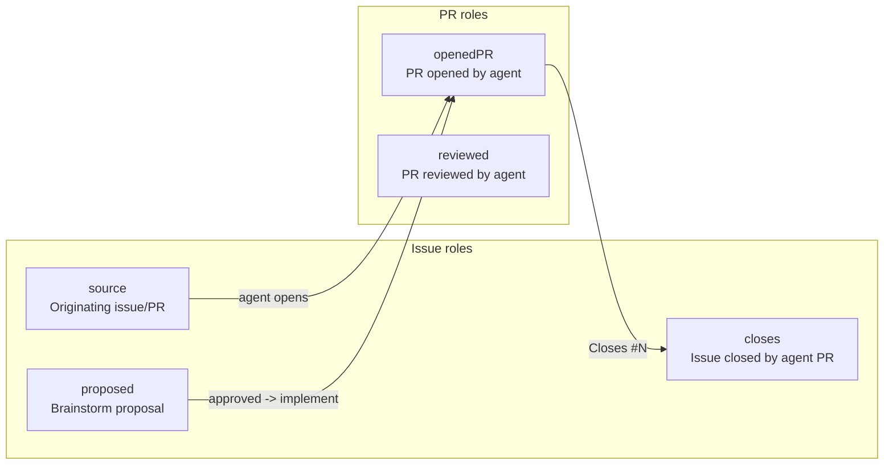
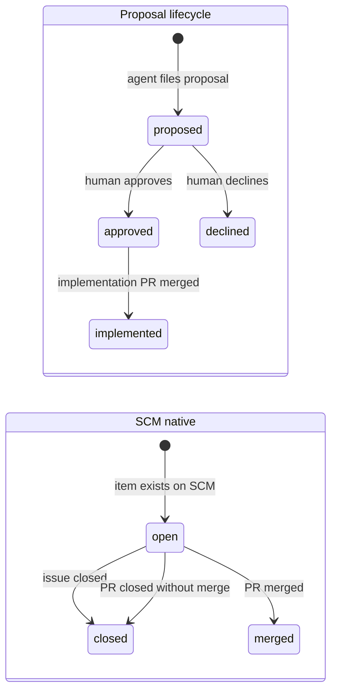

# WorkItem

`WorkItemRef` is not a standalone custom resource. It is a struct embedded in
`Task.status.workItems[]` - a per-Task ledger of every SCM artifact (issues,
pull requests, merge requests) the task has touched across its lifetime.

## Purpose

The ledger is the single authoritative source of truth for three operator
guarantees:

**Dedup.** Before the operator enqueues a new Task for an incoming webhook
event, it checks every active Task's ledger. If an existing Task already has
that `(repo, number)` pair anywhere in its `workItems`, the incoming event is
silently discarded. This prevents duplicate agent runs on the same issue
regardless of whether the task was born from the same webhook or discovered the
issue mid-flight.

**Multi-repo scope tracking.** When an agent opens PRs across several
repositories for one issue, each opened PR is written back into the ledger.
`TaskReposInScope` aggregates all `repo` fields into a sorted, deduplicated
slice that the operator uses to decide which repositories to clone and which
branches to watch for CI.

**Stall detection and recovery.** The `issueLifecycle` controller reads `state`
fields to detect when a proposed issue is stuck in `proposed` (never approved
or declined), when an `openedPR` has been `merged` but the issue has not been
closed, or when a task should be re-activated after human feedback.

**Agent prompt context.** On every agent pod launch the operator serialises the
full ledger into the `TATARA_WORK_ITEMS` environment variable via
`WorkItemsContext`. The agent receives a structured summary of all items it is
responsible for without needing to query the Kubernetes API.

---

## Field reference

`WorkItemRef` is defined in `api/v1alpha1/workitem_types.go`.

| Field | JSON key | Type | Required | Description |
|---|---|---|---|---|
| `Provider` | `provider` | string | yes | SCM provider. `github` or `gitlab`. |
| `Repo` | `repo` | string | yes | Repository slug in `owner/repo` form. |
| `Number` | `number` | int | no | Issue or PR/MR number within the repository. |
| `Kind` | `kind` | string | yes | Item type. `issue` or `pr`. |
| `Role` | `role` | string | yes | Relationship between this item and the Task. See [Role semantics](#role-semantics). |
| `State` | `state` | string | no | Current disposition of the SCM item. See [State transitions](#state-transitions). |
| `Title` | `title` | string | no | Issue or PR title at the time of last refresh. Carried for prompt readability. |
| `HeadSHA` | `headSHA` | string | no | Head commit SHA of the PR/MR branch. Populated for `openedPR` and `reviewed` items; empty for issues. |
| `LastRefreshedAt` | `lastRefreshedAt` | `*metav1.Time` | no | Timestamp of the most recent SCM sync that updated this entry. |

!!! note "Ledger location"
    The ledger is at `Task.status.workItems` (a `[]WorkItemRef`). It is seeded
    lazily from `spec.source` on the first reconcile and maintained by the
    operator as the agent drives actions through MCP tools. The field is absent
    on Tasks that have not yet been reconciled or that were created before the
    ledger was introduced.

---

## Role semantics

Each entry carries a `role` that describes the relationship between the SCM
item and the Task, not just whether it is an issue or a PR.



| Role | Kind | Description |
|---|---|---|
| `source` | issue or pr | The SCM item that triggered this Task. Webhook-born Tasks have exactly one `source` entry seeded from `spec.source`. |
| `proposed` | issue | A brainstorm-proposed issue that the agent filed on the tracker. Awaiting human approval before an implementation Task is spawned. |
| `closes` | issue | An issue that the agent's PR explicitly closes (via `Closes #N` in the PR body). The operator tracks this to detect when the work is complete. |
| `openedPR` | pr | A pull request or merge request opened by the agent as the implementation output. A Task may have multiple `openedPR` entries when the work spans more than one repository. |
| `reviewed` | pr | A PR/MR that a `review`-kind Task examined. The agent posts its verdict and the entry records the head SHA it reviewed. |

!!! warning "Role cardinality"
    A Task has at most one `source` entry. It may have multiple `openedPR`
    entries (one per repository in scope for a multi-repo implementation) and
    multiple `closes` entries. A single issue can appear in the ledger under two
    roles (for example, `source` and `closes` if the source issue is also the
    one being closed by the opened PR).

---

## State transitions

`state` tracks the disposition of the SCM item as understood by the operator at
the time of the last sync. The valid values split into two orthogonal groups:
proposal-lifecycle states (used with `proposed` and `approved/declined`
semantics) and native SCM states (`open`, `closed`, `merged`).



| State | Applies to roles | Description |
|---|---|---|
| `proposed` | `proposed` | Proposal issue has been created on the SCM tracker. No implementation Task exists yet. |
| `approved` | `proposed` | A human (or maintainer) has signalled approval on the proposal issue. The operator will spawn an `implement` Task. |
| `declined` | `proposed` | A human has declined the proposal. The proposal issue is closed and no implementation Task is spawned. |
| `implemented` | `proposed`, `closes` | The linked implementation PR has been merged. Used to avoid re-implementing an already-delivered proposal. |
| `open` | `source`, `closes`, `openedPR`, `reviewed` | The issue or PR is open on the SCM provider. |
| `closed` | `source`, `closes` | The issue has been closed (by merge, by human, or by the agent's PR). |
| `merged` | `openedPR`, `reviewed` | The PR/MR has been merged into its base branch. |

---

## Helper functions

Three functions in `workitem_types.go` operate on the ledger and are shared
across the agent controller and the webhook handler.

### `TaskMatchesItem`

```go
func TaskMatchesItem(t *Task, repo string, number int) bool
```

Reports whether a given `(repo, number)` pair is already covered by a Task.
The check has three layers, applied in order:

1. **Spec.Source seed.** Compares `repo` to the `owner/repo` portion of
   `spec.source.issueRef` and `number` to `spec.source.dedupNumber` (falling
   back to `spec.source.number` when `dedupNumber` is zero). This handles
   bot-PR Tasks where the dedup key is the linked issue number, not the PR
   number.
2. **Ledger scan.** Iterates `status.workItems` looking for an entry where
   `wi.Repo == repo && wi.Number == number`. Catches items added mid-flight by
   the agent (for example, an `openedPR` or `closes` entry).
3. **Legacy label fallback.** For Tasks created before the ledger existed,
   reads the now-deprecated `tatara.io/source-repo` and `tatara.io/source-number`
   labels. This allows ~O(1000) pre-ledger Tasks to remain matched during the
   migration period without a backfill migration.

!!! warning "Do not key on labels in new code"
    The legacy label constants are deleted in Phase 2 of the ledger migration.
    Any new dedup logic must use `TaskMatchesItem` and never read
    `tatara.io/source-repo` / `tatara.io/source-number` directly.

### `TaskReposInScope`

```go
func TaskReposInScope(t *Task) []string
```

Returns a sorted, deduplicated `[]string` of `owner/repo` slugs from:

- The `owner/repo` portion of `spec.source.issueRef` (when `spec.source` is set).
- Every non-empty `wi.Repo` in `status.workItems`.

This is the authoritative clone-scope helper shared by the agent controller
(to determine which repos the agent pod should be given access to) and by the
writeback logic (to detect when an in-scope repository produced no commits and
should trigger a warning comment).

### `WorkItemsContext`

```go
func WorkItemsContext(t *Task) string
```

Serialises the ledger into a Markdown string for injection into the agent
prompt via the `TATARA_WORK_ITEMS` environment variable. Returns an empty
string when `workItems` is empty. Each entry is rendered as:

```
## Spanned work items
- [issue] owner/repo#42 (role:source, state:open) - Add retry logic
- [pr]    owner/repo#17 (role:openedPR, state:open) - Implement retry client
- [pr]    org/other-repo!8 (role:openedPR, state:open) - Update shared library
```

GitHub PRs use the `#` separator; GitLab MRs use `!`. The agent receives this
context at session start and can reference it when deciding which repositories
to clone and which issues to close.

---

## Inspecting the ledger

Read the ledger for a running or completed Task:

```sh
kubectl -n tatara get task <name> \
  -o jsonpath='{.status.workItems}' | jq .
```

Filter to items in a specific role:

```sh
kubectl -n tatara get task <name> \
  -o json | jq '.status.workItems[] | select(.role == "openedPR")'
```

List all Tasks that reference a given issue (useful for dedup audits):

```sh
# Find all tasks touching my-org/my-service#42
kubectl -n tatara get tasks -o json | jq '
  .items[] |
  select(
    .status.workItems[]? |
    .repo == "my-org/my-service" and .number == 42
  ) | .metadata.name'
```

---

## Why the ledger replaced `tatara.io` labels

Prior to the ledger, the operator tracked SCM associations through a set of
Kubernetes labels on the Task object:

| Legacy label | Replacement |
|---|---|
| `tatara.io/source-repo` | `spec.source.issueRef` (owner/repo portion) |
| `tatara.io/source-number` | `spec.source.number` / `spec.source.dedupNumber` |

Labels have two structural limitations that made them unsuitable for production
at scale:

1. **Single-item constraint.** A label is a key-value string. Tracking a Task
   that spans multiple repositories (one source issue, two opened PRs in
   different repos) required either multiplying labels or encoding a
   comma-separated list - both fragile.
2. **No semantic structure.** Labels could express which issue started the Task,
   but not the role or current state of each item. Detecting "PR opened but
   source issue not yet closed" required cross-referencing SCM API calls on
   every reconcile instead of reading structured local state.

The ledger replaces both with a typed `[]WorkItemRef` slice that carries role,
state, head SHA, and refresh timestamp per item, supports arbitrarily many
entries, and is queryable with standard `kubectl -o jsonpath`/`jq` tooling.

The `tatara.io/source-repo` and `tatara.io/source-number` labels are preserved
only for backward compatibility with Tasks created before the migration. New
controller code must not set or read them.
