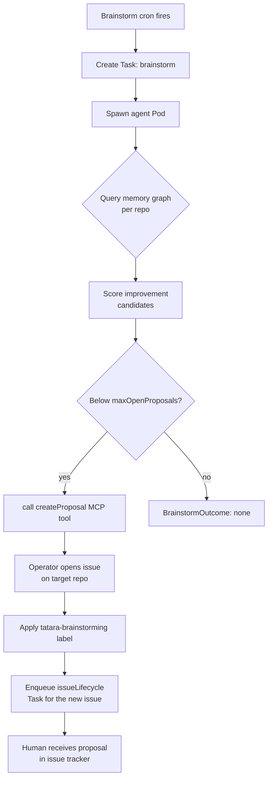
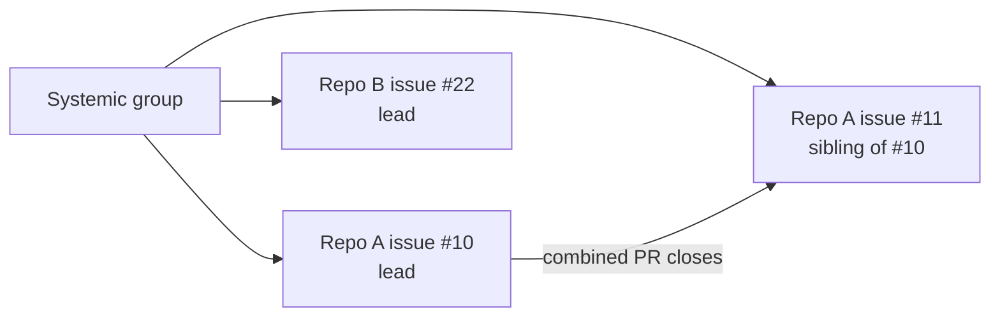

# Brainstorm Workflow

The brainstorm workflow is a periodic, autonomous improvement proposal engine. It surveys your codebase knowledge graph, identifies improvement opportunities, and opens GitHub/GitLab issues for human review. No human initiates it - a cron schedule fires it automatically.

## Trigger

- **Cron:** `spec.scm.cron.brainstorm` on the `Project` CR (e.g. `"0 9 * * 1"` for Mondays at 09:00)
- **Manual:** Create a `Task` with `kind: brainstorm` against the project

## Workflow steps



## Proposal structure

Each proposal issue includes:
- A concrete, actionable title
- A description covering: problem statement, proposed approach, expected benefit
- The `tatara-brainstorming` label (configurable via `spec.scm.brainstormingLabel`; `tatara-idea` is a deprecated legacy alias)

The agent targets proposals at specific repositories based on graph analysis - it does not spray proposals across all repos indiscriminately.

## Proposal limits

`spec.scm.cron.brainstorm.maxOpenProposals` (default: 5 per project) limits how many open proposal issues can exist simultaneously. The brainstorm agent checks this count before filing; if the cap is met, it exits with `BrainstormOutcome{action: none, reason: "..."}`.

## Systemic improvements

When the brainstorm identifies a cross-cutting issue affecting multiple repositories, it can file related proposals as a **systemic group**:

- Each proposal gets a `tatara/systemic-<id>` label
- The group counts as one against `maxOpenProposals`
- The lead task (lowest issue number in the group for a given repo) opens a single combined PR that closes all same-repo siblings



## Conversation forking

When a brainstorm agent opens multiple proposal issues, each resulting `issueLifecycle` task gets a **forked copy** of the brainstorm conversation (S3 copy-object). This gives each implementation agent the brainstorm context as its starting point, without the transcripts interfering with each other.

## Configuring brainstorm sources

```yaml
spec:
  scm:
    cron:
      brainstorm:
        sources:
          - memory    # knowledge graph (always recommended)
          - docs      # docs/ directory content
          - internet  # outbound internet egress (requires NetworkPolicy)
        maxOpenProposals: 5
```

With `internet` in sources, the operator stamps `tatara.io/egress: internet` on the brainstorm Pod, which a NetworkPolicy can use to grant `0.0.0.0/0` egress for that pod class only.

## Health check vs. brainstorm

The `healthCheck` workflow is a lighter-weight variant. Instead of proposing new work, it assesses the health of the current platform state (stalled tasks, drift, CI failures) and produces a report issue. It runs on its own `spec.scm.cron.healthCheck` schedule.
