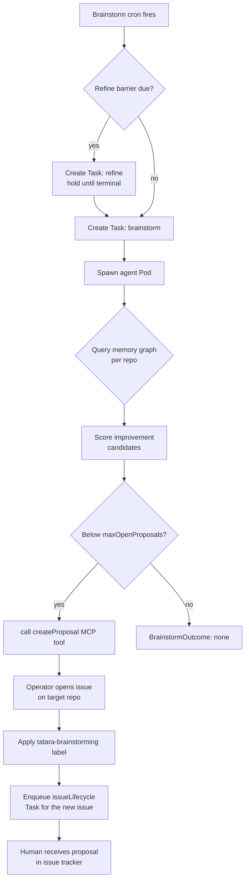
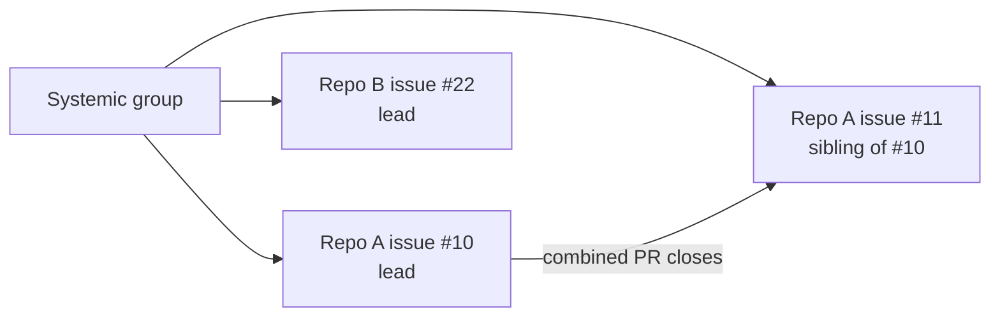

# Brainstorm Workflow

The brainstorm workflow is a periodic, autonomous improvement proposal engine. It surveys your codebase knowledge graph, identifies improvement opportunities, and opens GitHub/GitLab issues for human review. No human initiates it - a cron schedule fires it automatically.

## Trigger

- **Cron:** `spec.scm.cron.brainstorm` on the `Project` CR (e.g. `"0 9 * * 1"` for Mondays at 09:00)
- **Manual:** Create a `Task` with `kind: brainstorm` against the project

## Workflow steps



## One task per project per cycle

Brainstorm runs at **project scope**, not per-repo. At most one non-terminal brainstorm `Task` may exist for a project at any time - a Task in flight for *any* repo blocks a new one project-wide. Brainstorm Tasks carry an empty `RepositoryRef`; the agent decides which repos to target internally.

`spec.scm.cron.brainstorm.maxPerCycle` is a **deprecated, inert field** (kubebuilder default `1`). Setting it has no effect - the operator hard-caps at one brainstorm cycle regardless of its value.

## Refine barrier

Before a due brainstorm tick proceeds, the operator gates it on the [refine workflow](refine.md) completing a pass first. This is cadence-derived (no separate `refine` cron schedule): a due brainstorm tick creates a `refine` Task and holds (polling roughly every 30s) until that Task reaches a terminal state (`Succeeded` or `Failed` - a failed refine still releases the gate, so a broken refine never wedges brainstorm). Only brainstorm waits on this barrier; `mrScan`, `issueScan`, and `healthCheck` do not.

## Proposal structure

Each proposal issue includes:
- A concrete, actionable title
- A description covering: problem statement, proposed approach, expected benefit
- The `tatara-brainstorming` label (configurable via `spec.scm.brainstormingLabel`; `tatara-idea` is a deprecated legacy alias)

The agent targets proposals at specific repositories based on graph analysis - it does not spray proposals across all repos indiscriminately. Live handoffs (see [Refine](refine.md)) are considered for continuation proposals before a fresh-ideas research pass runs, under the same cap below.

## Proposal limits

`spec.scm.cron.brainstorm.maxOpenProposals` (CRD default: **5** per project) limits how many open proposal issues can exist simultaneously, counted **across all repos in the project, summed**. The check short-circuits: once the cap is reached the agent stops evaluating remaining repos. If the cap is met, the brainstorm agent exits with `BrainstormOutcome{action: none, reason: "..."}` rather than filing anything.

A systemic group (see below) counts as **one** entry against the cap regardless of how many sibling issues it spans.

## Systemic improvements

When the brainstorm identifies a cross-cutting issue affecting multiple repositories, it can file related proposals as a **systemic group** (bounded to at most 6 repos per group):

- Each proposal gets a `tatara/systemic-<id>` label
- The group counts as one against `maxOpenProposals`
- Per repo, the lead is elected as the **lowest issue number** in that repo for the group; the lead task opens a single combined PR that closes all same-repo siblings from the PR body (`Closes #N, Closes #M`)
- Cross-repo siblings are reference-only in the lead's prompt - the lead never edits another repo's code



## Staleness reaper (auto-decline)

`spec.scm.cron.brainstorm.staleProposalDays` opts in a staleness reaper: a positive value auto-closes bot-authored proposals that have had no human engagement (no human comment, no live work) for at least that many days. The unset default (`0` or negative) **disables the reaper entirely** - this is an explicit opt-in sentinel, not a kubebuilder default. When enabled, unengaged proposals older than the window are closed automatically, keeping `maxOpenProposals` from silently filling up with ideas nobody responded to.

## Issue engagement tracking

Every issue in an agent's context carries an `[bot-engaged]` marker when the bot has already commented on it. This is a **passive dedup marker**, not an instruction the brainstorm agent acts on directly - brainstorm itself never comments on existing issues (it only ever creates new proposals via `createProposal`/`propose_issue`). The marker exists so the agent can see, at a glance, which issues in its context it has already touched.

The actual "don't repeat yourself" behaviors that consume this marker live elsewhere:

- **healthCheck** (see below) uses `[bot-engaged]` to decide whether to comment on an existing issue, propose a new one, or skip - it explicitly avoids re-commenting on an issue already marked engaged.
- **issueScan** independently skips triage re-entry for a bot-authored, brainstorming-labeled issue that has had no human activity since the bot's own comment (bot-only `updatedAt` bumps do not count as engagement).

## Conversation forking

When a brainstorm agent opens multiple proposal issues, each resulting `issueLifecycle` task gets a **forked copy** of the brainstorm conversation (S3 copy-object). This gives each implementation agent the brainstorm context as its starting point, without the transcripts interfering with each other.

## Configuring brainstorm sources

```yaml
spec:
  scm:
    cron:
      brainstorm:
        sources:
          - memory    # knowledge graph (always recommended)
          - docs      # docs/ directory content
          - internet  # outbound internet egress (requires NetworkPolicy)
        maxOpenProposals: 5
        staleProposalDays: 14
```

With `internet` in sources, the operator stamps `tatara.io/egress: internet` on the brainstorm Pod, which a NetworkPolicy can use to grant `0.0.0.0/0` egress for that pod class only. As of Phase 1 of the [deep architectural research](research.md) build, this remains the only egress hook - no dedicated web-search/academic MCP servers are wired yet.

## Health check vs. brainstorm

The `healthCheck` workflow is a lighter-weight variant. Instead of proposing new work, it assesses the health of the current platform state (stalled tasks, drift, CI failures) and produces a report issue. It runs on its own `spec.scm.cron.healthCheck` schedule, and unlike brainstorm it retains the `[bot-engaged]`-gated re-comment path described above.
