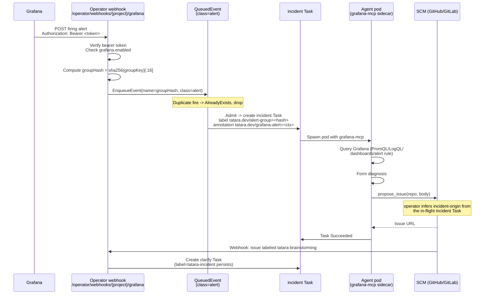

# Incident Response

When a Grafana alert fires, the tatara operator receives a webhook, deduplicates it against
any already-running investigation, and spawns a project-scoped `incident` Task. The agent
queries Grafana live, diagnoses the problem, and files exactly one evidence-backed issue via
`propose_issue`. That issue enters the normal triage/brainstorm flow with an additive
`tatara-incident` label so it is immediately visible as incident-originated.

---

## 1. Trigger

The operator exposes a Grafana-specific webhook endpoint per Project:

```
POST /operator/webhooks/{project}/grafana
```

Grafana (Alertmanager-compatible webhook contact point) calls this endpoint when one of the
registered alert groups transitions to `firing`. Any other status (`resolved`, `pending`) is
silently accepted with HTTP 202 and no Task is created.

### Prerequisites

The `spec.grafana` block on the Project CR must have `enabled: true`:

```yaml
spec:
  grafana:
    enabled: true
    url: https://grafana.example.com   # base URL for the grafana-mcp queries
    secretRef: tatara-grafana          # Secret with serviceAccountToken + webhookSecret
```

Without `enabled: true`, the endpoint returns 404.

### Authentication

The endpoint uses a **static bearer token** (not HMAC). Grafana must send:

```
Authorization: Bearer <webhookSecret>
```

The operator reads `webhookSecret` from the Secret named in `spec.grafana.secretRef` and
performs a constant-time comparison. A mismatch returns 401.

The same Secret also carries `serviceAccountToken`, which the operator mounts into the
grafana-mcp sidecar so the agent can query Grafana read-only.

??? note "Bearer vs. HMAC"
    The SCM webhook endpoint (`/operator/webhooks/{project}`) uses HMAC signature
    verification tied to each provider's signature header. The Grafana endpoint uses a
    simpler static bearer token because Grafana's unified alerting webhook does not support
    HMAC signing.

---

## 2. Dedup

Each Grafana webhook payload carries a `groupKey` string identifying the alert group. The
operator derives a dedup key as the first **16 hex characters of SHA-256(`groupKey`)** and
stamps it on the Task as label `tatara.dev/alert-group`.

```go
// alertGroupHash (grafana.go)
h := sha256.Sum256([]byte(a.GroupKey))
return hex.EncodeToString(h[:])[:16]
```

This hash is also used as the deterministic name for the `QueuedEvent`, making
concurrent re-fires within the same alert group idempotent at the queue layer: the second
`EnqueueEvent` call returns `AlreadyExists` instead of creating a second investigation.

!!! important
    An ongoing incident Task (any non-terminal phase) for the same alert group blocks a new
    one. Once that Task reaches a terminal phase (Succeeded or Failed), the next alert fire
    produces a fresh Task.

---

## 3. Context injection

Before spawning the agent, the operator renders a compact alert context block from the
webhook payload and stores it in two places:

- **Task goal** - passed as the turn-0 instruction (see below).
- **Annotation `tatara.dev/grafana-alert`** - stored on the Task for audit/debug.

The rendered block contains:

```
status=firing groupKey=<groupKey>
commonLabels: {alertname=..., component=..., severity=..., system=tatara}
commonAnnotations: {summary=..., description=...}
externalURL: https://grafana.example.com/...
alert[0]: status=firing labels={...} annotations={...} startsAt=<RFC3339> generatorURL=...
```

This gives the agent the exact alert rule URL (`generatorURL`) and the Grafana instance URL
(`externalURL`) so it can navigate directly to the firing rule and related dashboards without
external input.

---

## 4. Grafana MCP access

When `spec.grafana.enabled` is true, the operator provisions a read-only grafana-mcp for the
Project. The grafana-mcp is exposed as an in-cluster service (reported in
`status.grafana.endpoint`), and its URL is injected as `TATARA_GRAFANA_MCP_URL` into **every**
agent pod in a grafana-enabled project, regardless of kind (the injection gates only on
`project.Spec.Grafana.Enabled`, not on the Task kind). In practice only `incident` agents are
prompted to use it; other kinds simply do not act on the mounted server.

The agent uses it to:

- Follow the `generatorURL` to read the exact firing rule definition.
- Run PromQL queries against the relevant datasource.
- Run LogQL queries against Loki for correlated log evidence.
- Inspect related dashboards and annotations.

!!! warning "Read-only scope"
    The grafana-mcp is configured with a Grafana **Viewer** service account token. The agent
    cannot modify alert rules, silence alerts, or acknowledge incidents through this
    interface. All grafana-mcp queries are read-only by design.

If the grafana-mcp is unreachable or returns an error (e.g. 401), the agent is instructed to
call `report_internal_issue` (platform-failure self-report channel) rather than filing a
normal incident issue. The distinction is: tool failure should surface as a platform alert,
not get misrouted as an application incident.

For an investigation spanning multiple repos or datasources, the incident agent fans out
`Agent`-tool subagents per repo/per signal source rather than holding all evidence in one
context - same principle as brainstorm's fan-out, same retirement of the `Workflow` tool and
`ultracode` effort tier.

---

## 5. Agent output

The agent's intended terminal action is **`propose_issue(repo, body)`**, called once after
investigation. The `repo` argument is chosen from the Project's enrolled repositories based on
which one the evidence implicates.

!!! note "There is no `incident` argument on `propose_issue`"
    `propose_issue` takes `project`, `repo`, `title`, `body`, `kind`, `systemicId` - no
    `incident` flag. The incident-origin is **operator-inferred**, not agent-supplied: when the
    writeback layer handles the proposal it checks for an in-flight `incident` Task on the project
    (`incidentTask != nil`) and, if one exists, sets `ProposedIssue.Incident` and carries the
    in-flight Task's alert-group identity onto the proposal (for recurring-alert dedup). The
    incident goal prompt itself instructs the agent to call `propose_issue(repo, body)` with no
    flag. "Called exactly once" is a prompt instruction, not a tool-level constraint - the
    `incident` tool profile also grants `comment_on_issue`, `change_summary`,
    `decline_implementation`, `task_update` and the `subtask_*` tools; `propose_issue` is simply
    the one the goal steers the agent to as its output.

Given an in-flight incident Task, the operator's writeback layer:

1. Creates the issue in the specified repository via the SCM API.
2. Stamps it with the phase label (`tatara-brainstorming` by default) to start the triage
   flow.
3. Stamps it with the **incident label** (`tatara-incident` by default) as an additive,
   permanent marker.

```
propose_issue(repo, body)   (operator infers incident-origin from the in-flight incident Task)
    |
    v
SCM issue created with:
  - tatara-brainstorming  (phase label, managed/swept by the reconciler)
  - tatara-incident       (additive label, NEVER swept)
```

The incident label is never removed by the operator's phase-label reconciler. An issue filed
by an incident agent carries `tatara-incident` for its entire lifetime regardless of which
phase it is in. This is intentional: it allows filtering and dashboarding on incident-origin
without needing separate issue types.

### False positives

If the agent determines the alert is a **confirmed false positive**, it terminates with a
one-line note and does NOT call `propose_issue`. No issue is created.

### Custom incident label

The label defaults to `tatara-incident`. Override it in the Project SCM spec:

```yaml
spec:
  scm:
    incidentLabel: "P0-incident"
```

---

## 5a. Tier-revert incidents

A `tatara_tier_quality` alert (fired by the quality-feedback loop when a model/effort tier
downgrade regresses review or CI outcomes for a given `kind`) routes through the **identical**
webhook path as any other Grafana alert: same bearer check, same `groupHash` dedup, same
`incident` Task, same alert-class queue slot. There is no separate code path, dedup key, or
Task kind for tier-revert.

The only branch is in **which goal the agent gets**. The webhook checks
`CommonLabels["tatara_tier_quality"] == "true"`:

| `tatara_tier_quality` label | Goal | Behavior |
|---|---|---|
| absent / `false` | `GoalProject` | Standard read-only investigation ending in `propose_issue`; the agent is explicitly told not to remediate |
| `true` | `GoalTierRevert(project, kind, model)` | Investigates the quality regression for the named `kind`/`model` and opens a **GitOps MR against `tatara-helmfile`** (`values/project-<project>/common.yaml`) bumping `agent.modelByKind[kind]` back to the higher tier (e.g. `claude-opus-4-8`) and raising `agent.effortByKind[kind]` |

!!! warning "Agent proposes, never merges"
    `GoalTierRevert` explicitly instructs the agent to open the `tatara-helmfile` MR and stop -
    "Do NOT merge." The tier revert is agent-**proposed** GitOps, not a live edit of the
    `Project` CR's `modelByKind`/`effortByKind` fields via an MCP tool, and not a dedicated
    operator reconcile loop. It goes through the same human/CI-gated `tatara-helmfile` merge
    path as any other deploy pin change, consistent with the platform's GitOps-only deploy
    rule.

---

## 6. Queue priority

Incident events are enqueued with `class: alert` rather than the default `class: normal`.
The queue maintains a reserved capacity slot for alert-class events:

| Field | Default | Description |
|-------|---------|-------------|
| `spec.queue.alertCapacity` | `1` | Slots reserved exclusively for `class: alert` events |
| `spec.queue.capacity` | `3` | Slots for normal-class events |

A saturated normal queue (all 3 implementation/brainstorm tasks running) does **not** block
an incoming incident. The alert slot is admitted immediately. This ensures an incident
investigation starts promptly even during a busy implementation cycle.

---

## End-to-end flow



---

## Routing boundary

The incident pipeline spans two repos with a clear ownership split:

| Concern | Owner |
|---------|-------|
| Alert rule definitions (`alerts/*.yaml`, PromQL/LogQL expressions, thresholds) | `tatara-observability` |
| `system=tatara` notification policy routing | `infra/terraform/grafana` |
| Operator incident webhook contact point | `infra/terraform/grafana` |
| Incident Task lifecycle, dedup, agent goal | `tatara-operator` |

### Alert label requirements

For an alert to route to the incident webhook, its labels must include:

```yaml
labels:
  homelab: "true"         # matches the homelab top-level routing policy
  system: "tatara"        # routes to the tatara operator contact point
  component: "operator"   # identifies the originating component (informational)
  severity: "warning"     # "warning" or "critical" -> incident; "info" -> email only
```

!!! warning "Missing `system=tatara` silently misroutes"
    An alert rule without `system: "tatara"` will not reach the operator webhook. It will
    be routed by the homelab catch-all policy (typically email). No Task is created and no
    error is surfaced. Verify the label is present when a firing alert produces no incident
    Task.

Rules in `tatara-observability` follow the file-per-component convention
(`alerts/tatara-operator.yaml`, `alerts/tatara-memory.yaml`, etc.). Agents edit these YAML
files directly and open a PR; `terraform apply` runs on merge to main.

---

## Reference: Project CR fields

### `spec.grafana`

| Field | Type | Default | Description |
|-------|------|---------|-------------|
| `enabled` | `bool` | - | Must be `true` to activate incident handling and the alert webhook endpoint. |
| `url` | `string` | - | Grafana base URL; passed to grafana-mcp as the query target. |
| `secretRef` | `string` | - | Name of a Secret in the operator namespace. Must contain keys `serviceAccountToken` (Grafana Viewer SA token) and `webhookSecret` (static bearer for the alert webhook). |
| `cooldownSeconds` | `int` | `3600` | **Deprecated.** Previously imposed a re-fire cooldown; replaced by in-flight dedup. Has no effect. |

### `spec.queue`

| Field | Type | Default | Description |
|-------|------|---------|-------------|
| `alertCapacity` | `int` | `1` | Reserved concurrent slots for `class: alert` (incident) events. Independent of `capacity`. |

### `spec.scm.incidentLabel`

| Field | Type | Default | Description |
|-------|------|---------|-------------|
| `incidentLabel` | `string` | `tatara-incident` | Additive label stamped on every incident-originated issue. Never swept by the phase-label reconciler. |
