# Issue Lifecycle Workflow

The `issueLifecycle` workflow drives an issue from its opening through triage, human conversation, implementation, CI, merge, and closure. It is the main agentic development loop.

## Trigger

Any of:
1. A GitHub/GitLab issue is created with the `triggerLabel` (default `tatara`) already present
2. The `triggerLabel` is added to an existing issue
3. A periodic `issueScan` cron picks up labeled issues not yet in the queue

!!! note "`triageIssue` is a legacy Task kind"
    The `Task.Spec.Kind` enum still lists `triageIssue` as a valid value, and the operator's
    writeback/turn-loop switches still route it, but no production code path creates a new
    `triageIssue` Task anymore. Every issue-related Task creation site (`mrScan`, `issueScan`,
    the backstop sweep) now creates `issueLifecycle` directly, which starts its own state
    machine at the `Triage` phase described below. `triageIssue` is retained only so
    Tasks created before this consolidation can finish via the old arms; a `TestBindersNeverCreateTriageIssueOrSelfImprove`
    guard enforces that no binder creates a new one. Treat any reference to `triageIssue`
    elsewhere in the docs or CRD as historical.

## State machine

```mermaid
stateDiagram-v2
    [*] --> Triage: Task created
    Triage --> Conversation: agent posts triage comment<br/>(plan or question)
    Triage --> Done: agent declines (close / already done)
    Conversation --> Implement: human approves in comment
    Conversation --> Parked: deadline exceeded without approval
    Conversation --> Done: human closes issue
    Implement --> MRCI: agent opens PR and pushes
    MRCI --> Merge: CI passes
    MRCI --> Implement: CI fails, agent retries
    Merge --> MainCI: PR merged<br/>(native auto-merge or operator, per mergePolicy)
    MainCI --> Deploying: main CI green + significance declared<br/>(push-CD-eligible)
    MainCI --> Done: main CI green, no significance<br/>(legacy path; operator closes issue)
    MainCI --> Implement: main CI fails, agent retries
    Deploying --> Done: tatara-helmfile apply succeeds<br/>(pod-less; operator closes issue)
    Deploying --> Parked: deploy budget exceeded (deploy-timeout)
    Done --> [*]
    Stopped --> [*]: max iterations exceeded
    Parked --> [*]: human inaction timeout
```

`Deploying` is a first-class `Status.LifecycleState` in the CRD enum
(`Triage;Conversation;Implement;MRCI;Merge;MainCI;Deploying;Done;Stopped;Parked`). It is
**pod-less**: no agent runs while a Task is `Deploying`; the operator's deploy-supervision loop
drives the push-CD cascade. See [Semver Push-CD](push-cd.md) for the cascade internals and the
`deployBudgetSeconds` deadline.

## Triage phase

The agent:
1. Reads the issue body and comments
2. Queries the memory graph for relevant code context
3. Posts a triage comment with one of:
   - An implementation plan (`IssueOutcome.action: implement`)
   - A request for clarification (`IssueOutcome.action: discuss`)
   - A decline with reason (`IssueOutcome.action: close`)

The operator applies the appropriate managed label: `tatara-brainstorming` during discussion, `tatara-approved` on plan approval, or `tatara-declined` on a close/decline (never `tatara-rejected`, which is a deprecated legacy alias).

## Conversation phase

The agent monitors the issue thread for human replies. It can respond to clarification questions, update the plan, and wait for explicit approval. Approval comes as a comment from a `maintainerLogins` account (or any non-bot account if `maintainerLogins` is empty) containing language that the triage agent recognizes as approval.

!!! note "Approval gating"
    The human approval comment does not need to contain any magic keyword. The triage agent reads the conversation and determines intent. The `tatara-approved` label is applied by the operator after the agent posts the approval acknowledgment via MCP tool.

## Implement phase

On approval:
1. Agent clones the repository into `/workspace`
2. Reads codebase context from the memory graph
3. Writes code, creates/modifies files
4. Runs any available tests
5. Commits and pushes to the deterministic task branch `tatara/<kind>-<number>-<slug>`, where
   `<kind>` is a conventional prefix derived from the Task kind (`issueLifecycle`/`incident` ->
   `fix`, `implement` -> `feat`, everything else -> `chore`) - e.g. `tatara/fix-42-add-retry-cap`
6. Opens a PR that references the issue

Issue closure is **operator-driven**, not a merge-time SCM auto-close. On the non-push-CD
primary-repo path the operator stamps a `Closes #N` reference into the PR body, but it also
explicitly calls `CloseIssue` after main CI passes (legacy path) or after a successful
`tatara-helmfile` apply (push-CD path). The `Closes #N` line is only added when the change is
**not** push-CD-eligible and the source is the primary repo; it never auto-closes cross-repo
issues.

## Multi-repo tasks

If `spec.reposInScope` lists multiple Repository CR names, the agent clones all of them and opens one PR per repo with commits. The operator monitors all PRs; the lifecycle advances only when all are merged.

## MRCI phase

Waits for CI to pass on the opened PR. If CI fails, the lifecycle re-enters Implement and the agent investigates and fixes.

## Merge phase

The merge is **machine-driven; the agent never self-merges**. When the Task reaches the Merge
phase the operator calls `handleMerge`, gated by `mergeAllowed(project, prState)`:

| mergePolicy | Merge gate |
|---|---|
| `afterApproval` (default) | The operator merges once the Task reaches this phase. The human-approval gate sits **upstream**, at the Conversation -> Implement transition, so by the time a PR exists the plan was already approved. `mergeAllowed` does **not** independently re-check SCM review state, and it does **not** consult `pr_outcome`. |
| `autoMergeOnGreenCI` | The operator merges only when the PR's CI status is `success`. A present-but-not-green CI blocks the merge; it falls back to `afterApproval` behavior only when the forge reports no CI at all. |

For a push-CD-eligible bot PR, native auto-merge (enabled at PR-open time) owns the merge instead
of `handleMerge`; see [Semver Push-CD](push-cd.md). Either way the merge is not agent-driven -
`pr_outcome=merge` is now a selfImprove-only tool and even there defers to native auto-merge.

## MainCI phase

After merge, monitors the main branch CI run. If main CI fails (regression), the lifecycle
re-enters Implement. On green main CI the Task either enters [`Deploying`](push-cd.md) (when a
change significance was declared) or goes straight to `Done` with the operator closing the issue
(legacy path).

## Conversation persistence across phases

The issueLifecycle agent runs as a series of Pods, one per turn, that share a single persisted
conversation. The mechanics a senior operator needs to reason about:

- **Stable object key.** The transcript is stored in S3 under a deterministic
  `ConversationObjectKey` (`Status.ConversationObjectKey`, injected as `CONVERSATION_OBJECT_KEY`).
  It is keyed by the issue/PR number when present, so it stays stable across every lifecycle
  phase (the Task is 1:1 with the issue). A brainstorm-derived issue starts from a **forked** copy
  of the brainstorm conversation (see [Brainstorm](brainstorm.md#conversation-forking)).
- **Session resume.** The operator records the Claude session id (`Status.SessionID`) reported by
  the wrapper each turn and passes it back to the next pod as `CONVERSATION_SESSION_ID`, so a
  fresh pod resumes via `claude --resume <id>` instead of starting empty.
- **Full-resume vs compaction cutoff.** `AgentSpec.HandoverThresholdPercent` (default **25**) is
  the share of the context window (last-turn input tokens) past which the operator stops replaying
  the full transcript. Below the threshold the next pod does a full `--resume`; at or above it,
  the operator **skips** `CONVERSATION_SESSION_ID` and the wrapper starts a fresh, compacted
  session with an injected `## Resume from handover` summary instead. The two paths are mutually
  exclusive, gated by the pending-handover-resume annotation.

## Parked and Stopped

Neither `Parked` nor `Stopped` (nor `Deploying`) is an SCM label - each is a value of
`Status.LifecycleState`. There is no `tatara/parked` (or any `/parked`) label anywhere in the
operator.

- **Parked:** the agent is waiting for human input but the deadline has been exceeded, or a
  push-CD deploy blew its budget (`deploy-timeout`). A future comment from a maintainer
  re-activates the lifecycle. (The only park-adjacent SCM label is the distinct
  recovery-exhausted marker applied to bot PRs whose implement runs gave up, not a park-state
  label.)
- **Stopped:** the `maxLifecycleIterations` limit was hit. The agent posts a summary comment and
  exits. A new task can be manually created to resume.

## Labels applied during lifecycle

Only four **managed phase labels** exist - `tatara-brainstorming`, `tatara-approved`,
`tatara-implementation`, `tatara-declined` (plus two deprecated legacy aliases,
`tatara-idea`/`tatara-rejected`, recognized for lazy migration but never freshly applied). Each is
configurable via `spec.scm.*Label`. On every phase transition the operator's `setLifecycleLabel`
ensures **exactly one** managed label is present and strips the other five; it never touches the
bare `triggerLabel` (`tatara`) or any other non-managed label. The trigger label therefore stays
on the issue for its whole life. `Parked`, `Deploying`, and `Stopped` set no label (they are
lifecycle states).

| Phase | Managed label set | Managed labels stripped |
|---|---|---|
| Triage (plan / discuss) | `tatara-brainstorming` | the other five managed labels |
| Triage (decline / close) | `tatara-declined` | the other five managed labels |
| Conversation | `tatara-brainstorming` | the other five managed labels |
| Approved | `tatara-approved` | the other five managed labels (incl. `tatara-brainstorming`) |
| Implement (PR opened) | `tatara-implementation` | the other five managed labels (incl. `tatara-approved`) |
| Done | - (managed labels left as-is; issue is closed) | - |
| Parked / Deploying / Stopped | - (no label; lifecycle state only) | - |

The bare `tatara` trigger label is **never** removed by the lifecycle, and `tatara-rejected` is
**never** applied on decline (that legacy alias is only recognized for dedup on pre-existing
issues).
