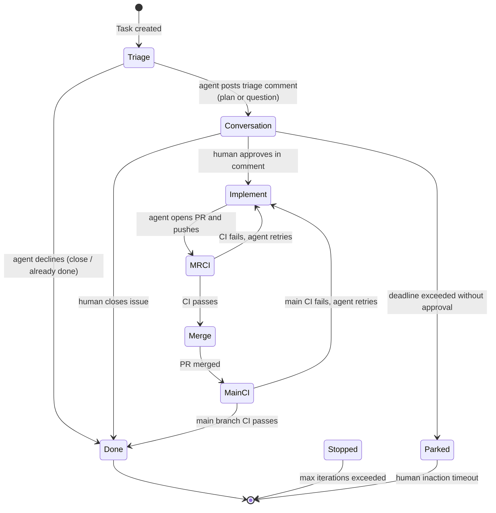

# Issue Lifecycle Workflow

The `issueLifecycle` workflow drives an issue from its opening through triage, human conversation, implementation, CI, merge, and closure. It is the main agentic development loop.

## Trigger

Any of:
1. A GitHub/GitLab issue is created with the `triggerLabel` (default `tatara`) already present
2. The `triggerLabel` is added to an existing issue
3. A periodic `issueScan` cron picks up labeled issues not yet in the queue

!!! note "`triageIssue` is a legacy Task kind"
    The `Task.Spec.Kind` enum still lists `triageIssue` as a valid value, and the operator's
    writeback/turn-loop switches still route it, but no production code path creates a new
    `triageIssue` Task anymore. Every issue-related Task creation site (`mrScan`, `issueScan`,
    the backstop sweep) now creates `issueLifecycle` directly, which starts its own state
    machine at the `Triage` phase described below. `triageIssue` is retained only so
    Tasks created before this consolidation can finish via the old arms; a `TestBindersNeverCreateTriageIssueOrSelfImprove`
    guard enforces that no binder creates a new one. Treat any reference to `triageIssue`
    elsewhere in the docs or CRD as historical.

## State machine

## Triage phase

The agent:
1. Reads the issue body and comments
2. Queries the memory graph for relevant code context
3. Posts a triage comment with one of:
   - An implementation plan (`IssueOutcome.action: implement`)
   - A request for clarification (`IssueOutcome.action: discuss`)
   - A decline with reason (`IssueOutcome.action: close`)

The operator applies the appropriate label (`tatara-brainstorming` during discussion, `tatara-approved` on plan approval).

## Conversation phase

The agent monitors the issue thread for human replies. It can respond to clarification questions, update the plan, and wait for explicit approval. Approval comes as a comment from a `maintainerLogins` account (or any non-bot account if `maintainerLogins` is empty) containing language that the triage agent recognizes as approval.

!!! note "Approval gating"
    The human approval comment does not need to contain any magic keyword. The triage agent reads the conversation and determines intent. The `tatara-approved` label is applied by the operator after the agent posts the approval acknowledgment via MCP tool.

## Implement phase

On approval:
1. Agent clones the repository into `/workspace`
2. Reads codebase context from the memory graph
3. Writes code, creates/modifies files
4. Runs any available tests
5. Commits and pushes to the task branch (`tatara/<issue-slug>-<number>`)
6. Opens a PR that references the issue

The PR body contains a `Closes #N` reference; on merge, GitHub/GitLab automatically closes the issue.

## Multi-repo tasks

If `spec.reposInScope` lists multiple Repository CR names, the agent clones all of them and opens one PR per repo with commits. The operator monitors all PRs; the lifecycle advances only when all are merged.

## MRCI phase

Waits for CI to pass on the opened PR. If CI fails, the lifecycle re-enters Implement and the agent investigates and fixes.

## Merge phase

Once CI passes and a maintainer approves, the operator (or the agent, depending on `mergePolicy`) merges the PR.

| mergePolicy | Who merges |
|---|---|
| `afterApproval` | Operator merges when the agent signals `pr_outcome=merge`; no independent SCM review-state check |
| `autoMergeOnGreenCI` | Operator merges automatically when CI is green |

## MainCI phase

After merge, monitors the main branch CI run. If main CI fails (regression), the lifecycle re-enters Implement.

## Conversation persistence across phases

The issueLifecycle agent runs in one persistent Pod. If the Pod crashes or is evicted, the operator resumes the conversation from the S3-persisted transcript. The agent sees its own previous turns and the issue thread history, allowing it to pick up exactly where it left off.

## Parked and Stopped

- **Parked:** the agent is waiting for human input but the deadline has been exceeded. The issue is labelled `tatara/parked`. A future comment from a maintainer re-activates the lifecycle.
- **Stopped:** the `maxLifecycleIterations` limit was hit. The agent posts a summary comment and exits. A new task can be manually created to resume.

## Labels applied during lifecycle

| Phase | Label set | Label removed |
|---|---|---|
| Triage (plan) | `tatara-brainstorming` | - |
| Triage (decline) | `tatara-rejected` | `tatara` |
| Conversation | `tatara-brainstorming` | - |
| Approved | `tatara-approved` | `tatara-brainstorming` |
| PR opened | `tatara-approved` (retained) | - |
| Done | - | `tatara`, `tatara-approved` |
| Parked | `tatara/parked` | - |
