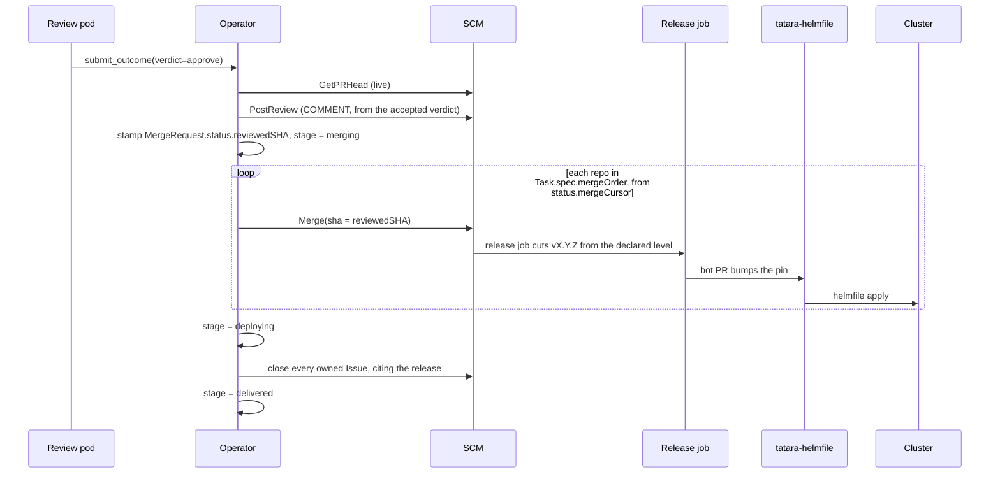

# Merge and deploy

Merging is an **operator action**. No agent merges anything, and auto-merge is never armed on a tatara-opened PR. <!-- stale-ok: auto-merge -->

There is no separate supervisor loop and no separate object tracking a release. `merging` and `deploying` are ordinary stages of the [Task stage machine](../reference/task.md), pod-less like `approved`, driven by the operator reconcile loop. The delivery path is `implementing` -> `reviewing` -> `merging` -> `deploying` -> `delivered`.

!!! danger "The forge never merges for us" <!-- stale-ok: auto-merge -->
    The operator retains a disarm call for exactly one purpose: disarming PRs opened *before* the cutover. Nothing arms it. <!-- stale-ok: auto-merge -->
    No MCP tool exposes merge, so a compliant agent has no path to it at all.

## The merge sequence

A Task reaches `stage=merging` on exactly one trigger: a review pod called `submit_outcome(verdict=approve)` and the operator accepted it. At acceptance the operator does three things, in order:

1. Reads the **live** head SHA of every owned `MergeRequest` (`GetPRHead`). It never trusts the mirror's `status.headSHA` - the mirror is up to one sweep stale.
2. Posts the SCM review itself, under the bot identity, from the accepted verdict. **The agent posts nothing.** There is one writer per medium: the agent writes conversation, the operator writes reviews, merges, labels and status.
3. Stamps `MergeRequest.status.reviewedSHA` with that live head.

The review the operator posts is **always** a `COMMENT` event. GitHub 422s the PR author on both `APPROVE` and `REQUEST_CHANGES` on a self-authored PR, and only `COMMENT` is permitted, so the verdict lives in the review body (`## Review: approved` / `## Review: changes requested`) and, authoritatively, in the accepted `submit_outcome`.

One consequence is worth stating plainly: **the forge carries no machine-readable trace of the review verdict.** The audit trail of record is the operator's structured log and `MergeRequest.status`, not a forge review-decision field. It is also why a branch-protection rule requiring an approving review can never be armed on a tatara-opened PR: the platform can never post one on its own PR, and a rule that required it would deadlock every merge.

Then, at `stage=merging`, the operator walks `Task.spec.mergeOrder` sequentially, resuming from `Task.status.mergeCursor`:

```
for i := status.mergeCursor; i < len(spec.mergeOrder); i++ {
    repo := spec.mergeOrder[i]
    mr   := the owned MergeRequest for repo

    if mr.status.state == "merged" { status.mergeCursor = i+1; continue }

    liveHead := SCM.GetPRHead(repo, mr.number)      // LIVE. Never the mirror.
    if liveHead != mr.status.reviewedSHA {
        mr.status.status = "new"; mr.status.reviewedSHA = ""
        stage = reviewing                            // the head moved: re-review
        return
    }
    if CI at liveHead != green || !mergeable { requeue; return }

    sha, err := SCM.Merge(repo, mr.number, method, liveHead)   // expected-head SHA
    if err is 409 "head sha changed" {
        mr.status.status = "new"; mr.status.reviewedSHA = ""
        stage = reviewing; return                    // TOCTOU closed
    }
    wait for the release job at sha to go green
    status.mergeCursor = i+1
}
stage = deploying
```

`SCMWriter.Merge` takes the expected head SHA, and the forge 409s on a mismatch. **A head that moves between the review and the merge can never be merged.** The Task goes back to `reviewing` instead, and that re-review is bounded: the head-move edge increments `status.headMoveReentries` and fails the Task at `failed(head-moving)` after three laps. It is the only bounded cycle in the platform that spawns a pod on every lap, which is exactly why it is capped - a branch whose head keeps moving (a human pushing to it, a flapping CI autocommit) burns a review pod each time round.

`mergeCursor` is persisted, so a restarted operator resumes mid-order and never re-merges a repo. A repo already `merged` is skipped and the cursor advances past it.



## Merge order

`Task.spec.mergeOrder` is a list of Repository CR names in dependency order, first-merged first. It is **required** whenever a Task owns MRs in more than one repo, and it is validated to cover every owned MR's repo:

- `400 mergeOrder required for a multi-repo change` when it is absent
- `400 mergeOrder does not cover repo <X>` when it omits one

For the single-repo case the operator fills it in itself, at `/outcome`, with the one repo that has an owned open MR. That is not an ordering choice - with one element there is no ordering to get wrong. Reaching `merging` with an empty `mergeOrder` is a bug and is treated as one: `failed(merge-order-missing)`.

**There is no lexical default, ever.** Lexical order over this platform's own repos is `agent-skills < cli < claude-code-wrapper < operator`, which merges the cli *before* the operator, and the operator's REST decoder calls `DisallowUnknownFields()` on every endpoint. That exact ordering is the fleet outage this field exists to prevent.

## semver push-CD

`MergeRequest.status.significance` (`major` | `minor` | `patch`) is what the release job cuts the tag from. It is **implement-owned**: written once from the implement Task's `submit_outcome(change_significance=...)`.

A **review outcome may only escalate it** - `max(implement, review)` over the ordering `patch < minor < major`. An attempt to lower it is ignored and logged WARN. The in-cluster reviewer is documented-flaky, and it must never be able to downgrade a major release to a patch.

A human sets the equivalent with a `semver:<level>` PR label on their own PR.

Everything past the merge is author-agnostic: the tag-cut and the propagation key on the released level, not on who merged, so a human merging their own labelled PR by hand gets the identical downstream chain. See [CI/CD and the deploy model](../architecture/ci-cd.md) for what the release job does with the tag.

## GitLab has no review object

`project-infrastructure` is the GitLab project, and it owns `tatara-helmfile` - the cluster-admin-scoped repo. GitLab has no review-event object at all, so `PostReview` maps very differently there.

On GitLab the review body is posted as a plain MR note, and each finding becomes its own **discussion** carrying a `position` block (`base_sha`, `start_sha`, `head_sha`, `new_path`, `new_line`) sourced from the MR's `diff_refs`. There is no unapprove or approve step either way: the merge is the approval of record on both forges, identically.

**The order is inverted, and the order is load-bearing.** GitHub's review post is one atomic call (body plus inline comments together), so a single marker in the review body is a truthful "everything landed" flag. GitLab's path is N+1 calls, so it posts **the discussions first** - each carrying its own per-finding marker, `<!-- tatara-review round=N sha=S finding=K -->` - and **the body note last**, carrying the round marker `<!-- tatara-review round=N sha=S -->`. Only then does the round marker mean "every finding landed and the body landed". A resumed post skips exactly the units already on the forge and posts the rest.

!!! danger "A marker written before the work it guards is not an idempotency key"
    The marker that gates the skip must be written **last**, and it must mean "everything for this round is on the forge". Post the body note first on an N+1-call forge and a crash midway through the discussions leaves the marker present with the findings missing: the re-run sees the marker, skips, and those findings are never posted, while the round is stamped complete.

This is the largest new surface in the redesign, and it lands on the forge that owns the cluster-admin-scoped `tatara-helmfile` repo. Today's GitLab client has no `position` handling and no `discussion` handling at all, and its plain-note fallback anchors findings to nothing.

## Deploying and delivery

`stage=deploying` is pod-less. When every owned `MergeRequest` has `state == merged` and `deployedAt != nil`, the **operator** closes every owned Issue that is still open, with a citing comment (`Delivered in <repo>!<number> (<version>). Closed by tatara.`), sets `Issue.status.state = closed` and `Issue.status.status = done`, and only then stamps `Task.status.deliveredAt` and moves to `delivered`.

Delivery is a postcondition the operator **writes**, not a precondition it waits on. `issue_write(close)` is not reachable from `merging` or `deploying`: no agent runs there.

## Budgets and the bounded cycles

Both stages are pod-less, so each runs one clock, measured from `status.stageEnteredAt` against its own budget:

| stage | budget | on elapse |
|---|---|---|
| `merging` | 4h | `parked(merge-timeout)` |
| `deploying` | 2h | `parked(deploy-timeout)` |

Both parks are recoverable, and every re-entry is counted, so neither stage can spin forever on a wedged release:

| cycle | counter | cap | on exhaustion |
|---|---|---|---|
| `merging` / `parked(merge-timeout)` | `mergeReentries` | 3 | `failed(merge-blocked)` |
| `deploying` / `parked(deploy-timeout)` | `deployReentries` | 3 | `failed(deploy-blocked)` |
| `merging` / `reviewing` (the head moved) | `headMoveReentries` | 3 | `failed(head-moving)` |

## The merge gate is operator logic

The gate is enforced by the operator, not by the forge. The platform has one bot identity, so the forge cannot tell an operator merge apart from a merge driven by a pod holding the same token. That residual risk is accepted explicitly, and it is met with **detection, not prevention**: `operator_unexpected_merge_total` - an MR found merged with no `mergeCursor` advance - is a critical alert.

The controls that do work under one identity are branch protection forbidding direct pushes to `main`, a scoped installation token in place of an org-wide PAT, and `gh`, `glab` and forge-`curl` on the agent-pod deny-list. Workstation skills are a different context and keep both `gh` and human-driven merge.

See [Approval gates](../operations/security/approval-gates.md#the-approval-grammar) for the gate that authorises the implementation in the first place, and [PR / MR review](review.md) for the verdict that triggers the merge.
