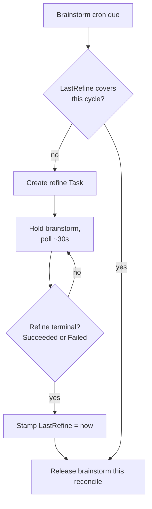

# Refine Workflow

The `refine` workflow is a groom-only backlog peer of brainstorm and incident. It never creates
new work and never implements anything: it folds duplicate Tasks together, closes stale issues,
and links related work, so brainstorm always runs against a clean, current backlog.

## Trigger

Refine has **no independent cron schedule**. It is cadence-derived: it fires as a mandatory
barrier ahead of the [brainstorm](brainstorm.md) cron, on every due brainstorm tick. There is no
`spec.scm.cron.refine.schedule` field - only `spec.scm.cron.refine.closedLookbackDays` (default
`30`), which bounds how far back refine looks at recently-closed issues/PRs for dedup context.

```yaml
spec:
  scm:
    cron:
      refine:
        closedLookbackDays: 30
```

## Groom-only contract

Refine's goal prompt is explicit: it is a **peer** of brainstorm and incident, not a
subordinate. It does **not** decide what gets built, cannot open new issues via `submit_outcome`
(brainstorm and incident are the only kinds whose outcome files one), and has no `code_*` tools
at all - a backlog groomer reads issues, not code. Its tool set is `task_get` / `task_context` /
`task_note` / `project_get` / `repo_list` / `report_internal_issue` (always-on), plus `task_list`,
`scm_read`, `issue_write`, `memory_query` / `memory_describe`, and `mr_write` restricted to
`action=comment` only - refine can reply on a member Task's MR thread but can never open one.
13 tools total. See [MCP tools](../reference/mcp-tools.md#the-profile-gating-table) for the full
per-kind gating table.

## Output

The pod's only path forward is `submit_outcome`:

```json
{"folds":[{"task":"tatara-clarify-2026-07-10-a1b2c"}],
 "closes":[{"repo":"tatara-operator","number":288,"reason":"duplicate of #291"}],
 "links":[{"repo":"tatara-operator","number":295,"isPR":true}]}
```

All three arrays are optional and independent - a refine pass can fold, close, and link in any
combination, including none of the three (a pure no-op sweep).

- **`folds`** adopts a member Task's Issues/MRs onto the calling Task, then **deletes** the
  member Task. A member with a running pod, or any live post-`approved` stage, is **refused with
  a `409`** - a fold can never yank a stage machine out from under an in-flight pod.
- **`closes`** closes an issue with a reason. Each target is **live-revalidated against SCM
  immediately before the close** - refine may be acting on a mirror view up to an hour stale -
  and refused with a `409` if the issue's controller owner is not this Task.
- **`links`** cross-references an Issue or MR without adopting or closing it.

Refine's fold is a **controller-ownership transfer**, not a copy: see
[Ownership](../architecture/ownership.md#the-refine-fold) for the full protocol and its
verification step - a `refining -> failed(fold-adoption-unverified)` transition exists precisely
because that step can fail.

## Cron barrier semantics

Refine acts as a **hard gate** on brainstorm, not merely a preceding step:

1. On a due brainstorm tick, the operator checks `Project.Status.LastRefine`. If it is unset or
   predates the current cycle's due-base time, refine is needed.
2. If needed and no terminal refine Task exists yet for this cycle, the operator creates one
   (at most one refine Task per project per cycle) and **holds** the brainstorm tick, polling
   roughly every 30s.
3. Once the refine Task reaches either `Succeeded` **or** `Failed` (both terminal), the operator
   stamps `Status.LastRefine = now` and releases brainstorm in the same reconcile. A failed
   refine still releases the gate - a broken refine never wedges brainstorm indefinitely.

Only brainstorm waits on this barrier. `mrScan`, `issueScan`, and `documentation` fire on their own
schedules unaffected by refine's state.



## A stalled implement is not auto-rerolled

An `implementing` Task that blows its 6h stage-work budget parks at `parked(stage-deadline)` -
not a recoverable retry loop. That park reason has **no re-entry**: it ages out at
`parkRetention` (7 days), the operator posts its bot park comment, and the reaper reaps it. The
next sweep re-mints the still-open Issue as a fresh `parked(backlog-sweep)` Task - owning it at
zero agent cost - and it is only promoted back to `triaging` (as a **new** Task, not the zombie of
the old one) once a human comments again. Refine plays no special role in this path: it grooms
the backlog `submit_outcome`-side (fold/close/link), it does not reroll stalled work.

## Relationship to brainstorm and incident

Refine, brainstorm, and incident are three peer backlog-facing kinds with a strict division of
labor: incident *investigates and proposes* from live alerts, brainstorm *proposes* new work from
the knowledge graph, refine *grooms* what already exists. None of the three implements; all three
end in a `submit_outcome` that either files an issue (incident's `file_issue`, brainstorm's
`propose`) or edits the backlog (refine's `folds`/`closes`/`links`) - never opens an MR.
