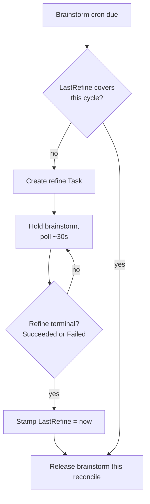

# Refine Workflow

The `refine` workflow is a groom-only backlog peer of brainstorm and incident. It never creates
new work and never implements anything - it tidies the existing backlog (closing duplicates,
tightening vague issues, grooming stale handoffs) and recovers implementation Tasks that gave
up recoverably, so brainstorm always runs against a clean, current backlog.

## Trigger

Refine has **no independent cron schedule**. It is cadence-derived: it fires as a mandatory
barrier ahead of the [brainstorm](brainstorm.md) cron, on every due brainstorm tick. There is no
`spec.scm.cron.refine.schedule` field - only `spec.scm.cron.refine.closedLookbackDays` (default
`30`), which bounds how far back refine looks at recently-closed issues/PRs for dedup context.

```yaml
spec:
  scm:
    cron:
      refine:
        closedLookbackDays: 30
```

## Groom-only contract

Refine's goal prompt is explicit: it is a **peer** of brainstorm and incident, not a
subordinate. It does **not** decide what gets built and carries no tool to create new work:

- No `propose_issue` / `createProposal` - refine cannot open new issues.
- No implement tool, no PR-opening path - refine cannot write code.
- No trigger-label application, no moving an issue toward implementation, no escalation.

What it *can* do, via its tool set (`task_list`, `list_issues`, `list_commits`, `close_issue`,
`edit_issue`, `comment_on_issue`, `list_handoffs`, `delete_handoff`):

- Close duplicate issues.
- Edit/tighten vague or stale proposal issues (better titles, scoped descriptions).
- Groom the handoff backlog - list and delete stale or completed handoffs alongside the issue
  backlog, so brainstorm's continuation-proposal pass (offering to continue a live handoff
  before running a fresh-ideas research pass) works against current data.
- Comment on issues with recovery guidance for Parked implementations (below).

The operator stamps `TATARA_TOOL_PROFILE=refine` and `TATARA_SKILL_PROFILE=refine` on the
refine Pod; the actual per-profile MCP tool allowlist that enforces this at the transport layer
lives in `tatara-cli`, not the operator.

## Cron barrier semantics

Refine acts as a **hard gate** on brainstorm, not merely a preceding step:

1. On a due brainstorm tick, the operator checks `Project.Status.LastRefine`. If it is unset or
   predates the current cycle's due-base time, refine is needed.
2. If needed and no terminal refine Task exists yet for this cycle, the operator creates one
   (at most one refine Task per project per cycle) and **holds** the brainstorm tick, polling
   roughly every 30s.
3. Once the refine Task reaches either `Succeeded` **or** `Failed` (both terminal), the operator
   stamps `Status.LastRefine = now` and releases brainstorm in the same reconcile. A failed
   refine still releases the gate - a broken refine never wedges brainstorm indefinitely.

Only brainstorm waits on this barrier. `mrScan`, `issueScan`, and `documentation` fire on their own
schedules unaffected by refine's state.



## Recovering gave-up implementations

Refine's other job is surfacing implement Tasks that parked recoverably so they get either
auto-rerolled or escalated to a human - it does not perform the reroll itself; that is the
operator's `recoverOrphans` backstop.

`Task.Status.ImplementGiveUps` counts how many times an `Implement -> Parked` transition
happened with a **recoverable** park reason (non-recoverable declines, e.g. an explicit refusal,
never increment this counter and are never rerolled). The cap is `maxImplGiveUps = 3`:

| `implementGiveUps` | Backstop behavior | Refine's role |
|---|---|---|
| `< 3` | `recoverOrphans` adopts the Parked Task in-place back to `Implement` (same Task object, no fresh spawn) | Refine comments a refined/tightened scope on the issue so the next auto-reroll has better direction |
| `>= 3` | Reroll is skipped entirely; the Task stays `Parked` indefinitely | Refine comments a human-escalation summary and does **not** touch labels or close the issue |

The counter resets to `0` when a human re-engages via a fresh Triage entry, but is preserved
across `Implement` reroll cycles. A Parked Task with `0 < implementGiveUps <= maxImplGiveUps` is
also exempted from time-based garbage collection by the reaper, so the counter survives while
the issue stays open.

The same `maxImplGiveUps` cap and counter are reused independently by
[deploy supervisor](deploy-supervisor.md) deploy-supervision for its `Deploying -> Implement`
reroll path - one shared bounded-retry primitive, two consumers.

## Relationship to brainstorm and incident

Refine, brainstorm, and incident are three peer backlog-facing kinds with a strict division of
labor: incident *investigates and proposes* from live alerts, brainstorm *proposes* new work from
the knowledge graph, refine *grooms* what already exists. None of the three implements; all three
end in either `propose_issue`/`createProposal` (incident, brainstorm) or backlog edits
(refine) - never a PR.
