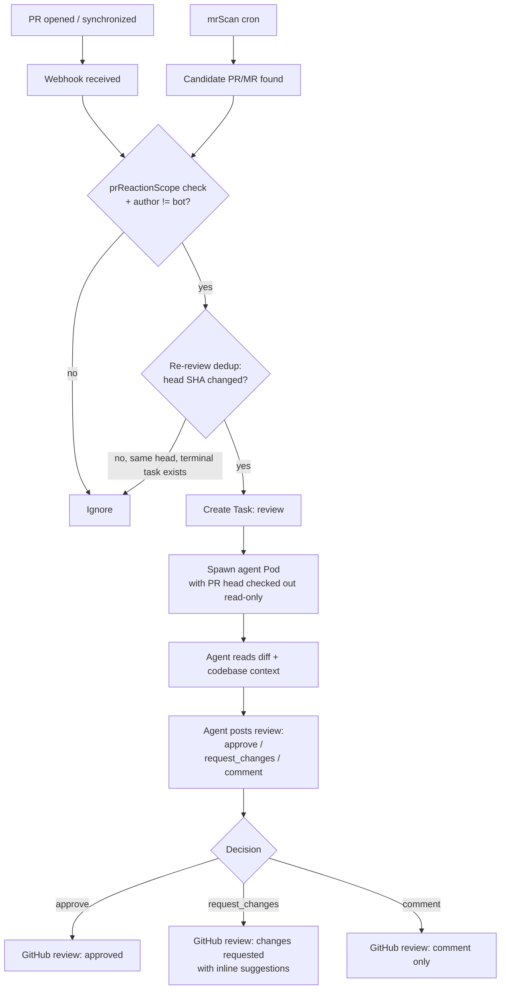

# PR Review Workflow

The `review` workflow triggers when a human-authored PR is opened (or updated) in an enrolled repository. The agent checks out the PR head read-only, reviews the changes, and posts a structured review verdict.

## Trigger

Two independent paths feed `review` Tasks:

1. **Webhook:** a pull request is opened or synchronized on an enrolled repository.
2. **`mrScan` cron:** a periodic scan (peer of `issueScan`) that lists open PRs/MRs on enrolled repos and picks up any candidate the webhook missed, so a dropped or delayed webhook is not a permanent gap.

Both paths apply the same scope check via `spec.scm.prReactionScope`:

| Value | Behavior |
|---|---|
| Empty / unset (**the default**) | Reacts to **every** open human PR/MR - the historical, permissive behavior |
| `labeledOrMentioned` | Only PRs with the `triggerLabel` OR that mention the bot |
| `all` | Every PR in every enrolled repository (equivalent to the unset default, explicit) |

!!! warning "Default is permissive, not `labeledOrMentioned`"
    The default `prReactionScope` is empty, which reviews every open PR/MR. This is intentional: a defaulted value would be indistinguishable from an explicit `labeledOrMentioned`, so the field is opt-in rather than kubebuilder-defaulted to the narrower scope. Set `prReactionScope: labeledOrMentioned` explicitly to restrict review to labeled/mentioned PRs.

The PR author must not be the bot itself (bot-authored PRs go through the `implement`/deploy-supervisor auto-merge path, not review).

## Workflow



## Re-review dedup

`mrScan` (and the webhook path) suppress re-review of a PR/MR whose head commit has not changed since the last completed review Task. The dedup key is the PR's current `headSHA` compared against the head SHA recorded on the matching Task's `role:reviewed` ledger entry (`WorkItemRef.HeadSHA`); pre-ledger Tasks fall back to a legacy `tatara.io/head-sha` label. Same head + a terminal review Task already exists -> suppressed. A new commit pushed to the PR changes the head SHA -> re-review proceeds.

!!! note "Past incident"
    An earlier version of this dedup only consulted the `role:openedPR` ledger entry, which a
    human-PR review Task never carries, so the check silently no-opped and the same MR was
    re-reviewed on every `mrScan` cycle, burning tokens. The fix's shared helper `headSHAForTask`
    now reads `HeadSHA` from **either** a `role:openedPR` or a `role:reviewed` entry (then falls
    back to `MergedHeadSHA` and the legacy `tatara.io/head-sha` label). For a human-PR review Task
    the operative entry is `role:reviewed`, so the dedup keys on the reviewed head as intended.

## Read-only constraint

The review agent **never pushes and never merges, and never calls a merge API**. The PR head is
checked out in `/workspace` read-only. Review's only two writeback actions are (a) a native
SCM review (approve / request-changes / comment) and (b) re-adding `tatara-implementation` to
invoke `implement` again on an unmergeable MR.

!!! note "Auto-merge is unrelated to review's writeback path"
    Native auto-merge (the [deploy supervisor](deploy-supervisor.md) `semver:*`-gated mechanism)
    is a completely separate code path - review's approval is what makes the deploy supervisor
    willing to merge, but review itself never touches the merge API.

## Review output

The agent posts a GitHub/GitLab review with:

- **Decision:** `approve`, `request_changes`, or `comment`
- **Summary comment:** overall assessment
- **Inline suggestions:** `Suggestion` objects at specific file + line locations, formatted as GitHub suggestion blocks

```go
type ReviewVerdict struct {
    Decision    string       // approve | request_changes | comment
    Body        string       // review summary
    Suggestions []Suggestion // inline suggestions
}

type Suggestion struct {
    Path string
    Line int
    Body string  // suggested replacement code
}
```

## Conversation persistence for reviews

Each PR gets its own conversation, distinct from any related issue's conversation. If the PR is synchronized (new commits pushed), the next review turn resumes from the prior conversation, giving the agent context about what it already reviewed.

## Approve-label + native review is the whole merge signal

On `approve`, review applies `tatara-approved` to the PR/MR **and** posts a native PR approval -
that is the entire approval signal the deploy supervisor consults. There is no separate human
maintainer sign-off step in the shipped default flow; review's approval, from a pod that
structurally never wrote the diff it is reviewing, is the merge gate. If review instead finds
any MR under the Task unmergeable (conflict, failed pipeline), it withholds approval and
re-adds `tatara-implementation` to invoke `implement` again - see
[Deploy Supervisor](deploy-supervisor.md) for what happens once approval + green CI both hold.
