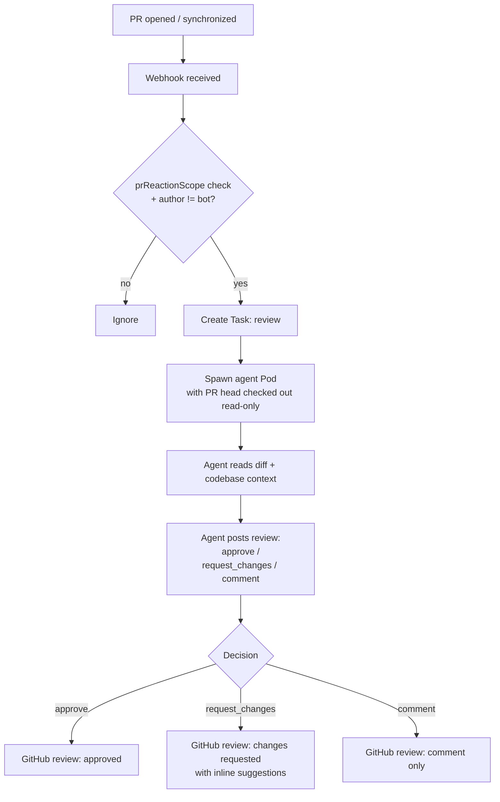

# PR Review Workflow

The `review` workflow triggers when a human-authored PR is opened (or updated) in an enrolled repository. The agent checks out the PR head read-only, reviews the changes, and posts a structured review verdict.

## Trigger

A pull request is opened or synchronized on an enrolled repository. Whether the operator reacts depends on `spec.scm.prReactionScope`:

| Value | Behavior |
|---|---|
| `labeledOrMentioned` (default) | Only PRs with the `triggerLabel` OR that mention the bot |
| `all` | Every PR in every enrolled repository |

The PR author must not be the bot itself (bot-authored PRs go through the issueLifecycle MR path, not review).

## Workflow



## Read-only constraint

The review agent **never pushes**. The PR head is checked out in `/workspace` but the agent's git identity does not have push access for this flow. Any attempt to push from a review task is rejected by the operator's MCP server.

## Review output

The agent posts a GitHub/GitLab review with:

- **Decision:** `approve`, `request_changes`, or `comment`
- **Summary comment:** overall assessment
- **Inline suggestions:** `Suggestion` objects at specific file + line locations, formatted as GitHub suggestion blocks

```go
type ReviewVerdict struct {
    Decision    string       // approve | request_changes | comment
    Body        string       // review summary
    Suggestions []Suggestion // inline suggestions
}

type Suggestion struct {
    Path string
    Line int
    Body string  // suggested replacement code
}
```

## Conversation persistence for reviews

Each PR gets its own conversation, distinct from any related issue's conversation. If the PR is synchronized (new commits pushed), the next review turn resumes from the prior conversation, giving the agent context about what it already reviewed.

## Bot approval gate

The review agent is the bot identity. A bot `approve` alone is not sufficient to merge under the `afterApproval` merge policy - a human maintainer approval is still required. The bot review is advisory; the merge gate requires a human.
